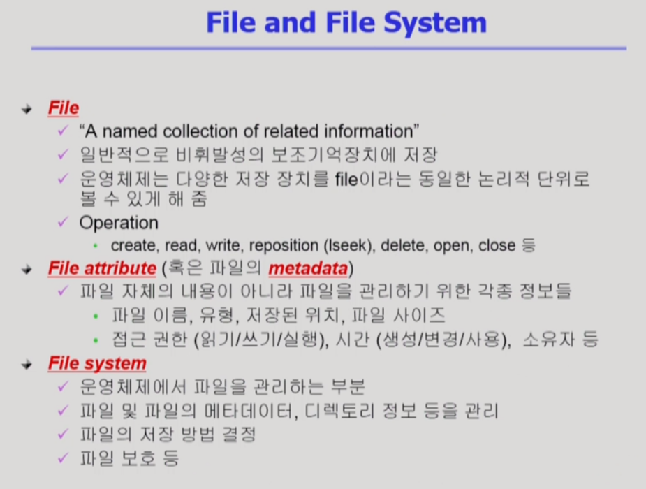
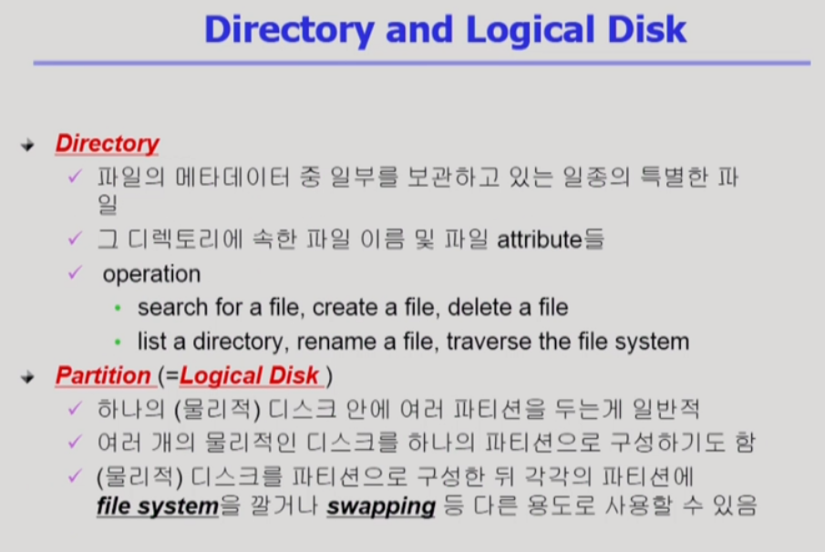
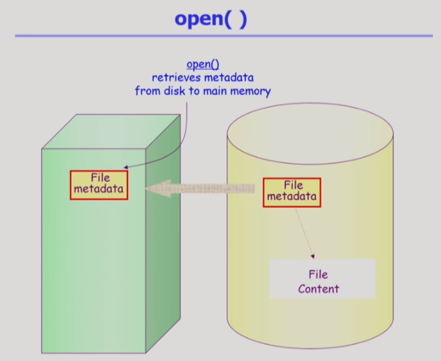
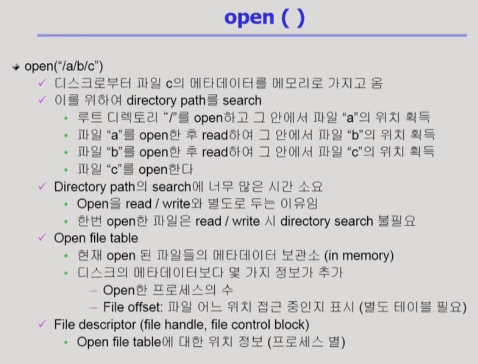
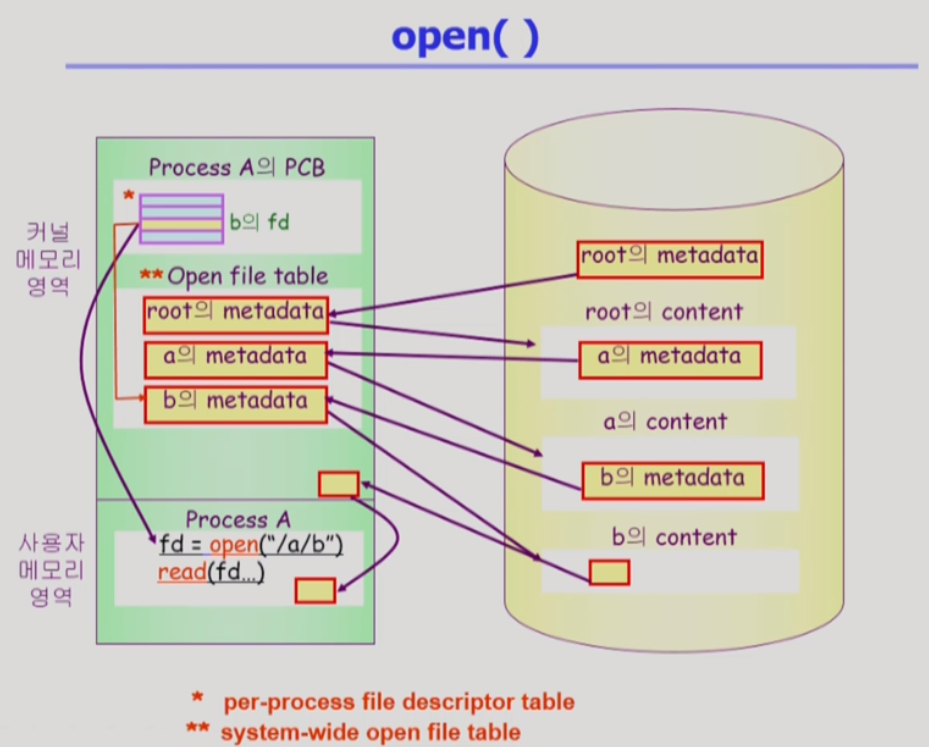
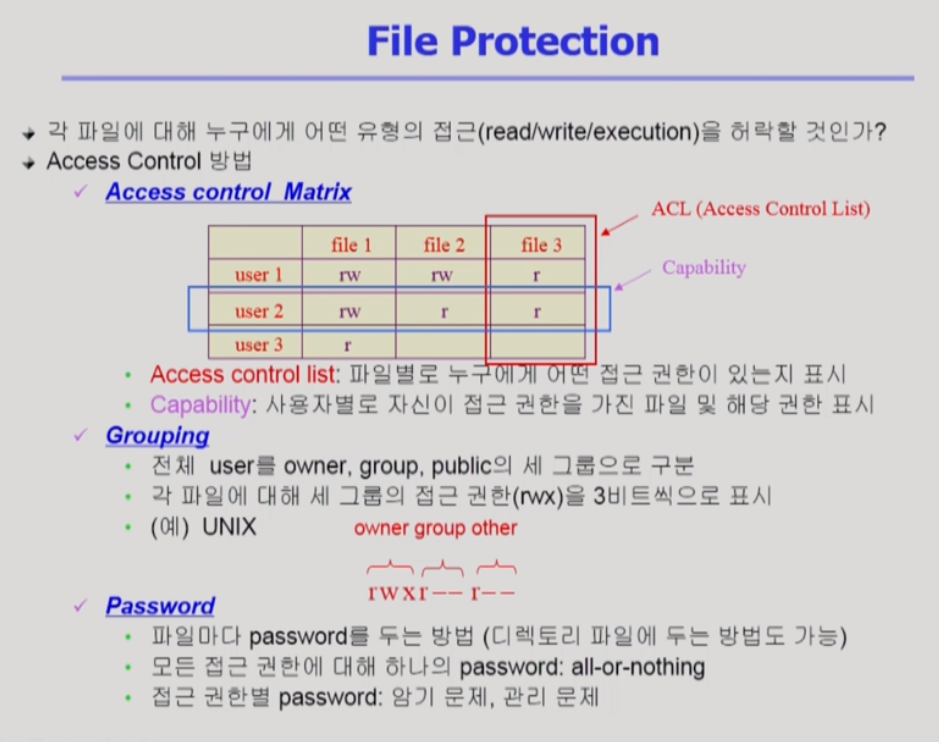
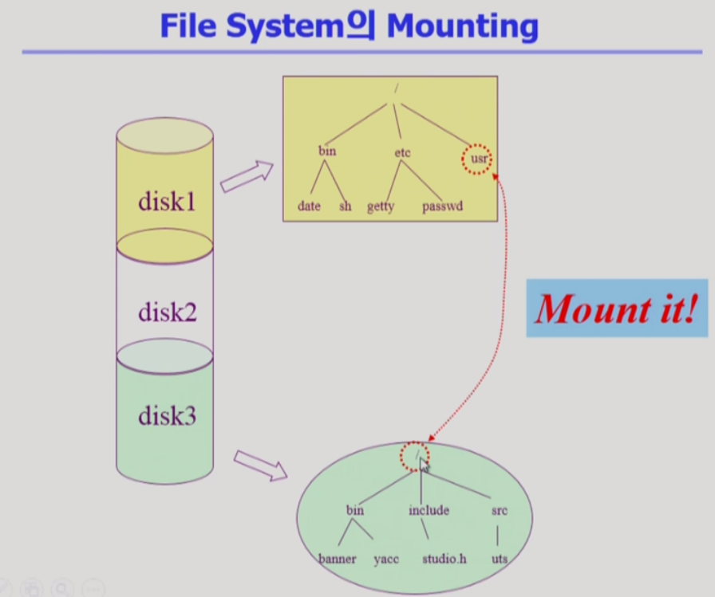
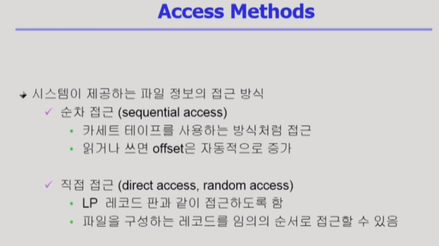

# 파일시스템

> 파일시스템의 기초, 디렉토리 구조, 파일의 접근권한 보호 등에 대해 알아본다.

## File and File System

- 이름을 통해서 접근하는 단위
- reposition : 현재 파일에 접근하는 위치를 바꿔주는 연산
- open : 파일의 메타데이터를 메모리에 올리기
- 루트 디렉토리로 계층적으로 파일 관리

- 물리적 디스크를 나눠서 논리적 디스크 여러 개로
- 파티션을 둬서 swapping area로 둘 수 있다

### open()

- 파일의 메타 데이터를 메모리로 올린다

- read, write, open 다 I/O를 하는 시스템 콜

- b의 메타데이터 위치를 저장한 file directory를 배열의 인덱스를 fd에 저장
- 운영체제가 b의 내용을 자신의 메모리 영역에 저장했다가 copy해서 사용자 메모리로 건너준다
- -> buffer caching
- 버퍼에 있던 없던 시스템 콜으로 무조건 운영체제로 CPU운영권이 넘어간다 -> LRU,LFU 등의 알고리즘 사용 가능
- 각 프로세스의 b의 어디를 보고 있는지에 대한 offset이 존재

### File Protection

3가지 방법

- ACL : 파일을 주체로 해서 
- Capability : 사용자를 주체로 해서
- 첫 번째 방법은 overhead가 크다
- Grouping은 9비트로 가능

### Mounting

- Mounting 연산 : 루트 파일 디렉토리 특정 디렉토리 이름에다가 다른 파티션에 있는 루트 디렉토리를 마운트 해 주면 usr(마운트 된 디렉토리)에 접근하게 되면 다른 파일의 루트 디렉토리에 접근하는 꼴
- 서로 다른 파티션에 존재하는 파일 시스템에 접근 가능

### 파일 접근 방법

- 직접 접근도 순차 접근만 가능한 경우도 있다

