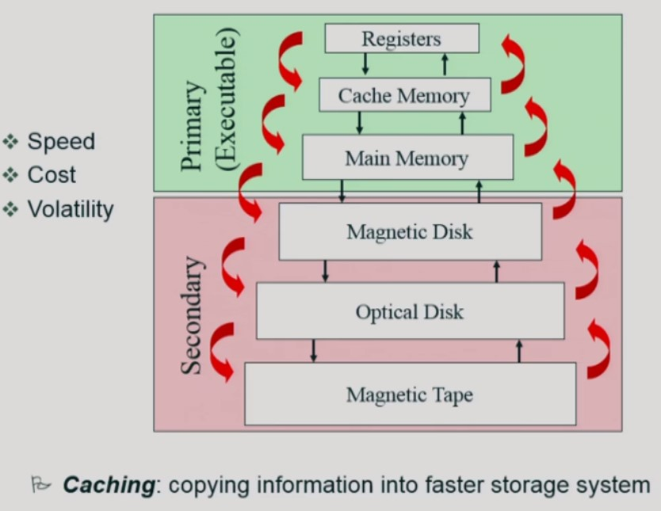

# CPU 스케줄링

1. FCFS(First-Come First-Served)
   - 프로세스의 도착 순서에 따라 진행
2. SJF(Shortest-Job-First)
   - 금번 CPU 사용시간이 가장 짧은 프로세스를 제일 먼저 스케줄
   - minimum average waiting time을 보장
   - Starvation 발생 가능 : CPU 사용 시간이 긴 프로세스가 진행되지 않을 수 있다
3. Round Robin[RR]
   - 각 프로세스는 동일 크기의 CPU 할당시간을 가짐
   - 할당 시간이 끝나면 인터럽트 발생, 프로세스는 CPU를 빼앗기고 CPU 큐의 제일 뒤로
   - n개의 프로세스가 CPU 큐에 있는 경우 **어떤 프로세스도 (n-1)*할당시간 이상을 기다리지 않음**
   - 대기시간이 프로세스의 CPU 사용시간에 비례

# 메모리 관리

- 미래를 모르는 상황에서 또 사용될 메모리를 유지하고 사용되지 않을 것 같은 페이지를 갈아치우기

- 디스크(파일 시스템) : 비휘발성
- 디스크(스왑영역) : 메모리 연장 공간

## LRU

- 가장 오래 전에 참조 페이지 삭제
- 단점 : 퇴물 존중

## LFU

- 참조 횟수가 가장 적은 페이지 삭제
- 단점 : 유망주 삭제

# 디스크 스케줄링

- 헤드의 이동을 최대한 줄이는 방향
- 디스크 접근 시간(Access time)의 구성
  1. 탐색시간(Seek time) : 헤드를 해당 트랙(실린더)으로 움직이는데 걸리는 시간
  2. 회전지연(Rotational latency) : 헤드가 원하는 섹터에 도달하기까지 걸리는 시간
  3. 전송시간(Transfer time) : 실제 데이터의 전송시간
- 디스크 스케줄링 -> seek time == seek distance을 최소화하는 목표
- FCFS(First-Come First-Served)
- SSTF(Shortest Seek Time First) : Starvation 문제 -> 형평성 X
- SCAN : 헤드가 디스크의 한쪽 끝에서 다른쪽 끝으로 이동하며 길목에 있는 요청 처리 -> 지그제그, 헤드의 이동거리가 짧아짐

# 저장장치 구조와 캐싱

## 플래시 메모리

- 반도체장치
- NAND형(스토리지), NOR형(임베디드 코드저장용)
- 비휘발성, 전력 소모가 적다, 물리적 충격에 강하다, 크기가 작고 가볍다
- 쓰기 횟수 제약, 데이터 변질 가능성

# 운영체제의 종류

- 서버용, PC용, 스마트디바이스용 운영체제
- 공개 소프트웨어 - Linux, Android -> 어차피 망한거 시장 장악이나 해보자, 지금은 강력한 무기
- 비공개 소프트웨어 - 윈도우, 맥