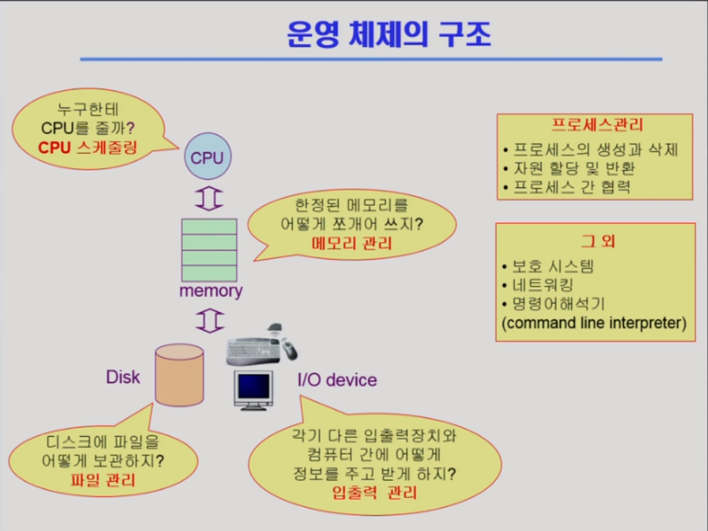

# 컴퓨터시스템의 구조

> 운영체제의 정의, 목적, 분류, 예, 구조를 알아보고, 과목 성격이 개발자 관점의 운영체제 이해임을 이해한다.

- 협의의 운영체제(커널)
  - 운영체제의 핵심 부분으로 메모리에 상주하는 부분
- 광의의 운영체제
  - 커널 뿐 아니라 각종 주변 시스템 유틸리티를 포함한 개념

# 1. 운영체제의 분류

1. 동시 작업 여부

- 단일 작업(single tasking) : 한 번에 하나의 작업만 처리
  - MS-DOS 프롬프트 상에서는 한 명령의 수행을 끝내기 전에 다른 명령을 수행시킬 수 없음
- 다중 작업(multi taskong) : 동시에 두 개 이상의 작업 처리
  - UNIX, MS Windows 등에서는 한 명령의 수행이 끝나기 전에 다른 명령이나 프로그램을 수행할 수 있음

2. 사용자의 수

- 단일 사용자(single user) : MS-DOS, MS Windows
- 다중 사용자(multi user) : UNIX, NT server

3. 처리 방식

- 일괄 처리(batch processing) : 
  - 작업 요청의 일정량 모아서 한꺼번에 처리
  - 작업이 완전 종료될 때까지 기다려야 함
- 시분할(time sharing)
  - 여러 작업을 수행할 때 컴퓨터 처리 능력을 일정한 시간 단위로 분할하여 사용
  - 일괄 처리 시스템에 비해 짧은 응답 시간을 가짐 ex)  UNIX
  - interactive 한 방식
- 실시간(Realtime OS)
  - 정해진 시간 안에 어떠한 일이 반드시 종료됨이 보장되어야하는 실시간 시스템을 위한 OS(원자로 등)
  - 확장
    - Hard realtime system : 원자로 폭발
    - Soft realtime system : 영상 인코딩을 못 맞춰 끊기는 등

# 용어 정리

- Multitasking
- Multiprogramming : 여러 프로그램이 메모리에 올라가 있음을 강조
- Time sharing : CPU의 시간을 분할하여 쓴다는 의미를 강조
- Multiprocess
- 구분
  - 위 용어들은 컴퓨터에서 여러 작업을 동시에 수행하는 것을 뜻한다
  - Multiprocessor : 하나의 컴퓨터에 CPU가 여러 개 붙어 있음을 의미

# 운영체제의 예

1. 유닉스(UNIX)
   - 서버용
   - 코드 대부분이 C언어 -> 사람이 이해하기 편하다
   - 높은 이식성 - 여러 아키텍쳐에서 호환
   - 최소한의 커널 구조
   - 복잡한 시스템에 맞게 확장 용이
   - 소스 코드 공개
   - 프로그램 개발에 용이
   - 다양한 버전 - Linux, System V, FreeBSD, SunOS, Solaris
2. DOS(Disk Operationg System)
   - MS사
   - 단일 사용자용 운영체제, 메모리 관리 능력의 한계
3. MS Windows
   - MS사의 다중 작업용 GUI 기반 운영체제
   - Plug and Play, 네트워크 환경 강화
   - DOS용 응용 프로그램과 호환성 제공
   - 불안정성
   - 풍부한 지원 소프트웨어
4. Handheld device를 위한 OS
   - PalmOS, Pocket PC (WinCE), Tiny OS

