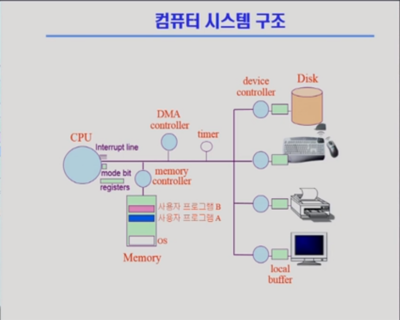

# 컴퓨터시스템의 구조

> 컴퓨터 시스템의 구조와 관련해, 프로그램 수행에 Mode bit, Timer 등이 어떻게 작동하는지 알아본다.

## 

# 1. 컴퓨터시스템 구조

## 1. Mode bit

- 사용자가 프로그램의 잘못된 수행으로 다른 프로그램 및 운영체제에 피해가 가지 않도록 하기 위한 보호 장치 필요
- Mode bit을 통해 하드웨어적으로 두 가지 모드의 operation 지원
  - 1 사용자 모드 : 사용자 프로그램 수행
  - **0 모니터 모드** : OS 코드 수행
- 보안을 해칠 수 있는 중요한 명령어는 모니터 모드에서만 수행 가능한 **특권명령**으로 규정
- Interrupt나 Exception 발생시 하드웨어가 mode bit을 0으로 바꿈
- Progrem Counter : 다음 실행할 메모리의 주소를 가진 곳

# 2. Timer

- 일정 시간 간격으로 Interrupt를 발생(무한 루프 시 CPU 제어권을 운영체제로 넘긴다)
- 타이머는 매 클럭 틱 때마다 1씩 감소
- 타이머 값이 0이 되면 타이머 인터럽트 발생
- CPU를 특정 프로그램이 독점하는 것으로부터 보호
- time sharing을 구현하기 위해 널리 이용
- 현재 시간을 계산하기 위해서도 사용

