# CPU 스케줄링

> CPU 스케줄링과 디스패처가 필요한 이유와 개념에 대해 알아본다.

## 1. 프로세스의 특성 분류

> CPU 스케줄링과 디스패처가 필요한 이유와 개념에 대해 알아본다.

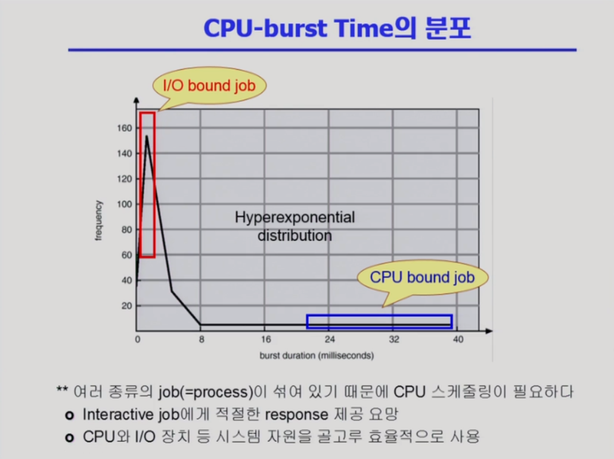

- I/O bound job에 CPU를 빨리 주면 효율적, 사람과 상호작용(Interactive job)하기 때문에 답답함이 덜해진다
- I/O bound job
  - CPU를 잡고 계산하는 시간보다 I/O에 많은 시간이 필요한 job
  - many short CPU bursts(CPU를 연속적으로 쓰는 시간)

- CPU-Bound process
  - 계산 위주의 job
  - few very long CPU bursts

## 2. CPU Scheduler & Dispatcher

> CPU 스케줄링과 디스패처가 필요한 이유와 개념에 대해 알아본다.

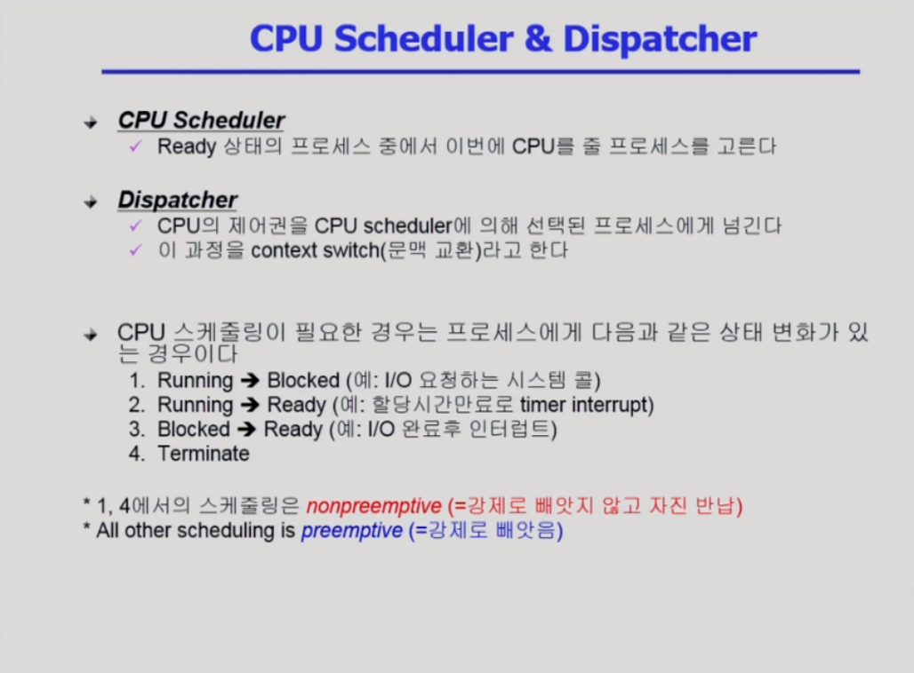

1) CPU를 잡고 있는 프로세스가 I/O 작업처럼 시간이 오래 걸리는 작업을 할 때 자진해서 CPU를 내어놓고 blocked

2) CPU를 잡고 있는 프로세스의 사용 시간이 다 되어 ready상태가 되어 다시 CPU를 기다림

3) 요청했던 I/O작업이 끝나면 I/O Device controller가 CPU에 인터럽트를 걸어서 blocked 된 프로세스를 ready 상태로. 우선순위 기반 스케쥴링의 경우, CPU를 빼앗기는 프로세스가 아직 사용 시간이 남아있더라도 I/O 처리가 끝난 프로세스의 우선순위가 더 높다면 그 프로세스에게 CPU가 넘어감

4) 프로세스가 종료됐을 때

- 둘 다 운영체제의 일부

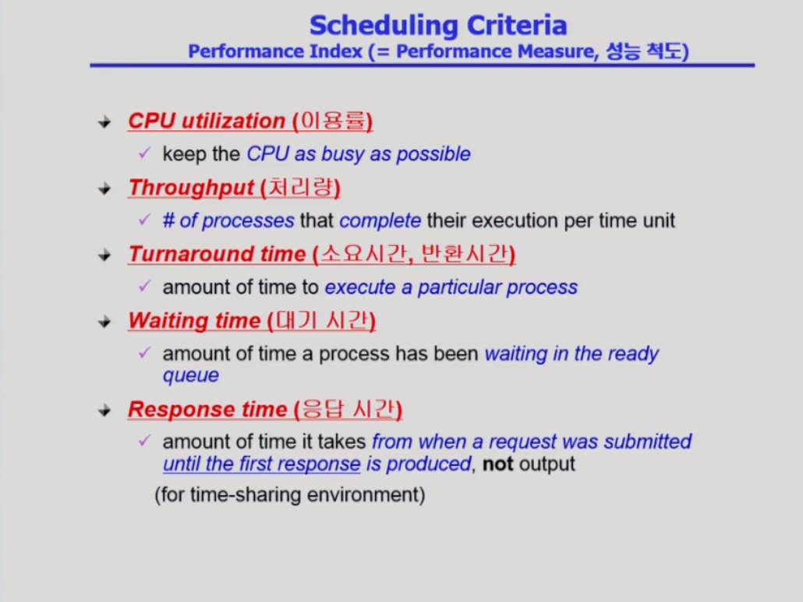

- CPU utilization 높을 수록, throughput 많을 수록, Time 짧을 수록 좋다
- Tunaround Time : CPU burst Time과 Waiting Time 모두 합친 것
- Waiting Time : ready que에서 대기한 시간
- Response Time : 처음 CPU를 얻게 되는 시간

## 3. CPU Scheduler & Dispatcher

> CPU 스케줄링의 여러가지 알고리즘에 대해 알아본다.

### 1) FCFS (First-Come First-Served)

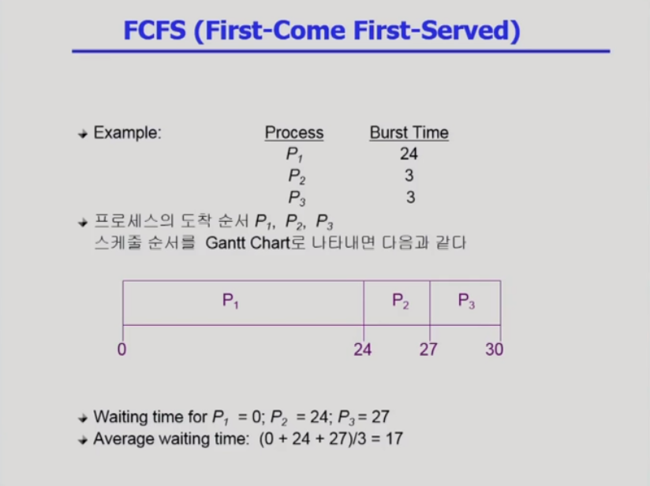

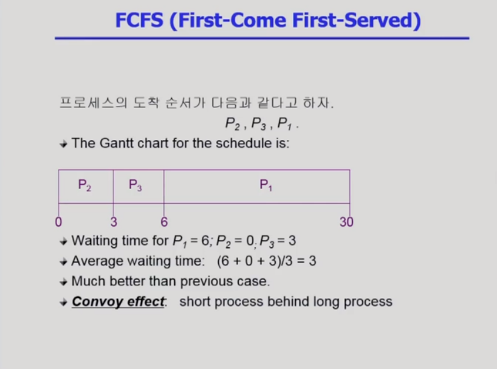

- Convoy effect : 긴 프로세스 뒤에 짧은 프로세스가 있어 waiting time이 길어지는 안 좋은 효과

### 2) SJF (Shortest Job First)

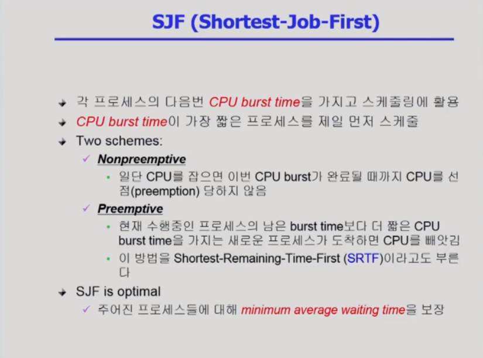

- optimal - 최적, 다른 방법을 쓰더라도 average waiting time을 더 줄일 수 없다

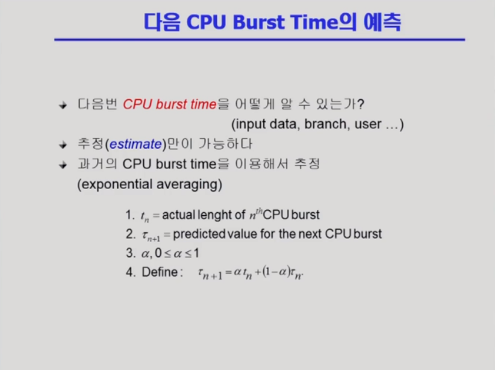

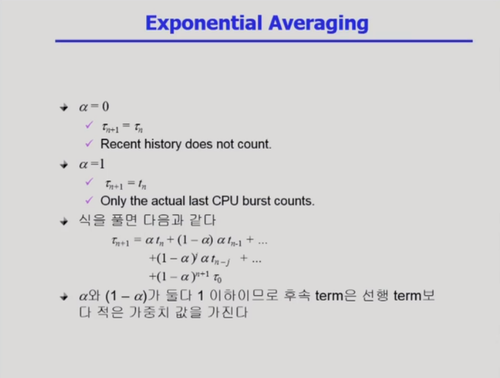

- 직전 CPU burst time이 가장 가중치를 갖는다

### 3) Priority scheduling

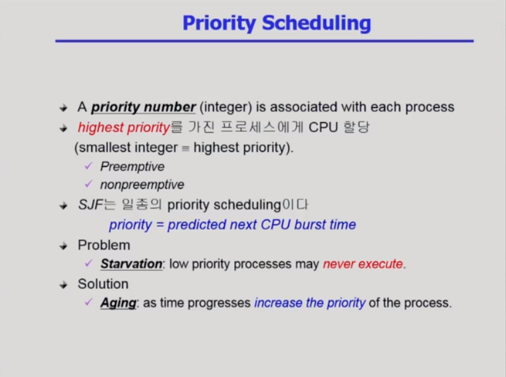

### 4) Round Robin scheduling (RR)

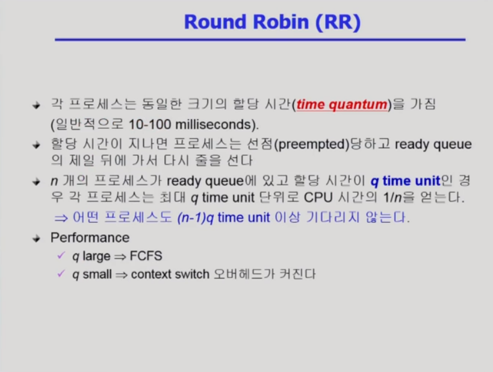

- 할당 시간을 I/O bound job은 바로 처리 되서 나가고 CPU bound job이 적절히 처리되고 나갈 정도로 잡아야 효율적이게 된다

- 일반적으로 SJF보다 average turnaround time이 길지만 reponse time이 더 짧다
- long, short job이 섞여있을 때 효과적
- long이나 short이나 공평하게 기다리는 시간은 각자 길이에 비례한다

### 5) Multilevel Queue

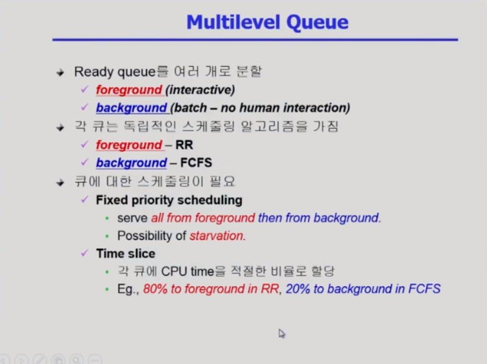

### 6) Multilevel Feedback Queue

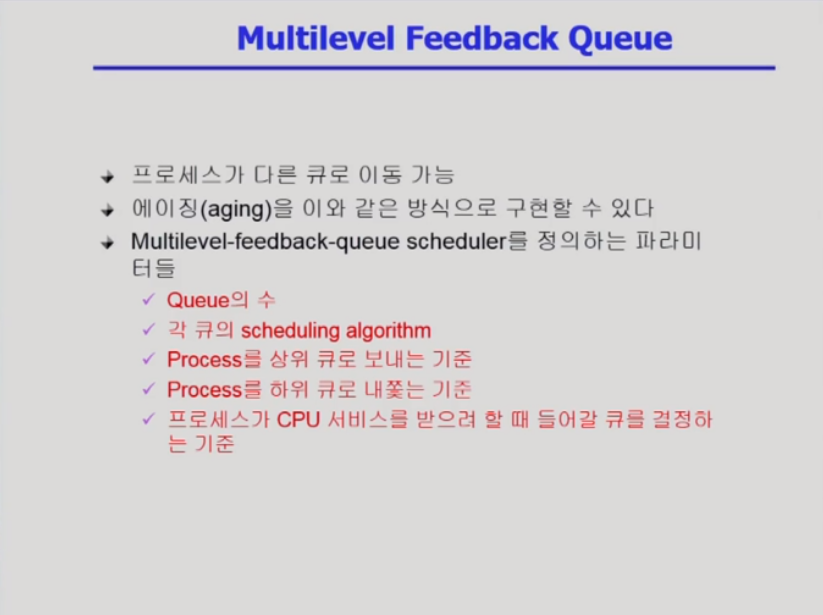

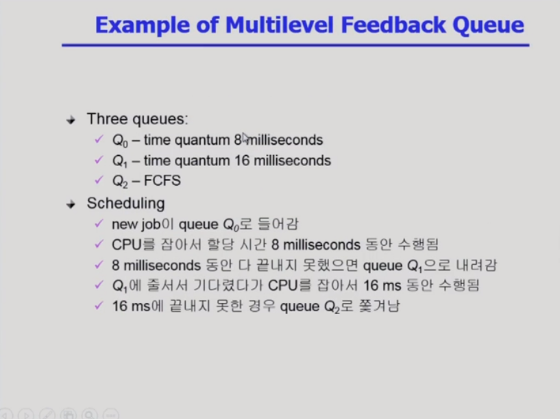

---

# CPU가 여러개일 경우들

### 7) Multiple-Processor Scheduling

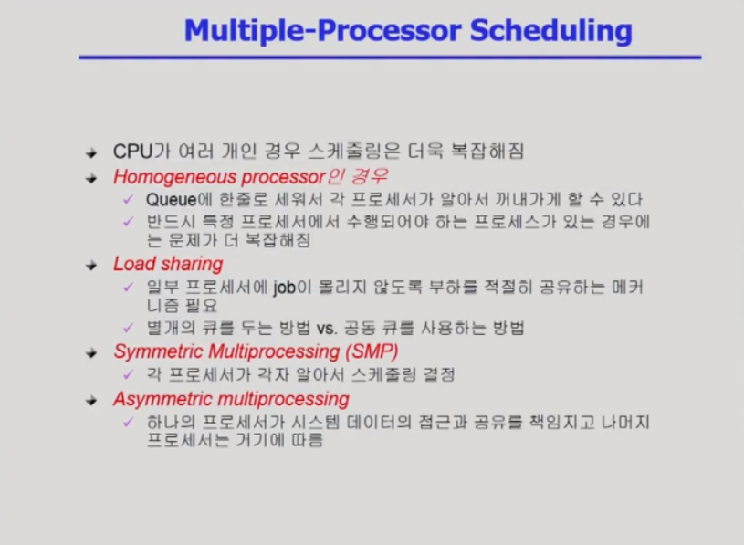

