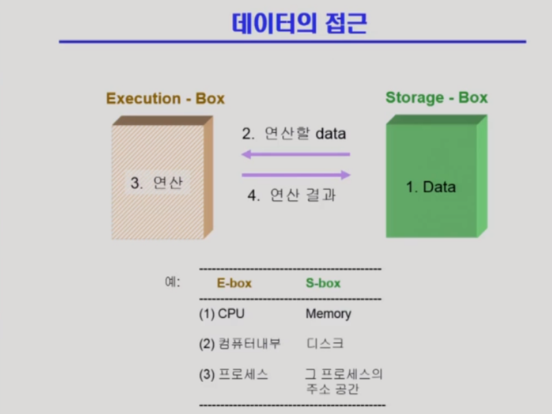
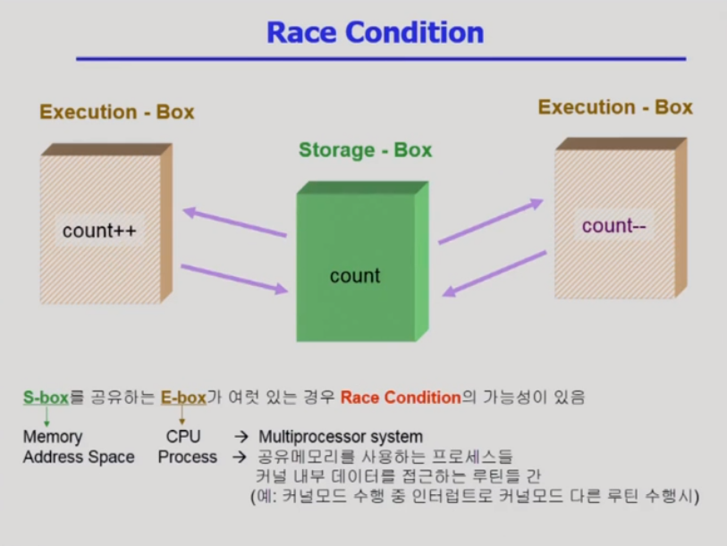
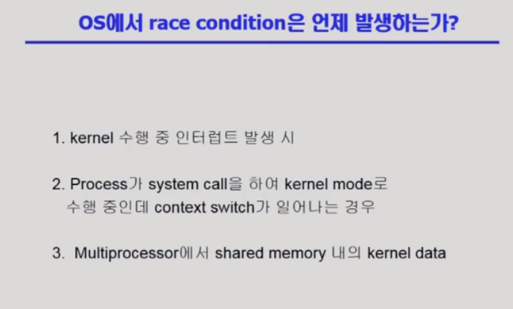
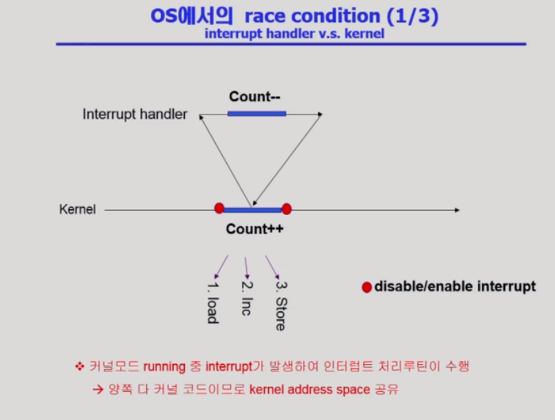
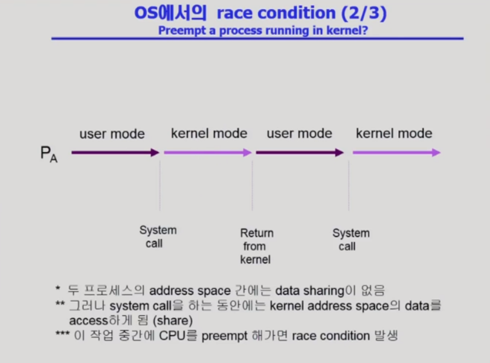
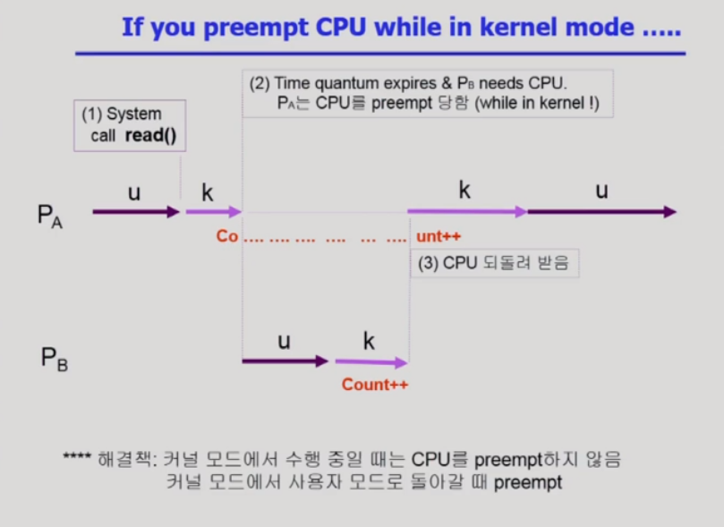
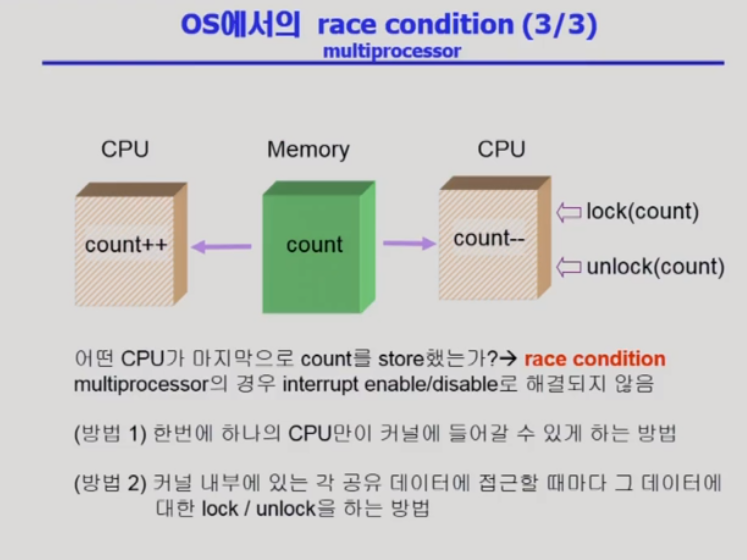
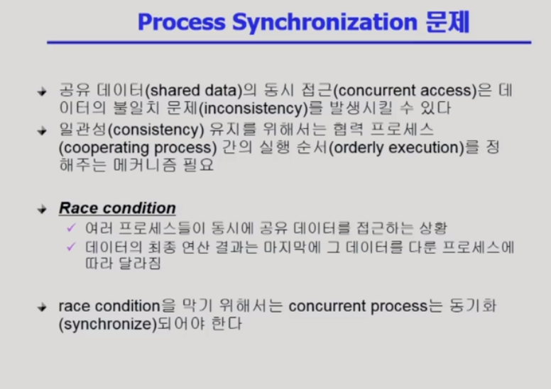
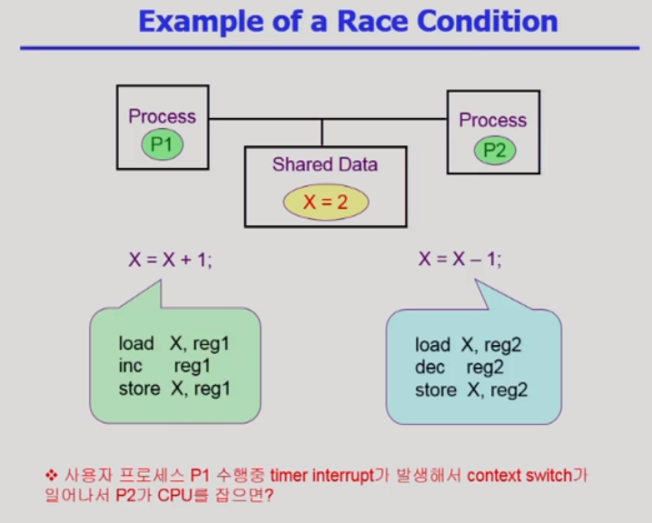
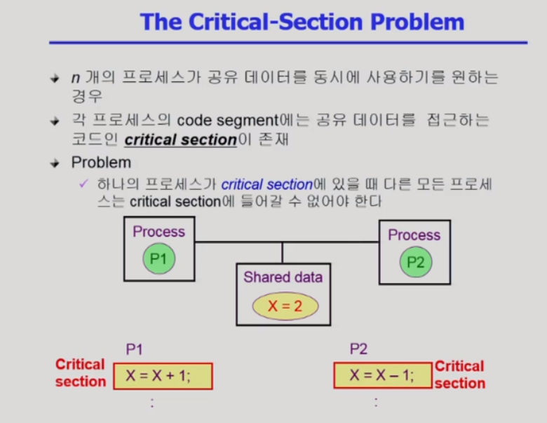

# Process Synchronization 1

> 동기화의 문제에 대해 알아본다.

## 데이터의 접근

- S-box에 저장된 데이터를 E-box로 읽어와서 연산하고 다시 원래 위치로 저장

- Race Condition(경쟁상태) : 하나의 공유 데이터에 동시에 접근하게 되었을 때 생기는 문제
- cpu가 하나여도 문제가 생긴다 : 하나의 프로세스가 시스템콜을 하여 운영체제가 커널의 데이터를 사용하는 중 다른 사용자 프로세스에서 시스템콜이 들어와 작업 중이던 커널의 데이터를 사용하는 과정에서 문제가 발생

- 메모리 변수를 레지스터로 값을 읽어오고 cpu안에서 레지스터 값을 변경하고 다시 메모리에 저장
- Interrupt에 의해 감소된 값이 아닌 context switch 전에 저장된 값에 1을 더하기 때문에 빼는 과정은 반영되지 않고 원하지 않는 값을 얻게 된다
- 변수를 다루기 전에 Interrupt를 disable시키고 다 처리한 후 enable시켜서 해결한다

- 프로세스B가 끝나고 다시 프로세스A로 돌아가면 context를 복원하면서 레지스터값도 B에 의해 증가되기 이전에 저장해놓은 Count 값을 가져와서 B,A에 의해 두 번 증가시켰어도 결과적으로는 프로세스A에 의해 하나만 증가된 값이 저장된다

- CPU가 여러 개인 상황에서도 운영체제가 실행될 때 문제가 생긴다
- 방법 1은 굉장히 비효율적

## Process Synchronization 문제

