# Process Synchronization 1

> 동기화 문제의 해결 방법에 대해 알아본다.

## The Critical-Section Problem

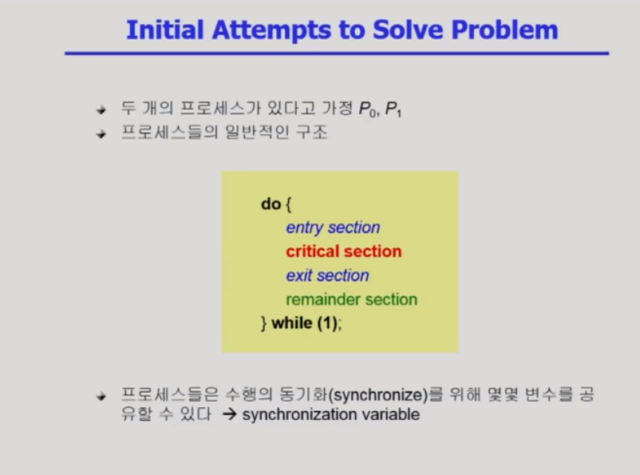

- critical section : 공유 데이터에 접근
- remaminder section : 공유 데이터에 접근하지 않음

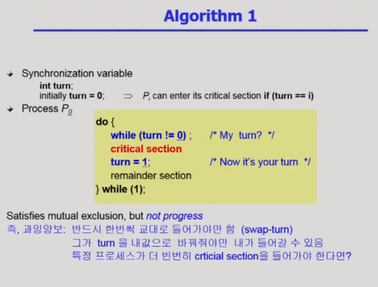

- 동시에 안 들어가게 보장
- 반드시 번갈아 들어가야해서 상대방이 turn 값을 바꿔줘야만 들어갈 수 있다

## 알고리즘이 만족해야하는 조건

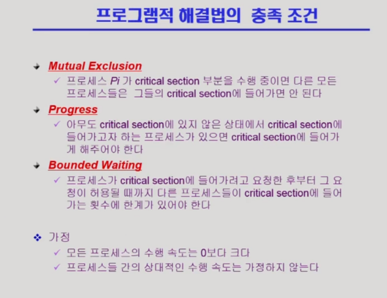

- Mutual Exclusion(상호베제)
- Progress(진행) : 들어간 프로세스가 없는데 한 프로세스가 들어갈려면 다른 프로세스가 turn값을 바꿔줘야지만 들어갈 수 있다
- Bounded Waiting(유한 대기) : Starvation을 막아야 한다

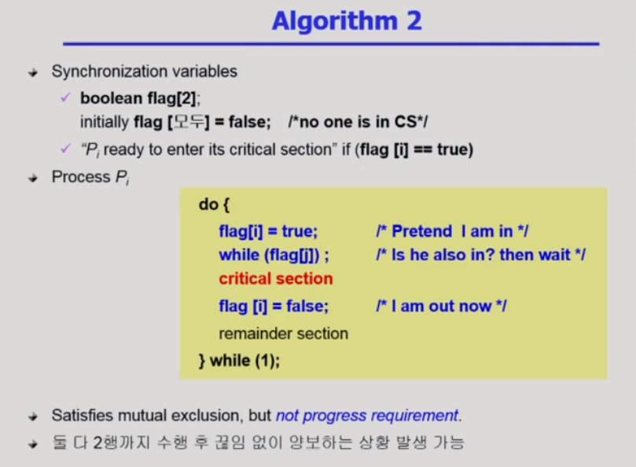

- 프로세스가 critical section에 들어가고 싶을 때 flag를 true로 하고 상대방이 true인지를 확인하고 true이면 나올 때 false로 바뀌는 것을 기다렸다가 진입
- critical section에 들어가기 전 flag가 true인 프로세스가 여러 개면은 어느 프로세스도 진입 못 함

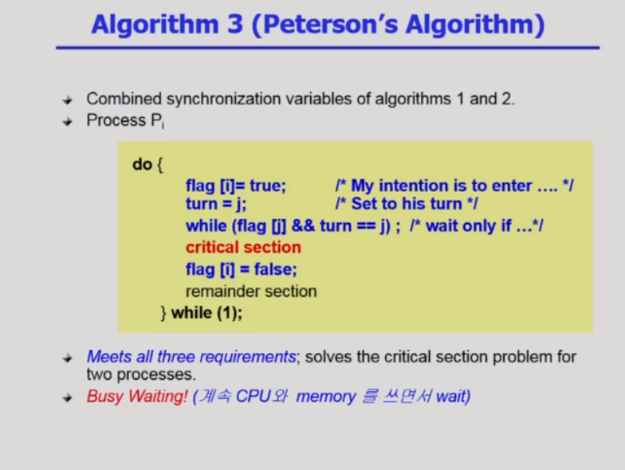

- 앞의 두 방법을 다 사용. flag도 사용, 동시에 flag를 들면 turn을 사용
  1) flag를 true로 하고 turn을 상대방의 차례로 만들고 상대방의 flag가 true고 turn도 상대방이면 상대방 순서가 끝날 때까지 대기
  2) 상대방의 flag가 false이거나 나의 turn일 경우 critical section에 진입
  3) 끝난 뒤에는 자신의 flag를 false로 설정
- 깃발, 턴 순서 바꾸면 동작하지 않는다
- Busy Waiting(spin lock) : CPU가 자신에게 있어 while문을 못 빠져나가 CPU와 메모리 낭비

## 하드웨어적 지원

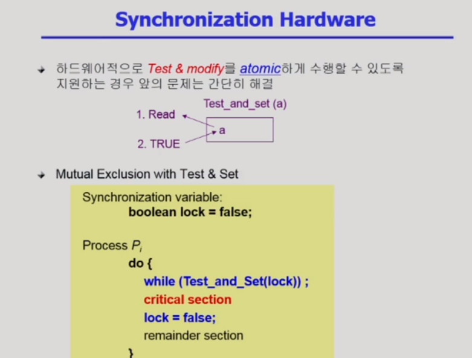

- atomic : 중단되거나 분할될 수 없는 원자적 명령어
- Test_and_Set(lock) : 
  - lock이 0이면 0을 반환하고 lock을 1로 세팅, 빠져나올 때 lock을 0으로
  - 1이면 while문에서 못 내려감

---

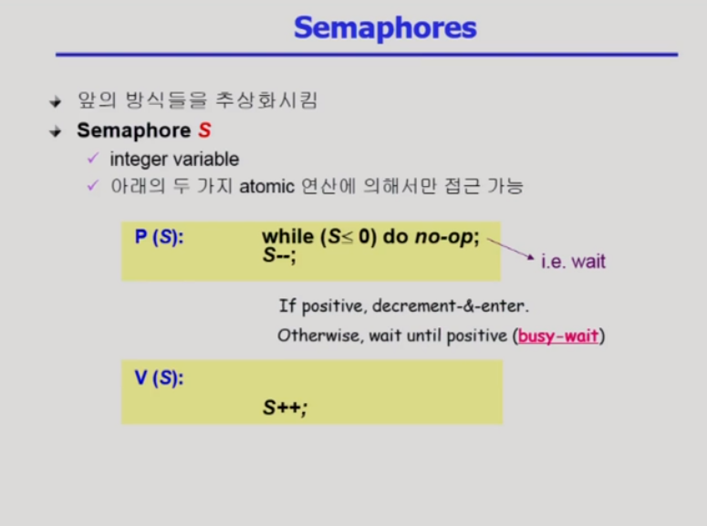

- P연산 : 자원을 획득하는 과정(lock을 거는 과정)
- V연산 : 자원을 반납하는 과정(lock을 푸는 과정)
- S(semaphore 변수)는 공유 자원

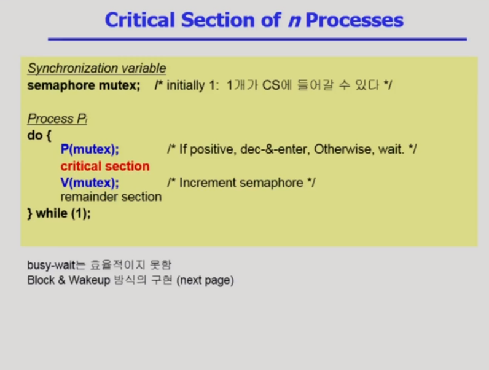

- mutex(mutual exclusion) : 하나만 critical section에 들어갈 수 있다
- semaphore 변수가 0이면 CPU를 반납하는게 효율적

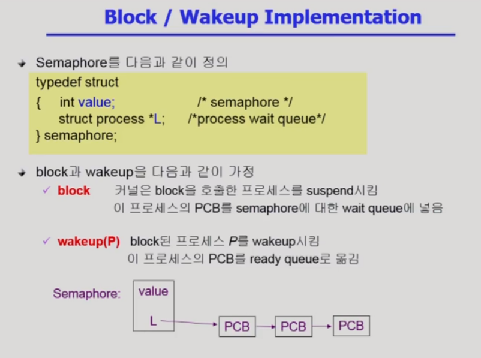

- Block & Wakeup = sleep lock
- semaphore 변수 여분이 없어서 기다려야할 프로세스들을 리스트 구조로 줄 세워 대기시킨다

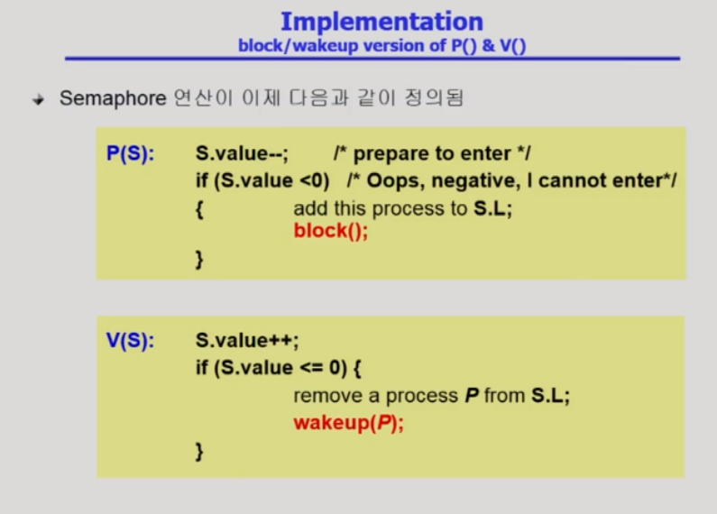

- V연산에서 하나를 더해도 음수나 0이라는 것은 기다리는 프로세스가 있다는 의미, block된 상태인걸 ready 상태로 바꿔줘야 한다
- S는 자원의 갯수가 아닌 음수면 기다리는 프로세스가 있고 양수면 자원이 남는다는 의미

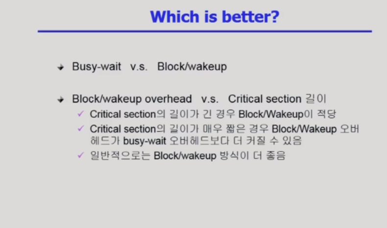

- critical section의 길이가 짧다 = 경쟁이 치열하지 않다 -> busy-wait을 해도 대기 시간이 짧다

# Semaphore의 종류

- Counting semaphore
  - 도메인이 0 이상인 임의의 정수값
  - 여러 개가 있어자원의 갯수를 셀 때
  - 주로 resource counting  사용
- Binary semaphore(=mutex)
  - 0 또는 1 값만 가질 수 있는 semaphore
  - 주로 mutual exclusion (lock/unlock)에 사용

