# 데드락

> 데드락의 문제, 발생 조건, 처리방법 네 가지중 하나인 프리벤션을 알아본다.

## Deadlock(교착상태)

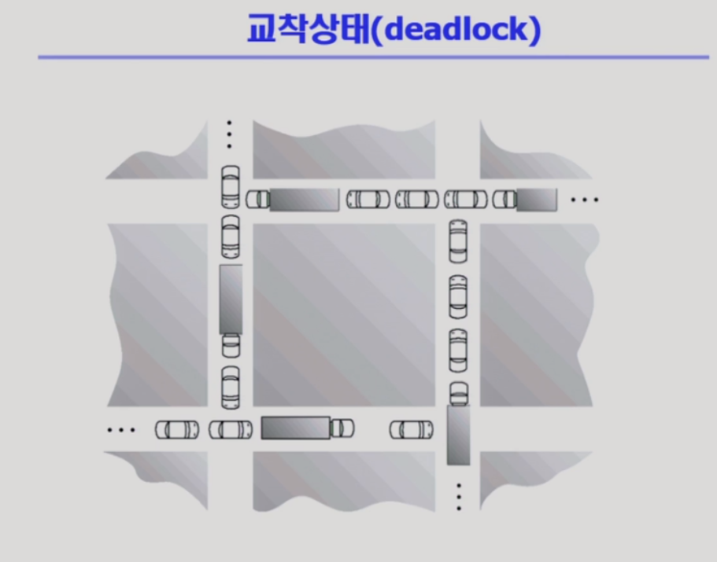

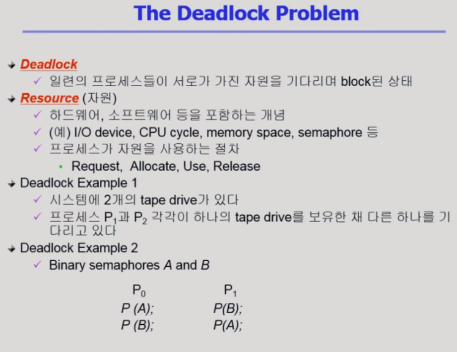

- Deadlock: 일련의 프로세스들이 서로가 가진 자원을 기다리며 block 된 상태

- Resource: 하드웨어 자원과 소프트웨어 자원을 모두 포함

- 프로세스가 자원을 사용하는 절차
  1. 자원을 요청
  2. 자원을 획득
  3. 자원을 사용
  4. 자원을 반납

## Deadlock 발생의 조건

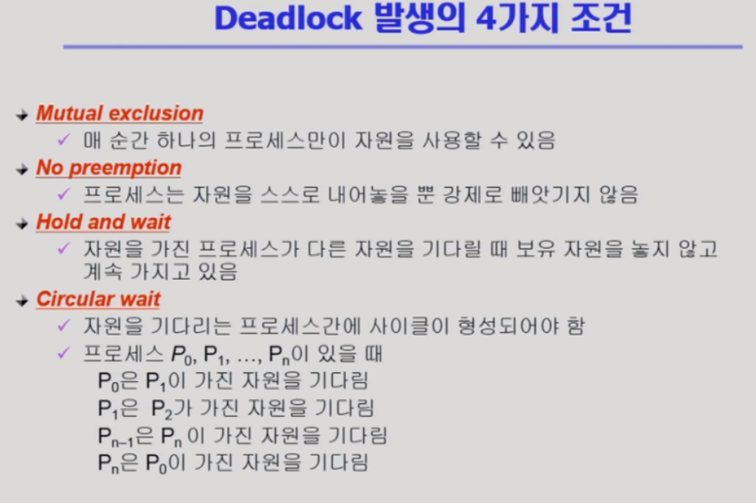

- Mutual exclusion(상호 배제) : 자원 독점
- No preemption(비선점) : 자원을 빼앗기지 않는다
- Hold and wait(보유 대기) : 가진 자원을 내놓지 않고 필요한 자원을 기다리기만
- Circular wait(환형 대기) : 내가 필요한 조건을 다른 프로세스가 가지는 것이 사이클로
- 4가지 조건을 모두 만족해야 deadlock이 생긴다

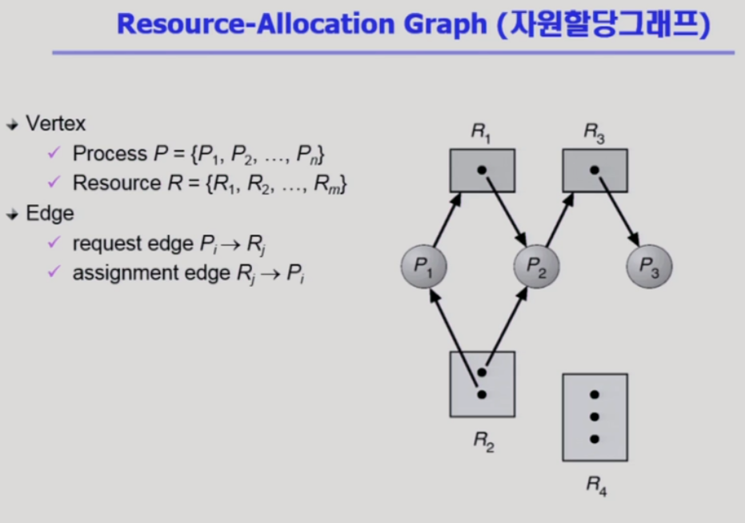

- 자원 -> 프로세스 : 자원이 프로세스에 속해있다

- 프로세스 -> 자원 : 프로세스가 자원을 기다리고 있다

- 사각형 안의 점 : 자원 안의 인스턴스 갯수

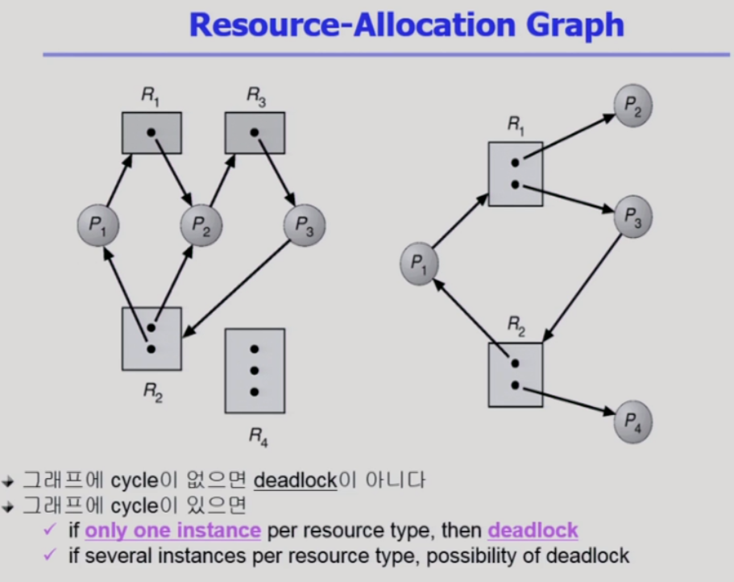

- 첫 번째 : 자원이 2개가 있지만 cycle이 2개라 deadlock이 생긴다
- 두 번째 : cycle이 있지만 cycle과 무관한 p2,p4이 자원을 반납하면 deadlock이 아니다

## Deadlock 처리 방법

- Deadlock Prevention (방지) :
  - 자원 할당 시 Deadlock의 4가지 필요 조건 중 어느 하나가 만족되지 않도록 하는 것
- Deadlock Avoidance (방지) :
  - 자원 요청에 대한 부가적인 정보를 이용해서 deadlock의 가능성이 없는 경우에만 자원을 할당
  - 시스템 state가 원래 state로 돌아올 수 있는 경우에만 자원 할당
- Deadlock Detection and recovery : 
  - Deadlock 발생은 허용하되 그에 대한 detection 루틴을 두어 deadlock 발견시 recover
- Deadlock Ignorance (방치) :
  - Deadlock을 시스템이 책임지지 않음
  - UNIX를 포함한 대부분의 OS가 채택

### Deadlock Prevention

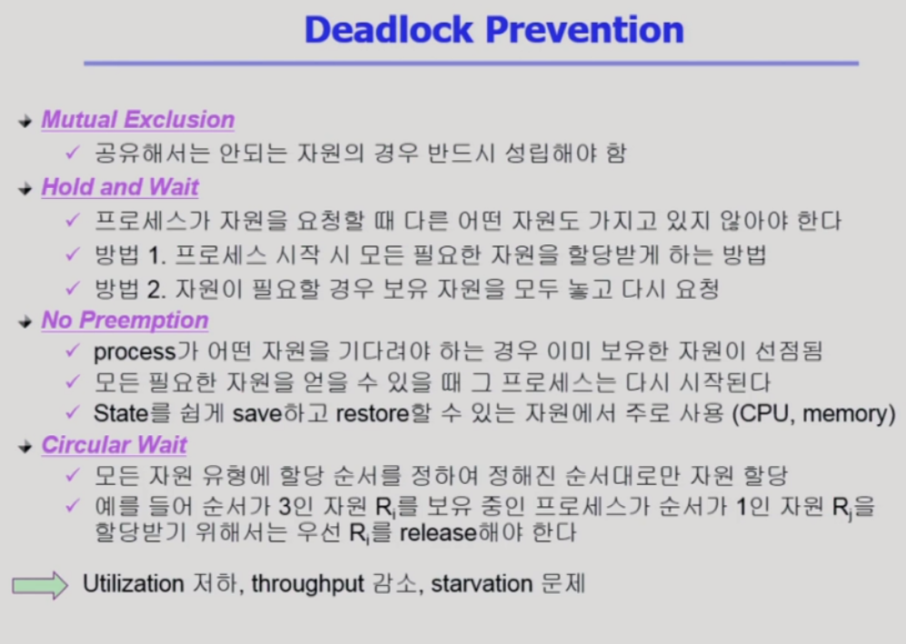

- Deadlock Prevention: 데드락이 발생하는 4가지 원인 중 하나를 원천적으로 차단

1) Mutual Exclusion: 한 번에 하나의 프로세스만 사용할 수 있는 자원에 대해 발생하기 때문에 차단 불가능

2) Hold and wait: 자원을 기다려야하는 상황에서는 자원을 보유하고 있지 않으면 됨. 
   1. 프로세스가 시작될 때, 프로세스가 평생에 필요한 모든 자원을 할당받게 만들어줌. 그리고 작업이 끝나면 그때 자원을 반납. 하지만 매 시점마다 필요로 하는 자원이 다른데 그걸 모두 잡고 있으면 자원 활용의 비효율성
   2. 자원이 필요할 때 그때마다. 자원을 Hold 한 상태에서 다른 자원을 기다려야 해서 wait 한다면 이미 hold 하고 있는 자원도 뱉어낸 다음 기다리는 방식. 이러면 누군가는 필요한 자원을 얻고 데드락을 해소

3) No Preemption: 필요한 자원을 가져올 수 없기 때문에 데드락 발생. 프로세스가 한 번 가져가면 중간에 빼앗아올 수 없기 때문에 deadlock 발생. CPU, 메모리 등등은 타이머 등의 interruption을 통해 preemption이 가능하기 때문에 데드락 발생 x(state를 쉽게 save 하고 restore 할 수 있기 때문). 하지만 어떤 자원은 중간에 빼앗아오면 완전 엉망이 되어서 preemtion을 허용하지 않는 경우도 발생.

4) Circular wait: 자원에 할당 순서를 정해놓고 정해진 순서대로만 자원을 할당

- 하지만 생기지도 않을 수 있는 deadlock을 prevention하기 위해 자원 이용률, 작업 처리량, 기아 문제 등 낭비

### Deadlock Avoidance

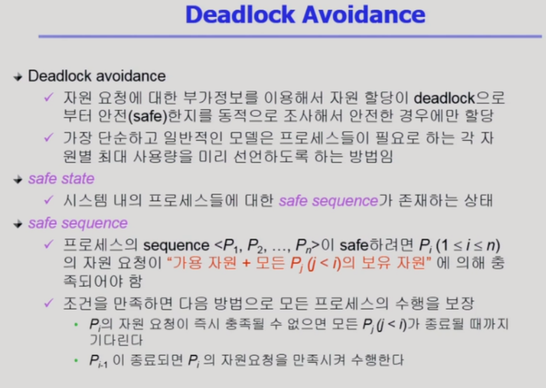

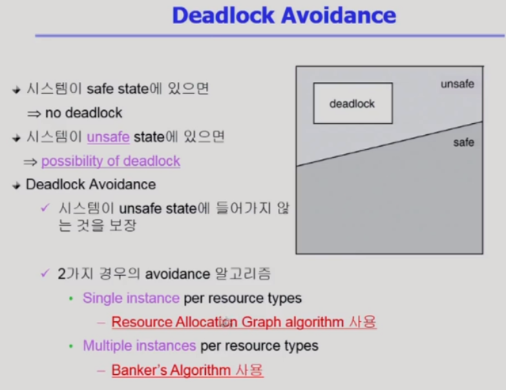

#### Resource Allocation Graph algorithm

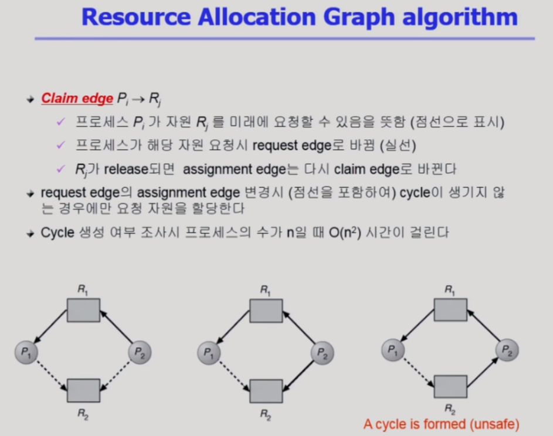

- 각 자원 당 인스턴스가 하나밖에 없을 때
- 프로세스를 시작할 때, 그 프로세스가 평생에 쓸 자원을 모두 알고있다고 가정. 때문에 deadlock의 가능성이 조금이라도 있다면 프로세스가 요청한 자원에 여분이 있더라도 자원을 할당해주지 않음.
- 항상 SAFE한 상태를 유지. Safe 하다는 건, 여분 자원만 가지고도 작업을 끝낼 수 있는 프로세스만 해당.

#### Banker's Algorithm

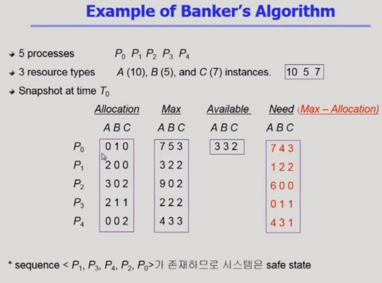

- 가용 자원(Available)이 있더라도 최대 필요량(Need)을 만족해야만 그때서야 필요량을 할당
- 가용 자원만으로 프로세스를 하나씩 종료시킬 수 있는 시퀀스(P1,P3,P4,P2,P0)가 존재하면 safe state

### Deadlock Detection and Recovery

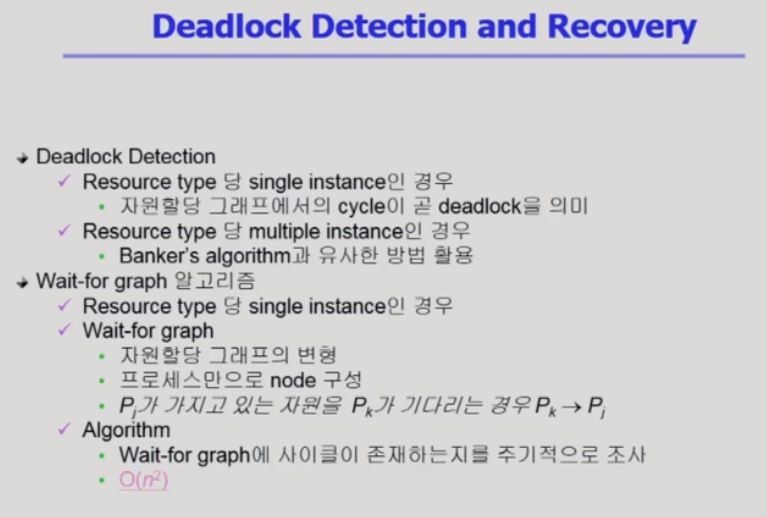

- 자원 당 인스턴스 갯수에 따라 방법이 나뉜다
- 하나인 경우

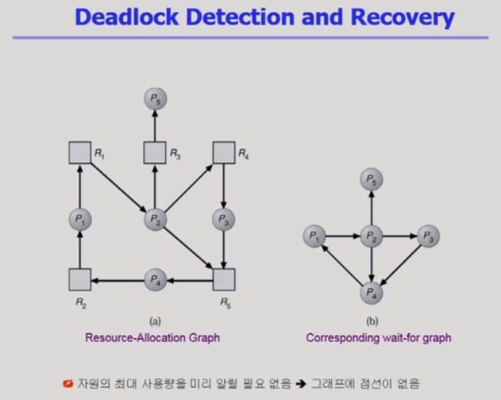

- 자원 당 인스턴스 갯수가 하나인 경우
- 자원을 빼고 프로세스끼리 연결하면 오른쪽 그래프

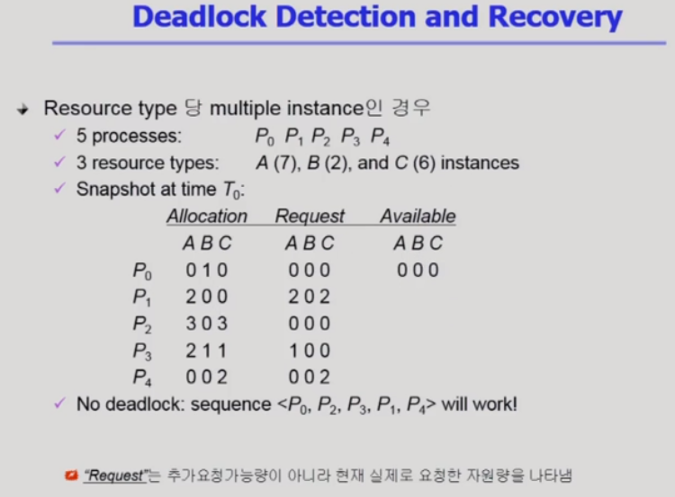

- 자원 당 인스턴스 갯수가 여러개인 경우
- banker는 최악을 가정하고 보수적으로 데드락 방지, detection은 낙관적으로 가정해서 요청이 없는 프로세스는 가진 자원을 반납할 것으로 가정해서 지금 데드락이 있냐를 체크
- P2가 C를 요청하는 순간 데드락(반납될거라고 가정하는 자원이 P0의 B 하나밖에 없어서 어느 프로세스의 요청을 만족시키지 못하니깐 데드락)

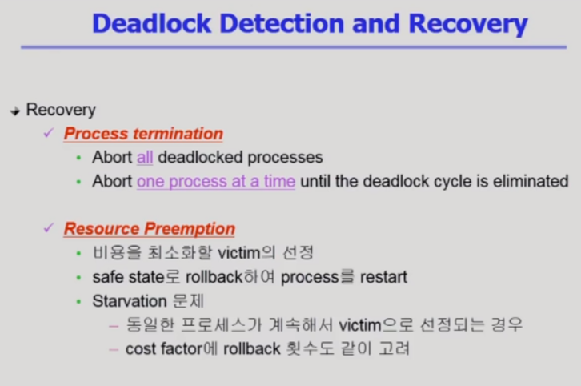

- 연루된 프로세스를 죽인다
  
  1. 모두 죽이는 방법
  
  2. 하나씩 죽여서 데드락이 사라지는지 확인하는 방법
  
- 자원 뺴앗기
  - 비용을 최소화하는 희생양을 죽인다 -> 계속 희생되면 stavation
  - 희생 횟수도 고려
  - safe state로 rollback, process를 restart

### Deadlock Ignorance

- Deadlock이 매우 드물게 발생하므로 deadlock에 대한 조치 자체가 더 큰 overhead일 수 있음
- 만약, 시스템에 deadlock이 발생한 경우 시스템에 비정상적으로 작동하는 것을 사람이 느낀 후 직접 process를 죽이는 등의 방법으로 대처
- UNIX, Windows 등 대부분의 범용 OS가 채택
- Deadlock은 현대에서는 중요성이 상당히 떨어지는 챕터이다
- 시험문제 내기에는 참 좋다

