# 메모리 관리

> 메모리 주소의 종류와 주소 바인딩, 변환방식, 관련 용어, 물리적인 메모리 관리에 있어서 두 방식 중 하나인 연속할당을 알아본다.

## Logical vs Physical Address

- Logical address(=virtual address)
  - 프로세스마다 독립적으로 가지는 주소 공간
  - 각 프로세스마다 0번지부터 시작
  - **CPU가 보는 주소는 logiacl address임**
  - 기계어에 있는 주소가 논리적 주소이므로 CPU는 논리적 주소를 본다
- Physical address
  - 메모리에 실제 올라가는 위치

* 주소 바인딩 : 주소를 결정하는 것
  - Symbolic Address(변수나 함수  이름 같은) -> Logical Address -> Physical address

## 주소 바인딩(Address Binding)

- Compile time binding
  - 물리적 메모리 주소(physical address)가 컴파일 시 알려짐
  - 시작 위치 변경시 재컴파일
  - 컴파일러는 절대 코드(absolute code) 생성
  - 전용 컴퓨터(특수한 목적을 위해 사용하는 컴퓨터)용
- Load time binding
  - Loader의 책임하에 물리적 메모리 주소 부여
  - 컴파일러가 재배치가능코드(relocatable code)를 생성한 경우 가능
- Execution time binding(=Run time binding)
  - 수행이 시작된 이후에도 프로세스의 메모리 상 위치를 옮길 수 있음
  - CPU가 주소를 참조할 때마다 binding을 점검 (address mapping table)
  - 하드웨어적인 지원이 필요(base and limit register, MMU)

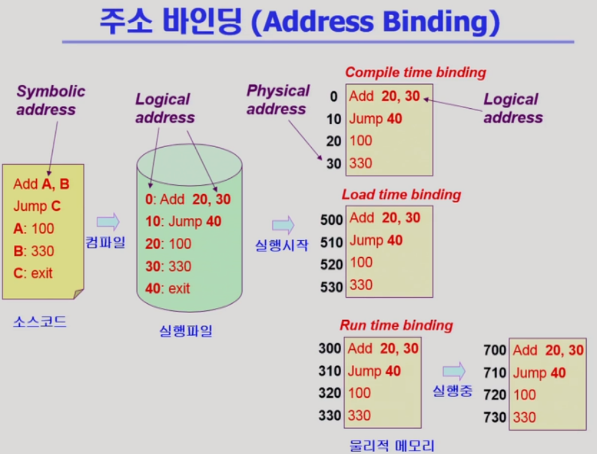

### MMU

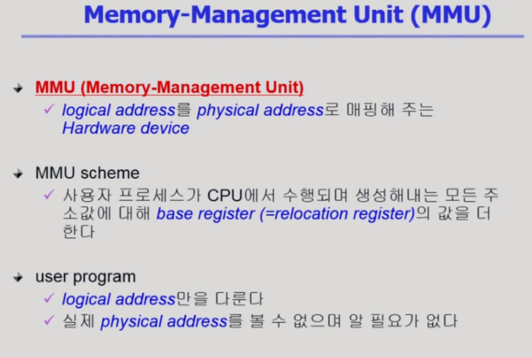

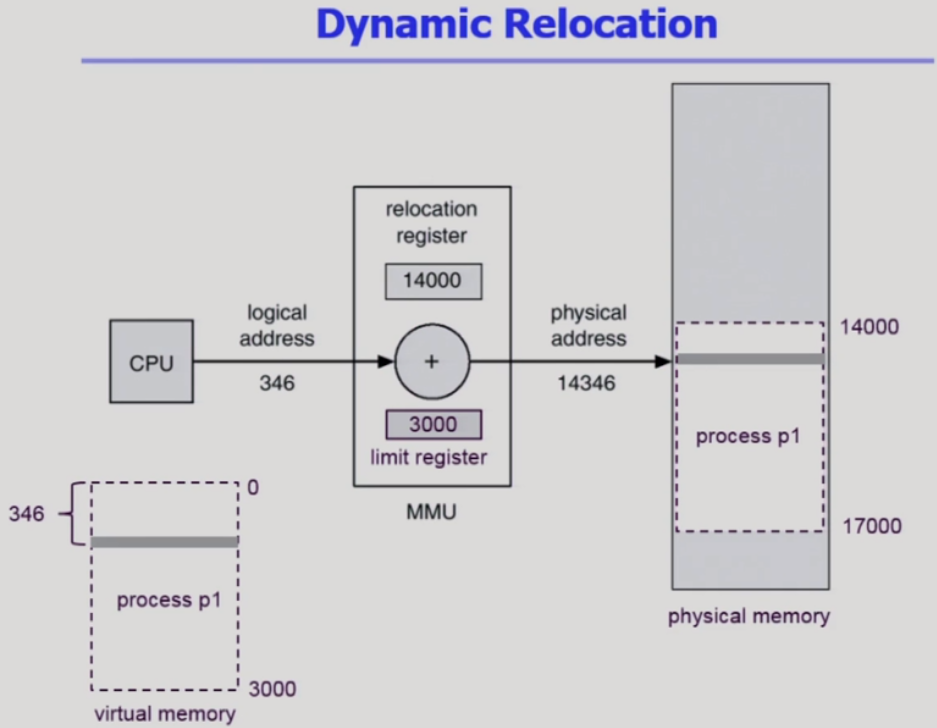

- base register와 limit register 두 개로 

- address를 벗어나면 trap

## 용어 설명

- Dynamic Loading(Loading : 메모리로 올리는 것) : 
  - 프로세스 전체를 메모리에 미리 다 올리는 것이 아니라 해당 루틴이 불려질 때 메모리에 load하는 것
  - memory utilizaion의 향상 (당장 필요한 부분만 올려서 메모리 낭비를 줄인다)
  - 가끔씩 사용되는 많은 양의 코드의 경우 유용, 예) 오류 처리 루틴(평상 시 쓸 일 없음)
  - 운영체제의 특별한 지원 없이 프로그램 자체에서 구현 가능(OS는 라이브러리를 통해 지원 가능)
- Dynamic Linking : 
  - Linking(소스코드와 라이브러리가 연결되는)을 실행 시간(execution time)까지 미루는 기법
  - Stack linking (<- Static library):
    - 라이브러리가 프로그램의 실행 파일 코드에 포함됨
    - 실행 파일의 크기가 커짐
    - 동일한 라이브러리를 각각의 프로세스가 메모리에 올리므로 메모리 낭비(printf 함수의 라이브러리 코드)
  - Dynamic linking(<- shared library) : .so(shared object) .dll(dynamic link library)
    - 라이브러리가 실행 시 연결(link)됨
    - 라이브러리 호출 부분에 라이브러리 루틴의 위치를 찾기 위한 stub이라는 작은 코드를 둠
    - 라이브러리가 이미 메모리에 있으면 그 루틴의 주소로 가고 없으면 디스크에서 읽어옴
    - 운영체제의 도움이 필요
- Overlays : 
  - 메모리에 프로세스의 부분 중 실제 필요한 정보만을 올림
  - 프로세스의 크기가 메모리보다 클 때 유용
  - 운영체제의 지원없이 사용자에 의해 구현
  - 작은 공간의 메모리를 사용하던 초창기 시스템에서 수작업으로 프로그래머가 구현(Manual overlay, 프로그래밍이 복잡)
- Swapping : 
  - 프로세스를 일시적으로 통째로 메모리에서 backing store로 쫓아내는 것
  - Backing store(=swap area) : 디스크(많은 사용자의 프로세스 이미지를 담을 만큼 충분히 빠르고 큰 저장공간)
  - Swap in/Swap out : 
    - 일반적으로 중기 스케줄러(swapper)에 의해 swap out 시킬 프로세스 선정
    - priority-based CPU scheduling algorithm
      - priority가 낮은 프로세스를 swapped out 시킴
      - priority가 높은 프로세스를 메모리에 올려 놓음
    - Compile time 혹은 load time binding에서는 **원래 메모리 위치**로 swap in 해야 함(힘듬)
    - Execution time binding에서는 추후 빈 메모리 영역 아무 곳에나 올릴 수 있음
    - swap time은 대부분 tranfer time (swap되는 양에 비례하는 시간)임

---

## 물리적인 메모리의 관리 기법(Allocation of Physical Memory)

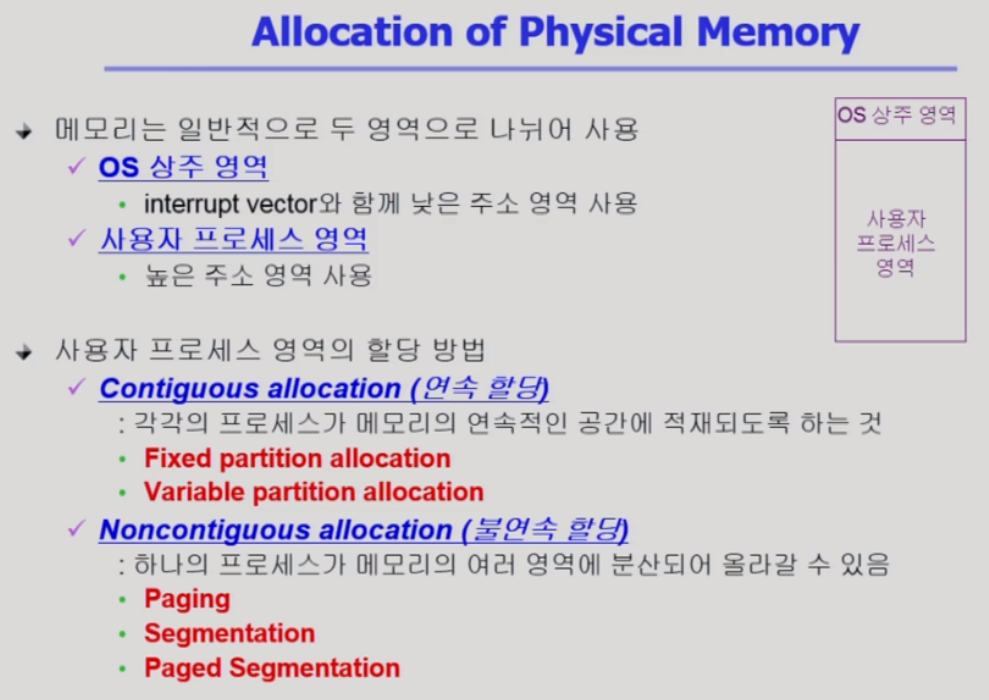

### 연속 할당(Contiguous allocation)

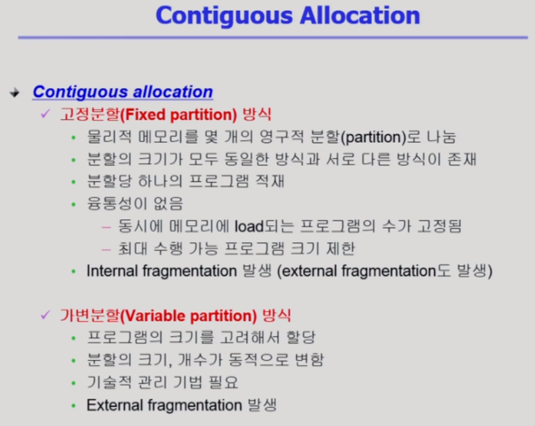

- 현재는 전혀 안 쓰고 이론만 알고 가자

- Internal fragmentation(내부 조각) : 프로그램 B가 분할 2에 못 들어가고 분할 3에 들어가고 남는 공간
  - 프로그램 크기보다 분할의 크기가 큰 경우
  - 하나의 분할 내부에서 발생하는 사용되지 않는 메모리 조각
  - 특정 프로그램에 배정되었지만 사용되지 않는 공간
- External fragmentation(외부 조각) : 분할 2 낭비되는 공간
  - 프로그램 크기보다 분할의 크기가 작은 경우
  - 아무 프로그램에도 배정되지 않은 빈 곳인데도 프로그램이 올라갈 수 없는 작은 분할

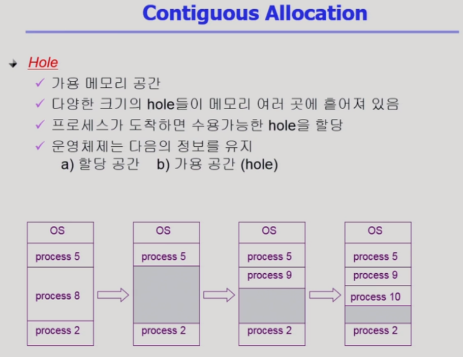

- 비어있는 hole 중 어디다가 프로그램을 올릴 것을 결정

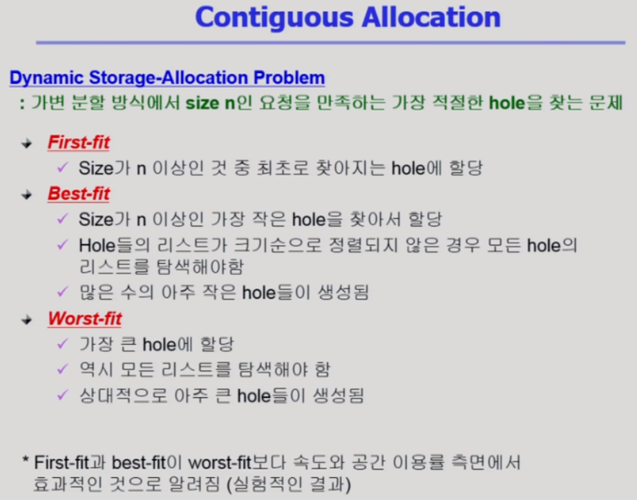

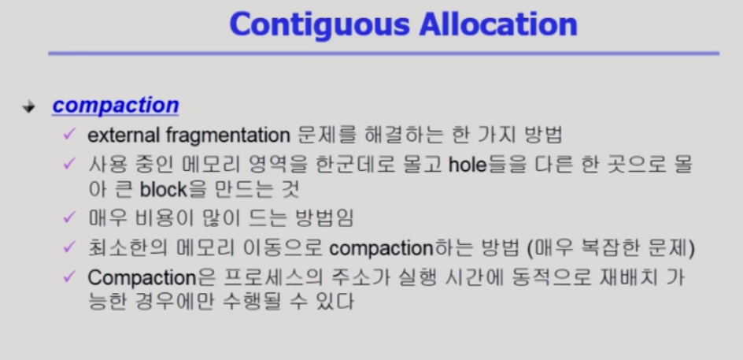

# 메모리 관리 2

>  물리적인 메모리 관리 중 남은 한 방식인 불연속할당과 관련해 페이징 기법에 대해 알아본다.

### 불연속 할당(Noncontiguous allocation)

#### Paging

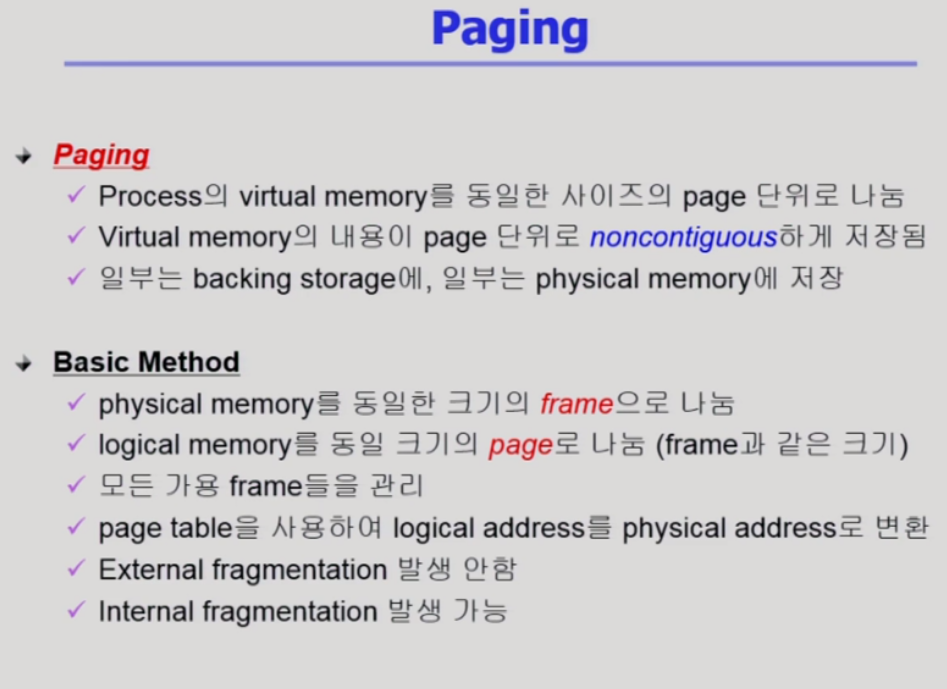

- 기본 4kb
- 외부 조각 발생 안 함
- 내부 조각은 발생할 수 있다(할당이 됐는데 사용은 안 됨, 4kb로 프로그램을 자르다보면 맨 마지막에 4kb가 꽉 안 찰 수 있다)

- 각각의 페이지의 주소 변환을 위한 page table(각 entry의 값에 접근)

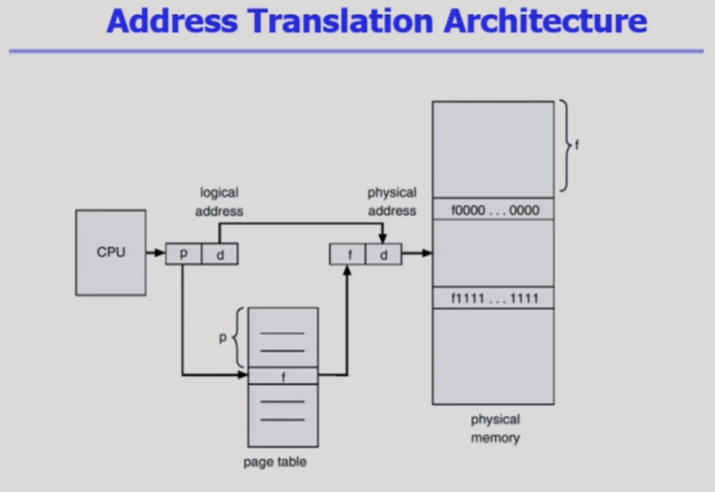

- 몇 page에 있는가와  page 안에서 얼마나 떨어져있는지가 담겨 있는 offset d, 32비트 주소 체계를 쓴다면 프로그램이 가질 수 있는 크기는 2**32 = 4GB-> 백만페이지
- 백만에 가까운 페이지, 총 32비트 중 4kb를 구분할 offset d를 뺀 나머지가 페이지를 이루는 비트

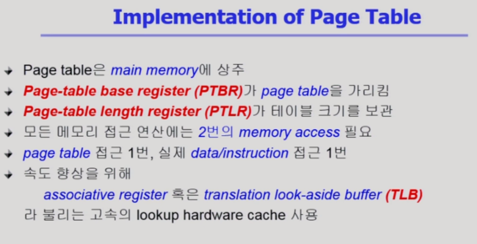

- 너무 커서 main memory에 상주
- page table에 한 번 접근하고 위치를 얻으면 다시 메모리의 그 위치로 가서 정보를 얻고
- TLB : 주소 전환을 빨리하기 위한 캐시 메모리

##### TLB(translation look-aside buffer)

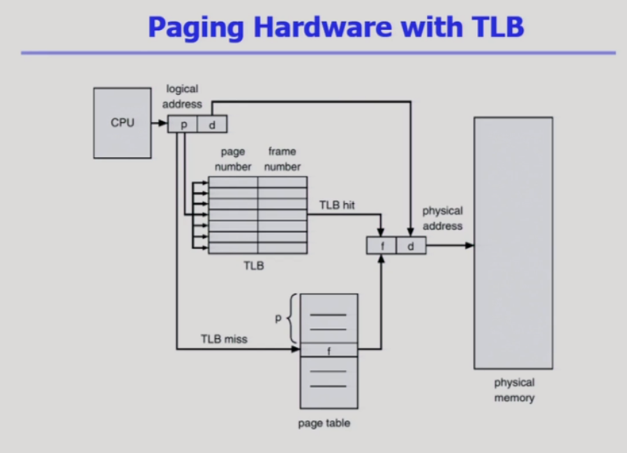

- 일부를 TLB에 담아서 빠르게 접근
- page table과는 다르게(p) page number와 frame number를 쌍으로 가지고 있어야 한다
- TLB에 있는 지 다 확인해야되서 overhead가 크다
- 순차적 탐색이 오래 걸려서 associative register로 병렬적으로 한번에 있는지를 파악

##### Associative Register

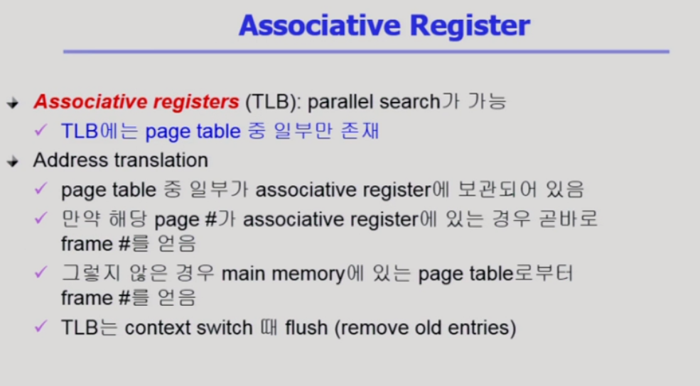

- 프로세스마다 page table이 다 따로 있어서 context switch시 flush

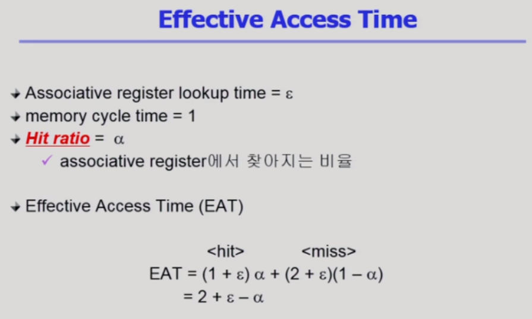

- 입실론은 작고 알파가 1에 가까운 값을 가지므로 2-> 1에 가까운 값으로 상당한 효과를 가진다

##### Two-Level Page Table

- 시간상으로는 손해이나 공간상으로 이득
- 사용 안 되는 부분들이 전부 page table에 만들어지는 것을 막음

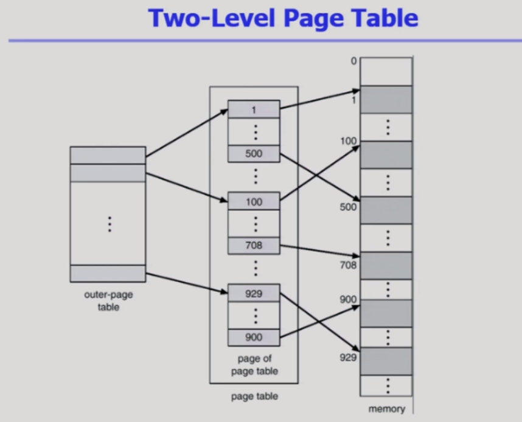

- 중간 page table은 하나가 4kb, entry는 1k개
- outer에서 안 쓰는 곳은 null로 2단계 page-table에서 안 만들어 진다

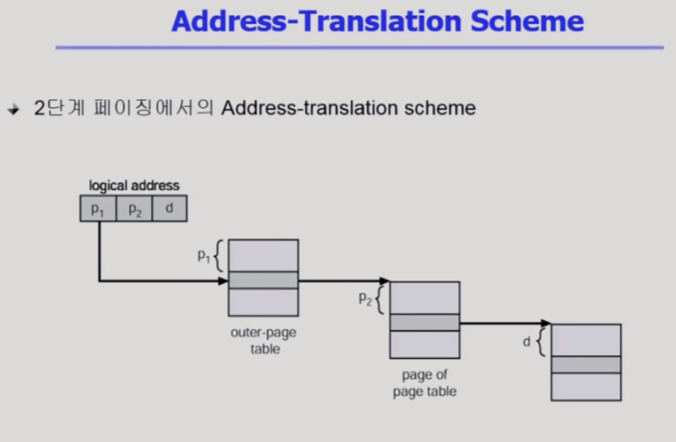

- outer-page의 시작 위치는 PTBR(Page Table Base Register)
- p2 -> frame 번호
- d는 12비트(4kb를 구분하기 위해)

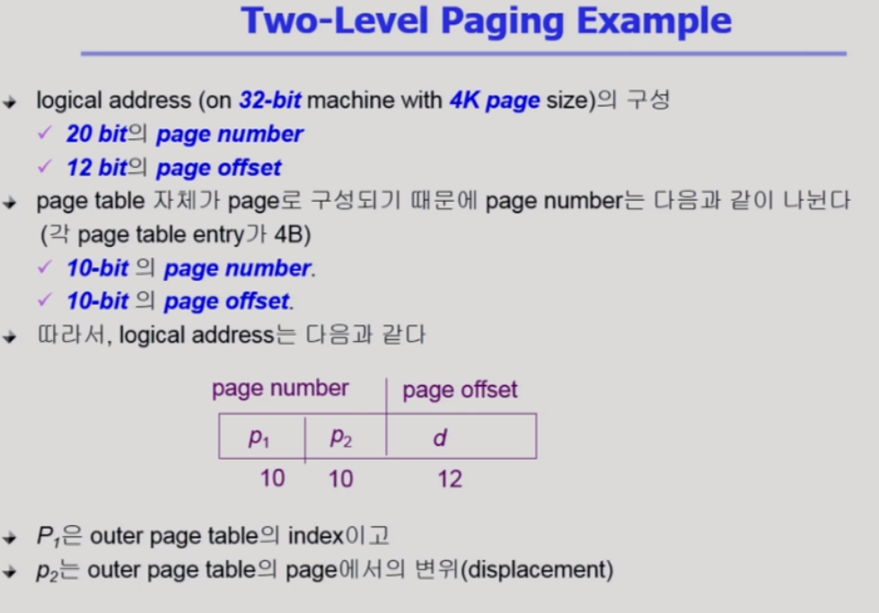

- p2는 1024를 구분하기 위해 2**10을 구분하기 위해 10비트 필요
- 4kb를 4바이트(페이지) 단위로 구분하므로 1k-> 1024개를 구분

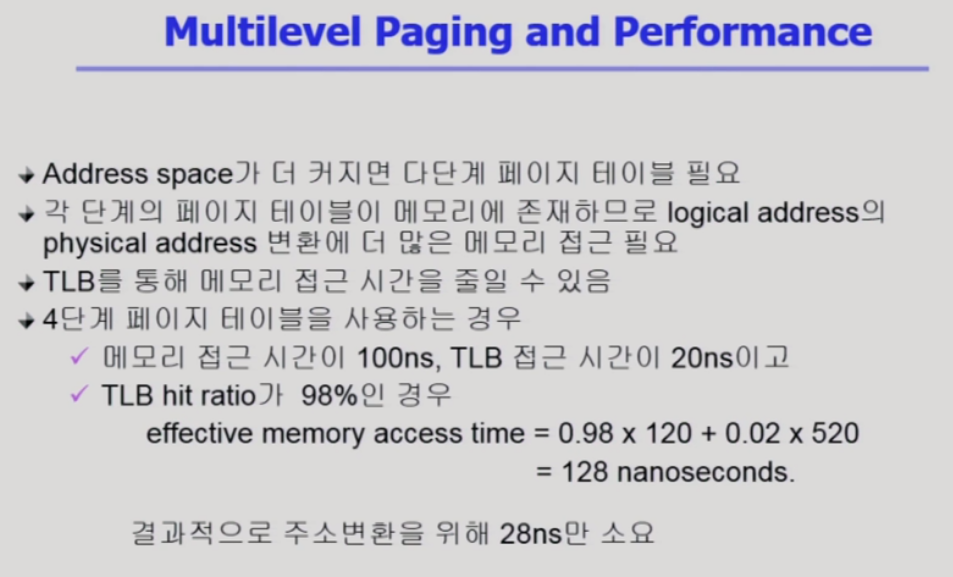

- 다단계 페이지를 써서 메모리 접근 횟수가 늘어도 TLB의 hit ratio를 높여서 시간을 적절하게 유지

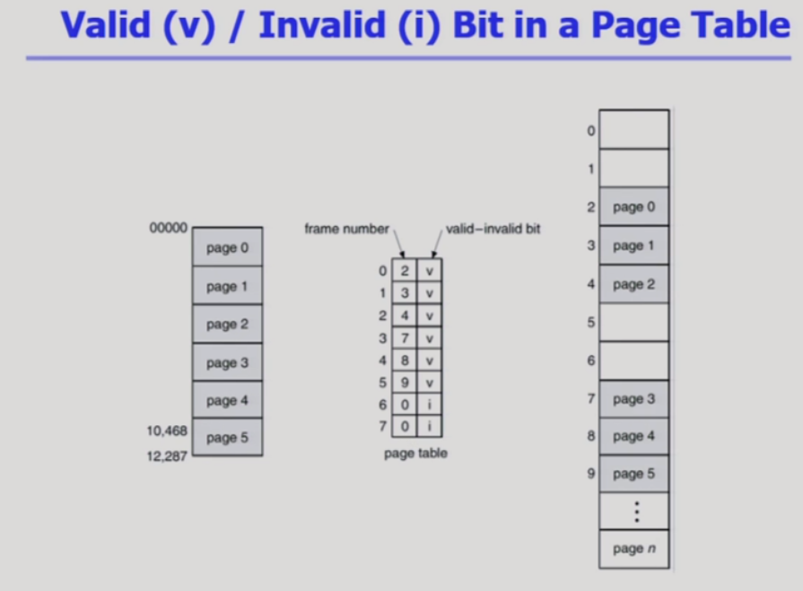

- 판별 비트 하나 추가
- 실제로 메모리에 올라가 있으면 valid, invalid는 디스크에 있을 수도 있고 사용 안 해서일 수도 있고

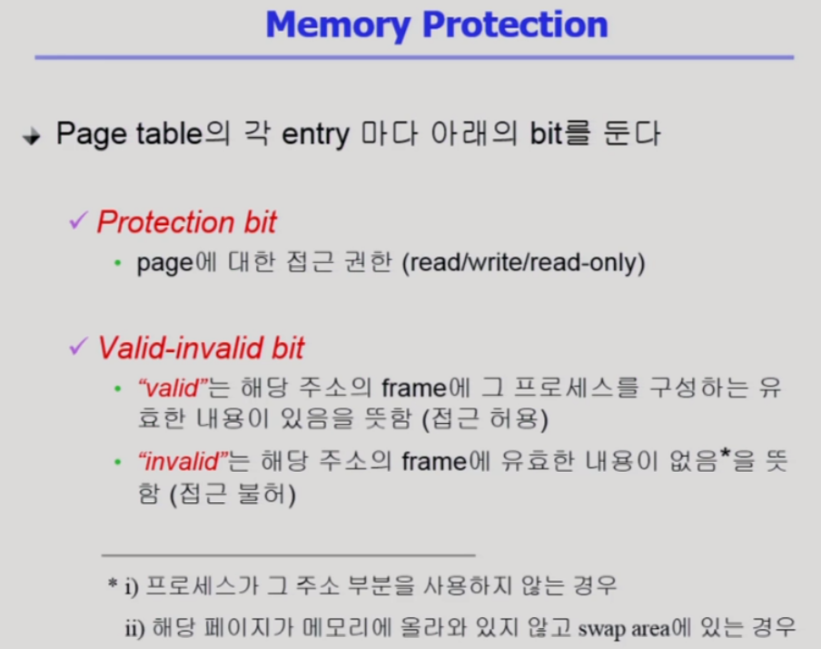

- 보안을 위한 비트 하나 추가
- 프로세스의 접근에 대한 권한이 아니라(어차피 프로세스 자신) read, write, read-only에 대한 권한
- 코드를 담은 페이지는 read-only

# 메모리 관리 3

>   물리적인 메모리 관리 방법인 세그먼트에 대해 알아본다.

##### Inverted Page table

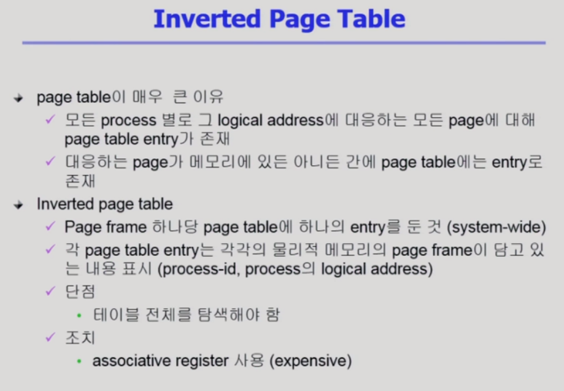

- **14분 다시 들어 보기**
- 장점 : 시스템 전체에 page table이 하나
- 단점 : 
  - 주소 변환을 위해 page table을 모두 검색해봐야 한다
  - associative register로 page table을 한번에 훑으면 되는데 비싸다

- p가 어느 프로세스의 p인지를 담는 pid

##### Shared page

- Shared code

  - Re-entrant Code(=Pure code), 재진입 가능 코드

  - 제약 조건 1 . **read-only**로 하여 프로세스 간에 하나의 code만 메모리에 올림

    (eg, text editors, compilers, window systems)

  - 제약 조건 2. Shared code는 **모든 프로세스의 logical address space에서 동일한 위치**에 있어야 함

- Private code and data

  - 각 프로세스들은 독자적으로 메모리에 올림
  - Private data는 logical address space의 아무 곳에 와도 무방

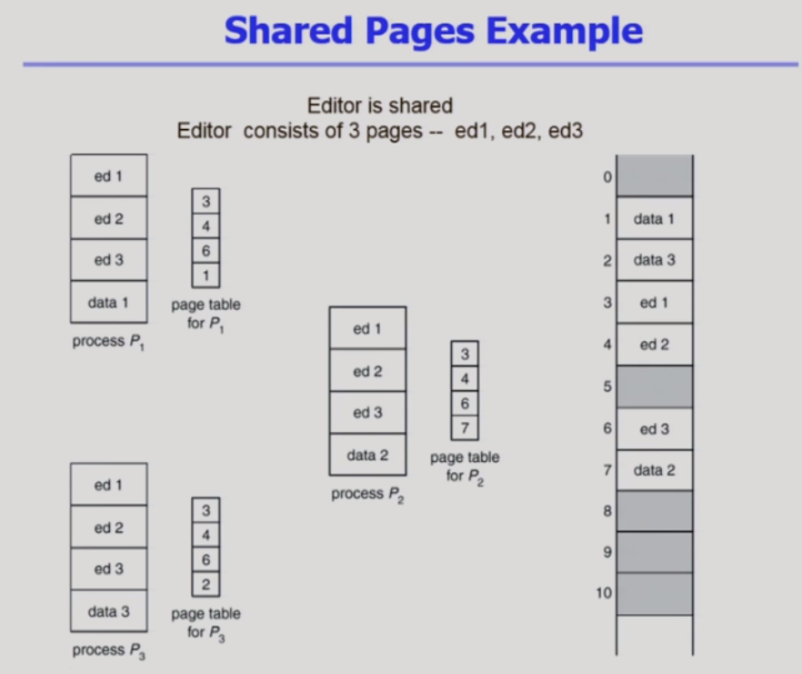

- 기계어 자체가 같기에 논리적인 주소도 모두 같아야 한다

#### Segmentation

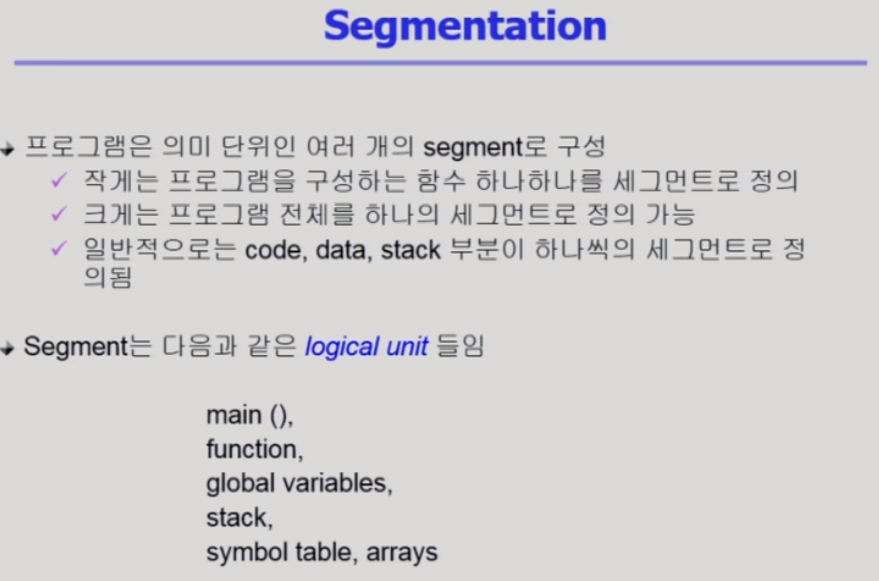

- Segment-table base register : 물리적 메모리에서의 segment table 위치
- Segment-table lenght register : 프로세스가 몇 개의 segment로 이루어 졌는가

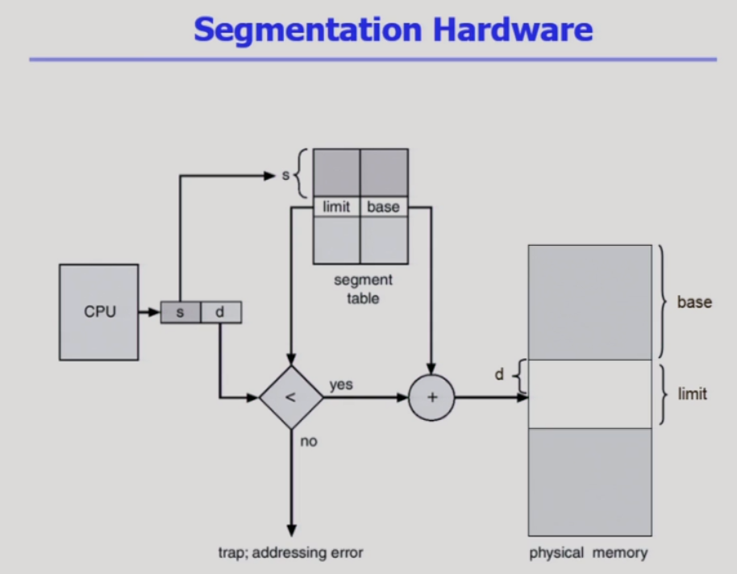

- paging에서는 page 길이가 다 같아서 불필요 했지만 segment는 길이가 다 다르므로 limit이 필요
- s가 STRL를 넘지 않는지 체크
- d가 limit을 벗어나는지를 확인하고 벗어나면 trap
- base는 주소를 나타내는 바이트

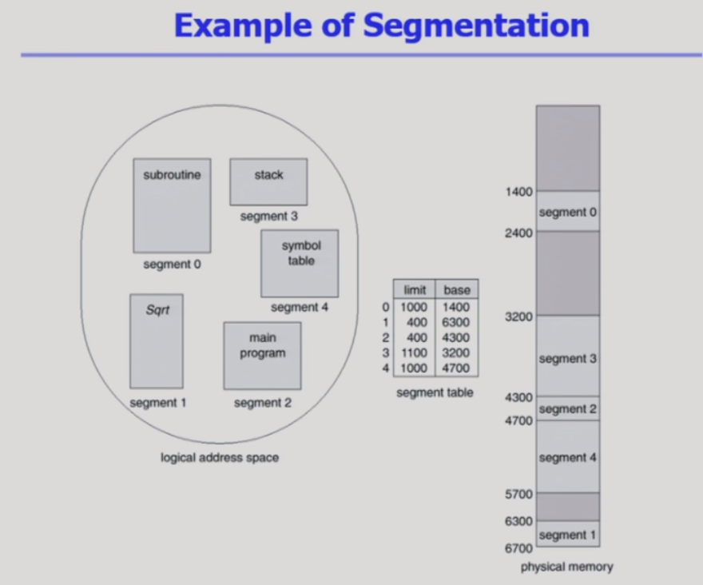

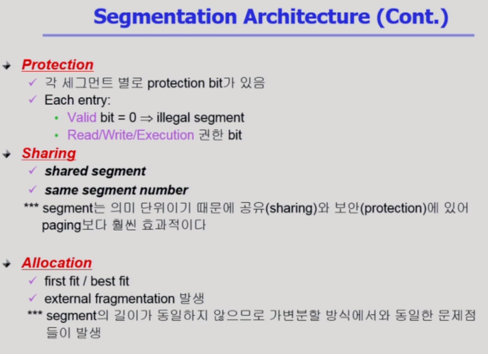

- valid bit 존재
- 보안이 필요한 코드와 그렇지 않은 코드가 의미별로 다 나뉘어져 있어서 유리(paging은 끝 부분이 애매하게 짤릴 때 남은 내부 조각 처리가 애매)
- 공유에서 유리
- 배치 문제는 처음 찾는 주소랑 크기가 제일 적절한 주소로 정하는 등의 방법(paging에서는 문제 없음)
- 외부 조각 발생
- 현실적인 구현 측면에서 segment table은 몇 개 안되나 page table은 엄청 많아서
- 그러나 실제 시스템에서는 page 기법을 근간으로 사용

#### Paged Segmentation

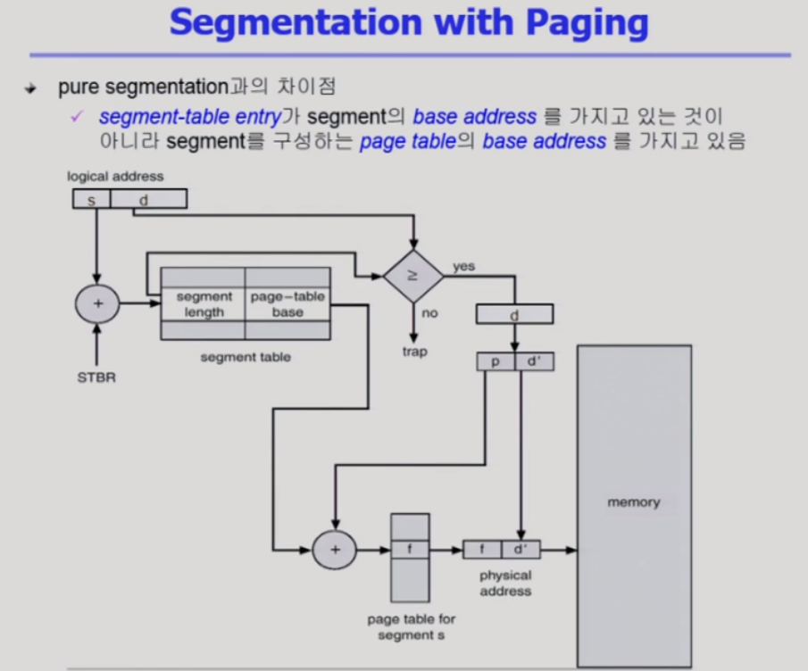

- 기본적으로 segment 기법, segment가 여러개의 page로 구성

이번 챕터는 하드웨어의 역할

virtual 은 os의 역할

- segment 하나가 여러 개의 page로 구성. 때문에 메모리에 올라갈 때 page 단위로 잘려서 올라감. segment table entry가 물리적 메모리에서 segment가 어디서 시작하는지 나타내는 base address가 아니라 segment를 구성하는 page의 위치를 나타내는 page table의 base address를 가지고 있음. 이를 통해 segment의 크기가 각각 달라 hole이 발생하는 문제를 해결. 

- 어떤 segment를 read-only로 설정할 것인지 등등의 의미단위 작업은 segment table에서 미리 설정.

 

1) logical address에서 s를 통해 setment table 내의 몇 번째 segment entry를 나타내는지 확인

2) 그렇게 알게 된 segment table의 s에서 segment 내부의 page의 시작 위치인 page-table base를 확인

3) 한편, 물리적 메모리에서 해당 segment가 어디에서 시작하는지 나타내는 offset값 d와 s를 비교하여 error를 검출

4) 3번에서 이상이 없다면 offset값 d를 나눠서 page의 page-table에서 몇 번째 page entry인지 나타내는 p값과 page의 어디에서 시작되는지 나타내는 offset 값 d'를 확인

5) 1~4번에서 얻은 값을 통해 최종적으로 논리적 주소를 물리적 메모리 주소로 변환

 

- 이 모든 작업은 MMU라는 하드웨어와 CPU가 해줘야 하는 일. 여기서 운영체제가 하는 일은 없음. 운영체제는 IO Device에 접근할 때. 하지만 메모리 접근 시에는 하드웨어가 작업. 

