# 프로세스 관리

> 프로그램의 실행 과정을 이해하고 커널이 가진 내용과 사용자 프로그램이 사용하는 함수를 알아본다.

## 1. 프로그램의 실행

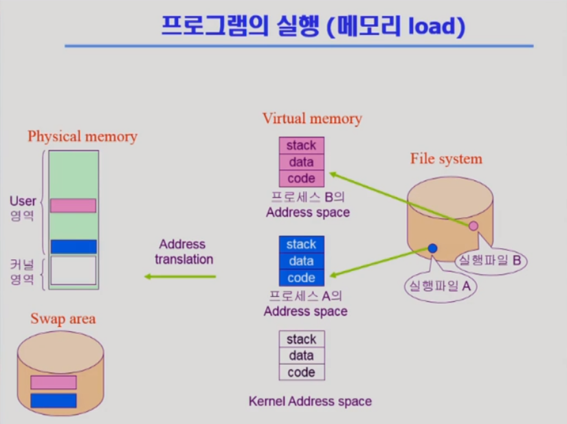

- Address translation
  - 가상 영역에서 물리 영역으로 이동할 때 논리적인 주소 → 물리적인 주소 변환 필요
- Address space: 가상 영역, Kernel 의 구성
  - code: 실행에 필요한 기계어 코드들
  - data: 실행 중에 메모리에 올라와 있는 객체 데이터 ex) 전역 변수, 인스턴스
  - stack: 함수 내부에서 사용하는 객체들

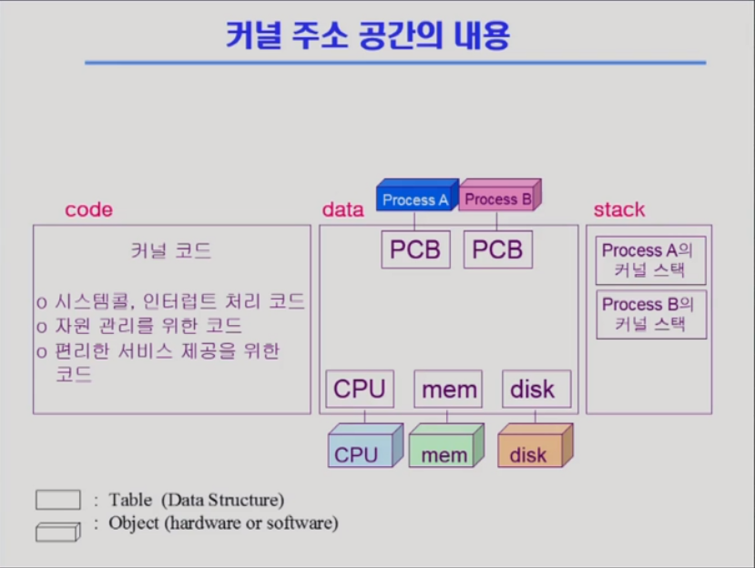

- PCB(Process Control Block): CPU, mem, disk 정보가 포함
- Kernel의 stack은 각 프로세스마다 개별적으로 운영된다

## 함수

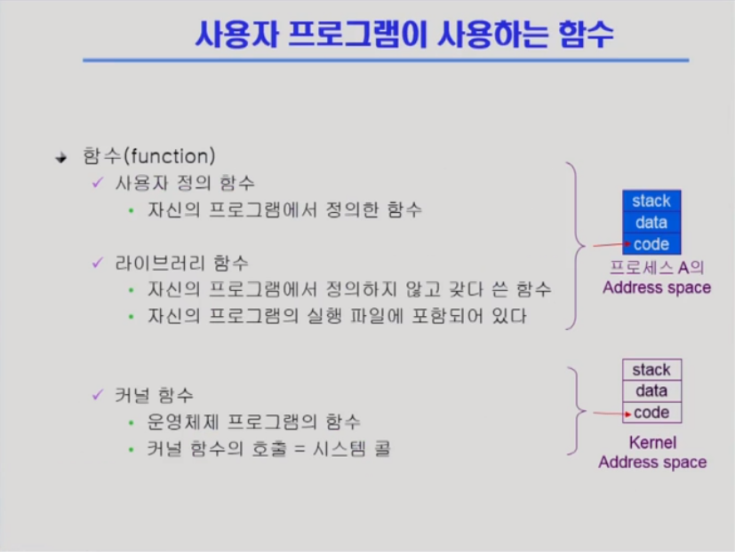

- 시스템 콜: I/O 사용 시 시스템 제어권을 운영체제에 넘기기 위해 사용

## 프로그램 실행

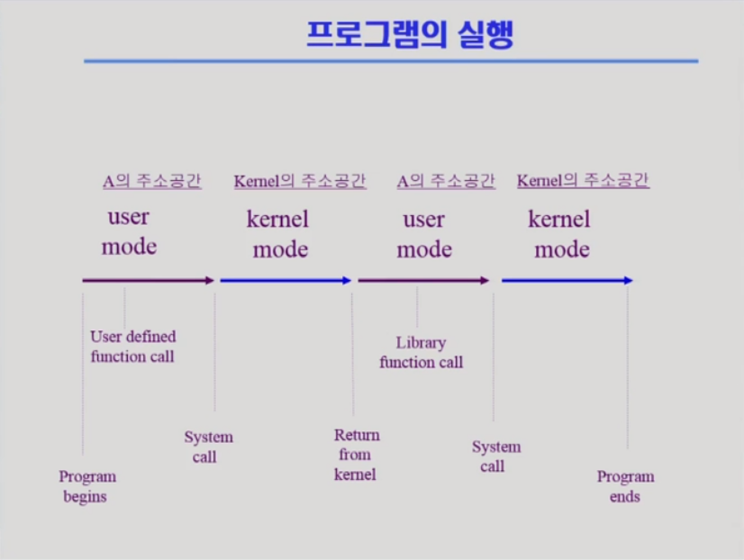

user mode - modebit - 1

kernel mode - modebit - 0

# 2. 프로세스의 개념

> 프로세스의 개념, 상태, 문맥과 운영체제가 프로세스를 큐에 넣고 관리하는 형태에 대해 알아본다, Process is a program in execution(실행)

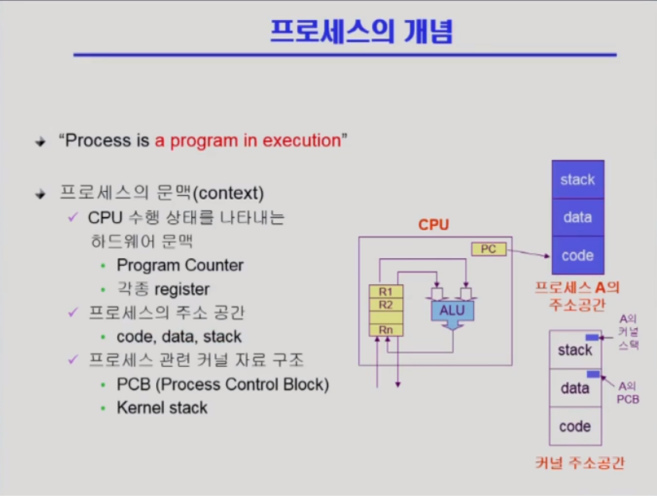

## 프로세스의 문맥

- 현재 프로세스의 상태를 나타낸다
- 현재 CPU를 얼마나 썼는가, 메모리를 얼마나 가지는가, 무슨 함수를 진행하는가

## 프로세스의 상태

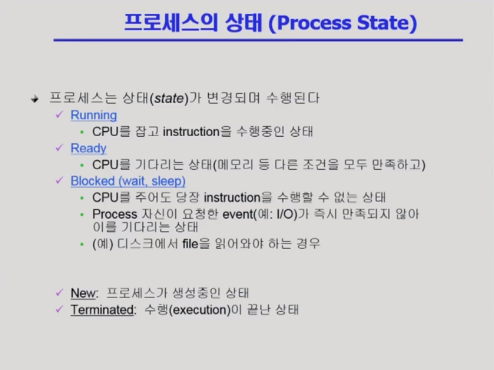

- 공유데이터에 접근하는 프로세스를 제외한 나머지 프로세스는 Blocked 상태이다
- Ready : 프로세스가 메모리에 존재하는 상태

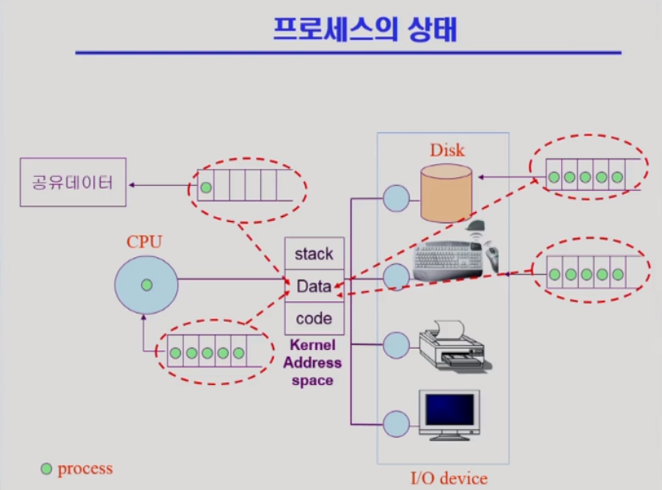

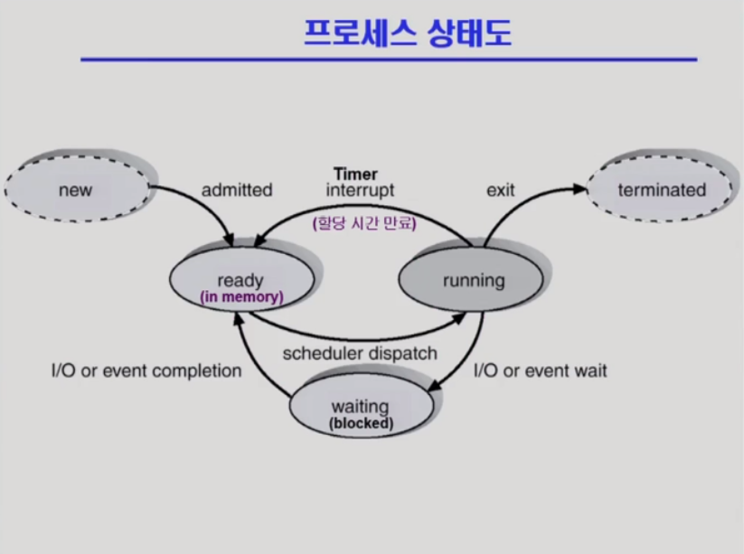

q) 프로세스가 cpu에서 기계어 실행을 하다가 cpu를 내놓는 경우 3가지

- timer interrupt : 할당 시간 만료
- I/O or event wait : I/O나 오래 걸리는 작업 때문에 blocked로 가서 작업이 끝나면 interrupt로 다시 ready que로
- exit : 프로세스 종료

## Process Control Block (PCB)

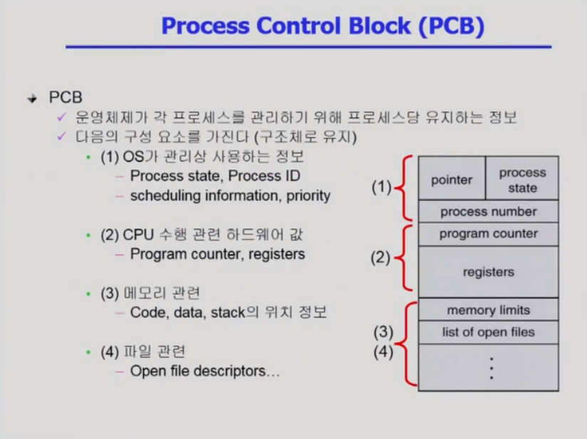

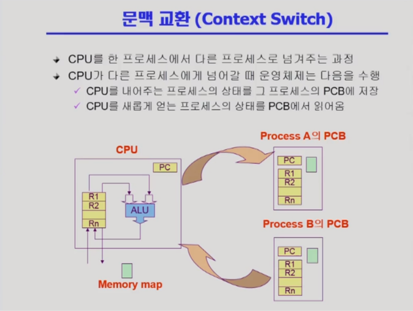

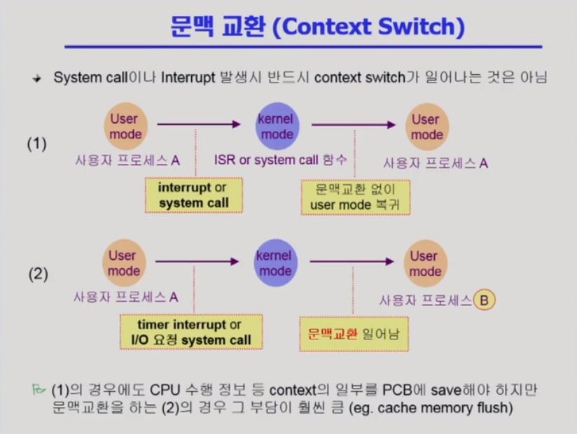

q) 문맥교환은 언제 일어나는가

- Overhead : 어떤 명령어를 처리하는데 소비되는 간접적, 추가적인 *컴퓨터* 자원을 의미한다.
- Register : 프로세서에 위치한 고속 메모리로 극히 소량의 데이터나 처리 중인 중간 결과와도 같은 프로세서가 바로 사용할 수 있는 데이터를 담고 있는 영역을 레지스터라고 한다.

## 프로세스를 스케줄링하기 위한 큐

- Job queue
  - 현재 시스템 내에 있는 모든 프로세스의 집합
- Ready queue
  - 현재 메모리 내에 있으면서 CPU를 기다리는 프로세스 집합
- Device queues
  - I/O device의 처리를 기다리는 프로세스의 집합

## 3. 스케줄러 (Scheduler)

> 스케줄러의 세 종류인 장기, 단기, 중기 스케줄러에 대해 알아본다.

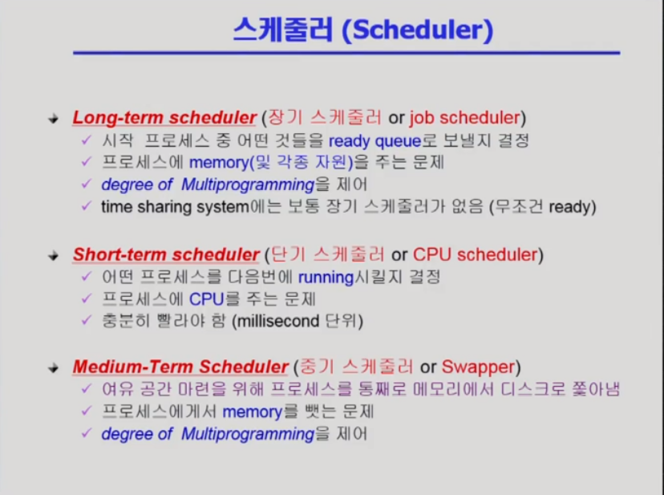

- 장기 스케줄러 = 메모리 스케줄러 
  - 프로세스 상태 변경: new → ready 로 admit 해주는 역할 (메모리에 들어오도록 허락해주는)
  - degree of Multiprogramming: 메모리 안 프로세스 수를 적절하게 조절
  - 우리가 다루는 일반적인 운영체제에는 없다
- 단기 스케줄러 = CPU 스케줄러
  - 자주 호출(timer interrupt 한번마다 호출)
- 중기 스케줄러(time sharing system에서는 중기가 장기 대체)
  - 메모리 부족해지면 뺏어온다
- Suspended(Stopped - 일을 아예 못하는 정지된 상태) -> 중기 스케줄러가 들어가면서 추가된 프로세스의 상태
  - 외부적인 이유로 프로세스의 수행이 정지된 상태
  - 프로세스는 통째로 디스크에 swap out된다
  - break key: 사용자가 프로그램을 일시 정지시킨 경우
  - 외부에서 resume 해주어야 Active (수동적)
    - Blocked: 자신이 요청한 event가 만족되면 Ready (능동적)

q) 중기 스케줄러로 생긴 프로세스의 상태에 대해 설명

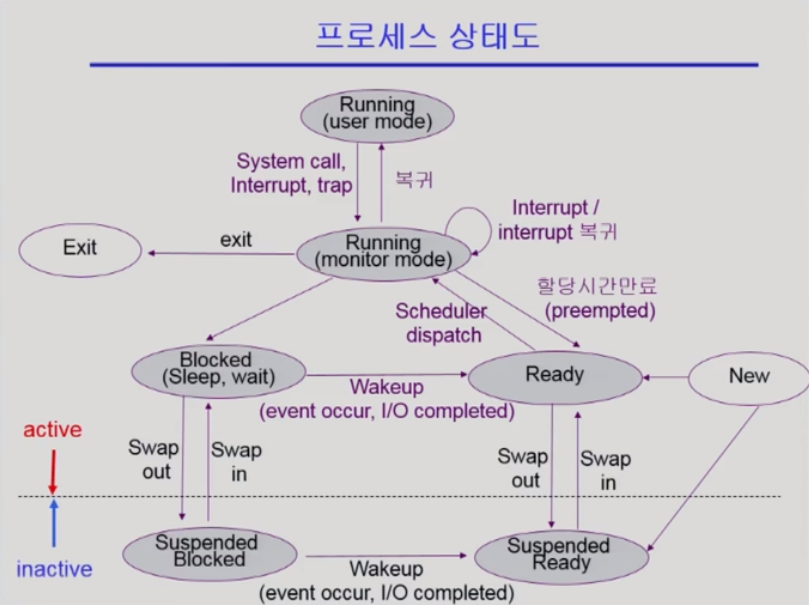

