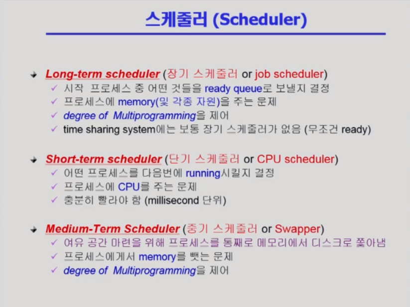
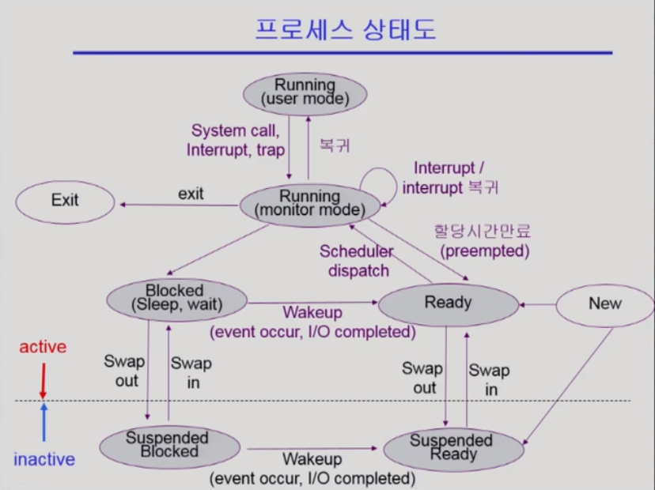
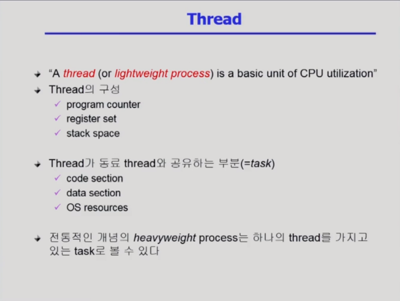
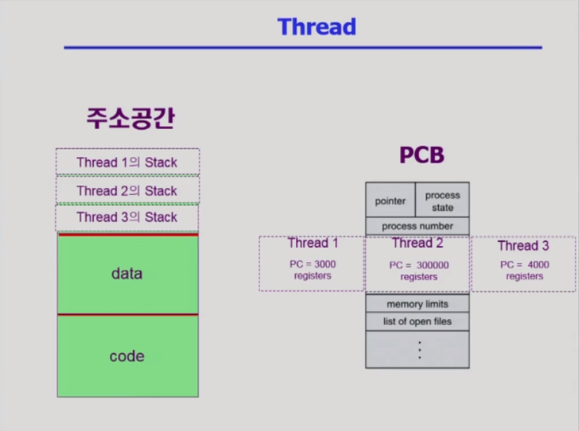
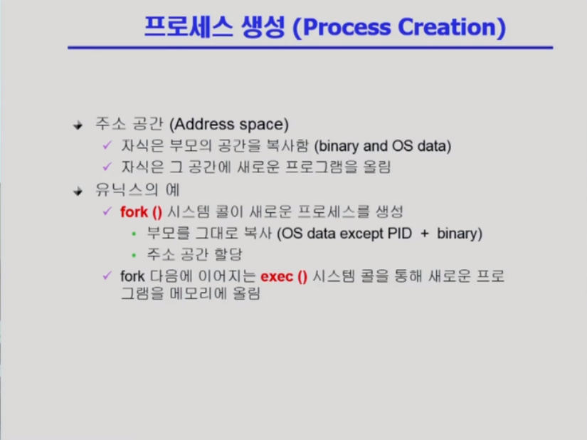
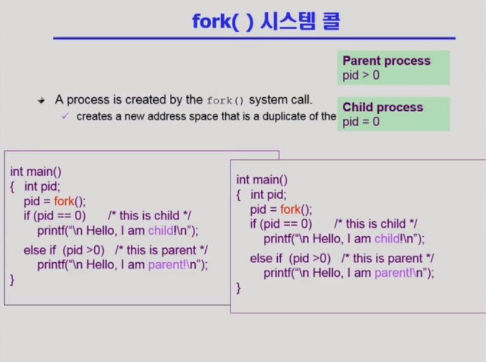
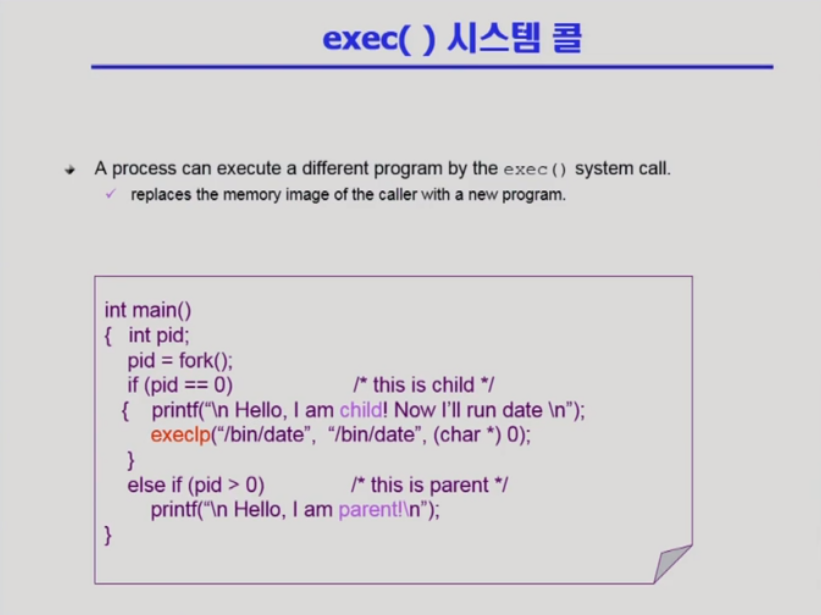
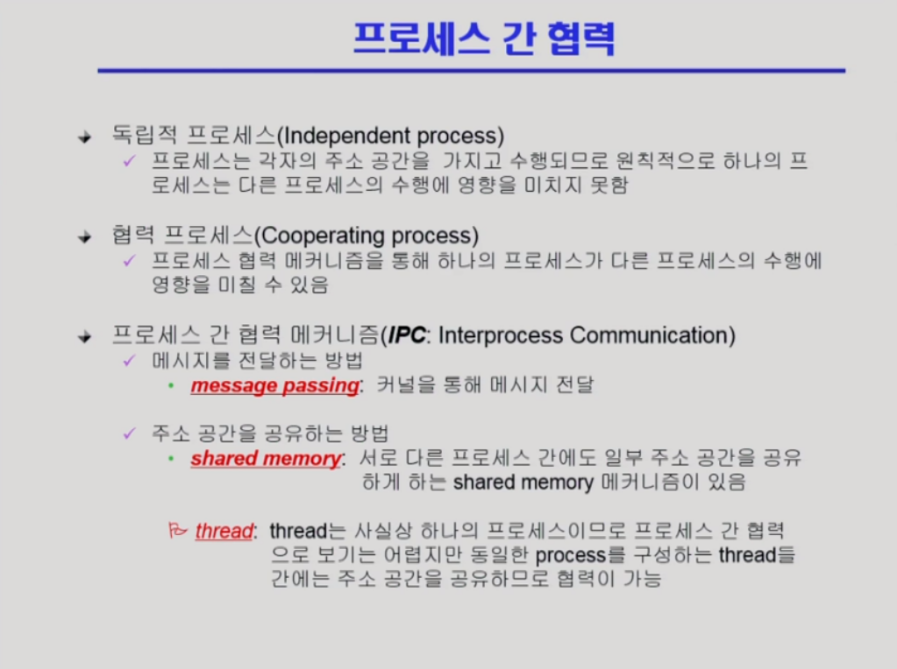
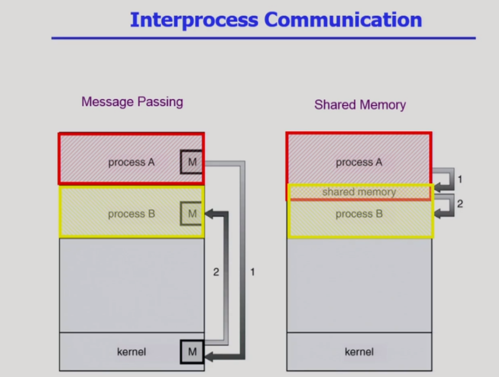

# 프로세스 관리

> 프로그램의 실행 과정을 이해하고 커널이 가진 내용과 사용자 프로그램이 사용하는 함수를 알아본다.

## 4. 프로세스의 상태 변화

> 프로세스의 상태 변화와 프로세스 중 CPU 수행 단위인 스레드에 대해 알아본다.

- 운영체제가 running, blocked라는 표현은 안 씀, 프로세스의 상태를 표시하기 위해 사용
- 프로세스가 시스템콜을 해서 운영체제 코드가 실행 중이어도 CPU를 다른 프로세스에 뺏긴게 아니므로 여전히 커널 모드에서 running 상태
- Interrupt가 와서 운영체제에 뺏겨도 바뀌기 전까지는 running 상태
- I/O는 소프트웨어, 하드웨어 Interrupt 둘 다 일어남 처음에 시스템콜로 소프트웨어 Interrupt, I/O 입력 다 되면 하드웨어 Interrupt
- 제자리로 오는 Interrupt는 우선순위가 높은 Interrupt가 끝나고 오는 것

Q) 프로세스 상태도 그려봐라

## 5. 스레드(Thred)

- 다중 스레도로 구성된 태스크 구조에서는 하나의 서버 스레드가 blocked (waiting) 상태인 동안에도 동일한 태스크 내의 다른 스레드가 실행(running)이 되어 빠른 처리를 할 수 있다. (웹브라우저 로딩 중 그림로딩 중 글이라도 빨리 표시한다)
- 동일한 일을 수행하는 다중 스레드가 협력하여 높은 처리율(throughput)과 성능 향상을 얻을 수 있다.
- 스레드를 사용하면 병렬성을 높일 수 있다.

- 장점
  - 응답성이 빠르다
  - 자원 공유 효과 (코드나 data 등)
  - 경제성 (프로세스 하나를 만들기 vs 스레드 하나 만들기 30배)
  - CPU가 여러개인 상황에서 여러 스레드로 병렬성
- 구현 방법
  - 커널 스레드 : CPU가 알아서 스레드로 인식, 운영체제가 지원해주는 스레드 사용, 다른 쓰레드로 넘어가는 것을 커널이 프로ㅔ스 스케줄링처럼 관리
  - 유저 스레드 : 사용자 스레드, 사용자만 알아서 운영체제한테 비동기식 입출력을 요청해서 다른 스레드 실행
  - real-time threads

## 5. 프로세스의 관리

> 프로세스의 생성에 있어 자식 프로세스가 부모 프로세스를 복제, 새로운 과정을 덮어씌우는 과정과 프로세스의 종료에 대해 알아본다.

### 프로세스의 생성

- 자원 공유

  - 배정된 자원 안에서 서로 싸우는게 대부분
  - 일부분의 자원을 공유한다

- 주소 공간 (Address space)

  - 자식은 부모의 공간을 복사함 (binary and OS data)

  - 자식은 그 공간에 새로운 프로그램을 올림

  - **fork()**

     시스템 콜이 새로운 프로세스를 생성

    - 부모를 그대로 복사

    - 주소 공간 할당

    - fork() 다음에 이어지는 ***exec()*** 시스템 콜을 통해 새로운 프로그램을 메모리에 올림

      > fork 와 exec 의 차이점?

### 프로세스의 종료

### fork() 시스템 콜

## 프로세스 간 협력

