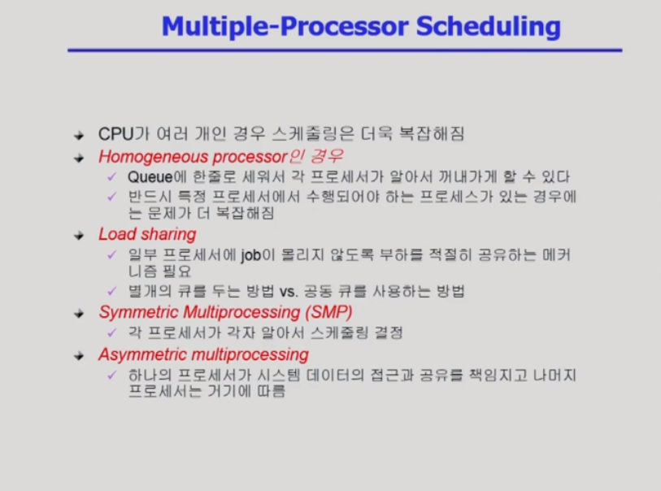
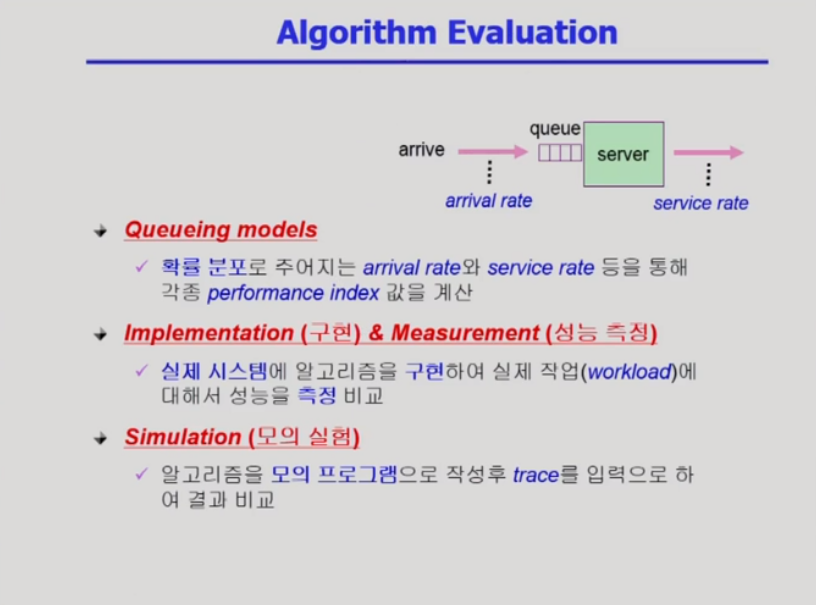

# CPU 스케줄링

> 특수한 CPU Scheduling에 대해 알아본다.

## 1. Multiple-Processor Scheduling

- 제약 조건이 있을 경우 더 복잡해진다
- load balancing

symmetric - cpu들이 다 대등하게 알아서 스케줄링한다

## 2. Real-Time Scheduling

- deadline이 추가로 붙어서 이를 만족시키는 것이 중요
- Hard real-time systems : 
  - Hard real-time task는 정해진 시간 안에 반드시 끝내도록 스케줄링해야 함
  - 오프라인으로 미리 스케줄링을 시켜놓고 따라가게하는 경우도 많다
- Soft real-time systems : 
  - Soft real-time task는 일반 프로세스에 비해 높은 priority를 갖도록 해야함
  - 주기적으로 일해야하는 경우가 많다
  - deadline을 지키는 것이 중요하지만 반드시 보장하지 않을 수 있다

## 3. Thread Scheduling

- Local Scheduling : User level thread의 경우 사용자 수준의 thread library에 의해 어떤 thread를 스케줄할지 결정
- Global Scheduling : kernel level thread의 경우 일반 프로세스와 마찬가지로 커널의 단기 스케줄러가 어떤 thread를 스케줄할지 결정

# 스케줄링 알고리즘 평가 방법

- Queueing models : 대단히 이론적인 방법, job의 도착율과 cpu처리율이 확률분포로 주어진다
- 실제 구현은 대단히 어려워서 Simulation을 사용하기도 한다
- trace : Simulation에서 input이 되는 데이터(실제 포로그램에서 뽑아서 사용 혹은 임의로 만들어서 사용)