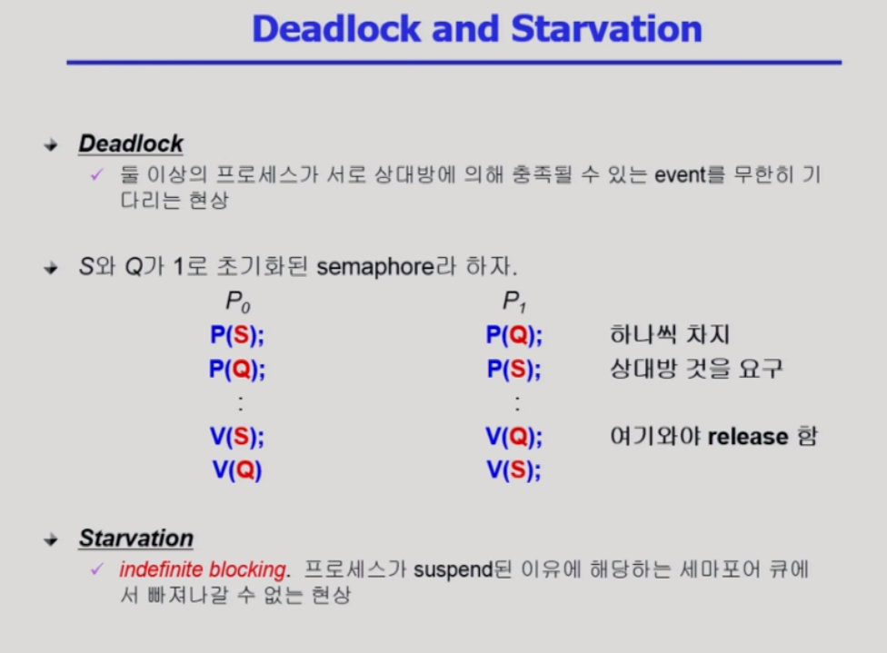
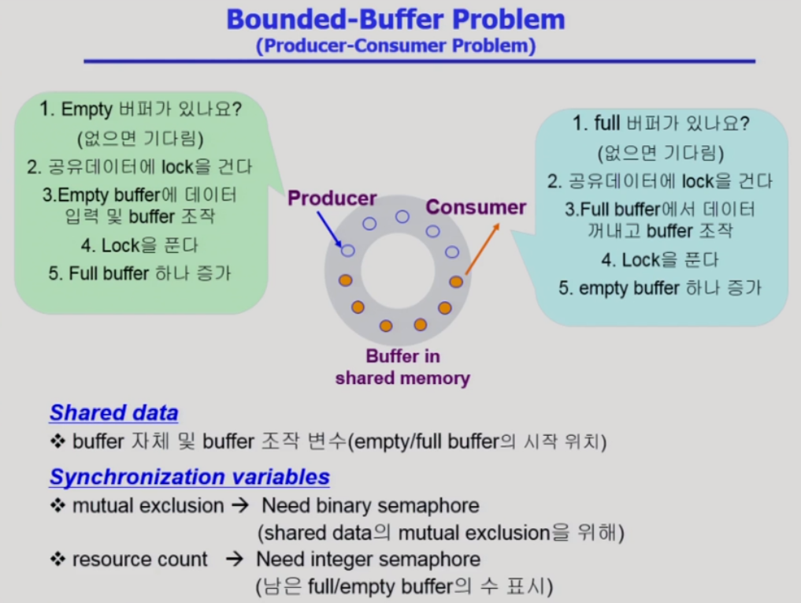
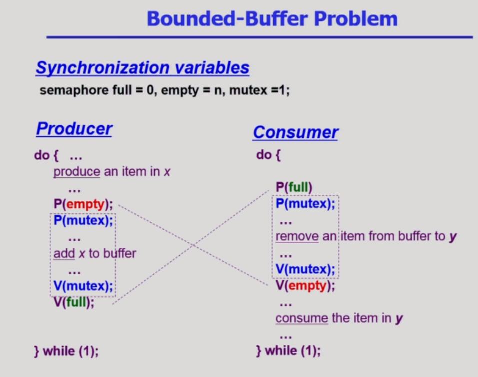
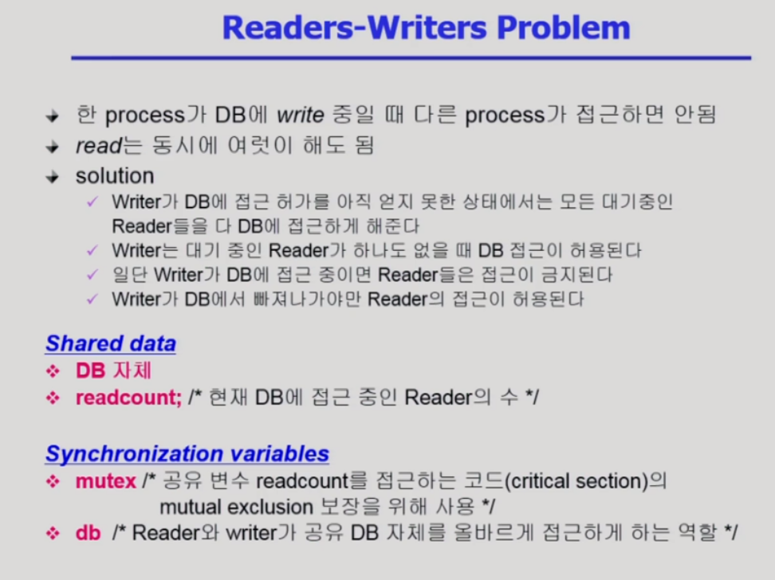
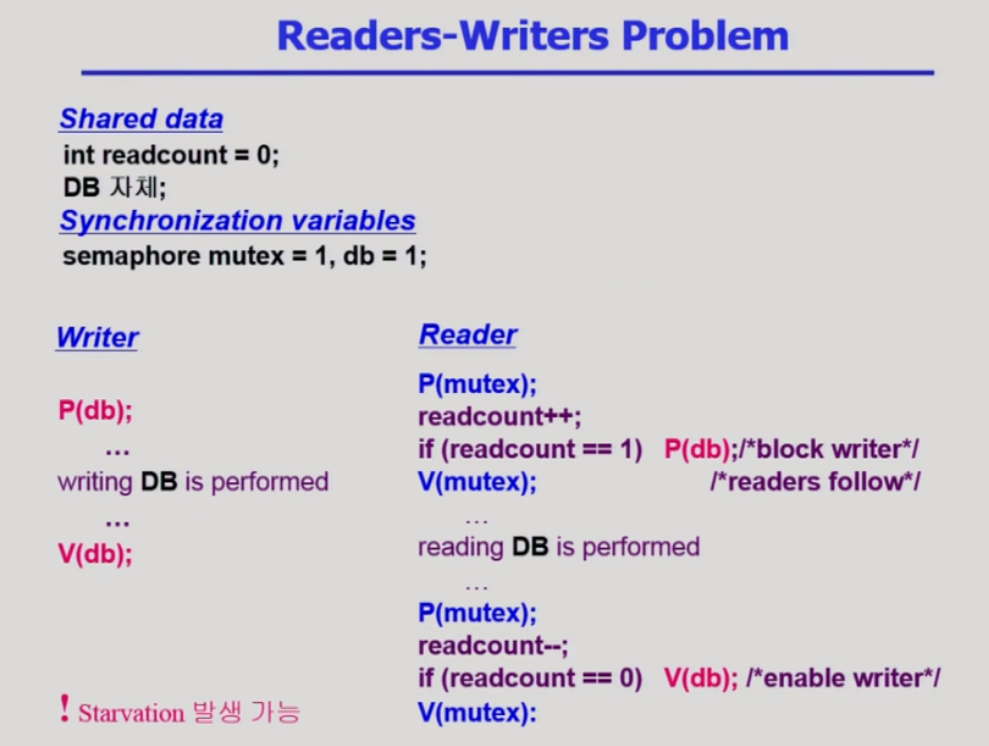
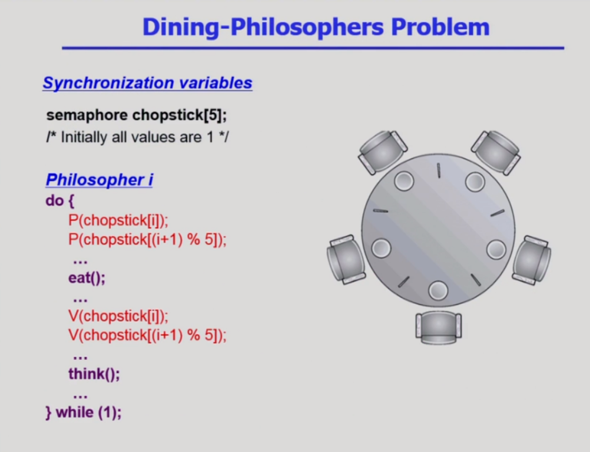
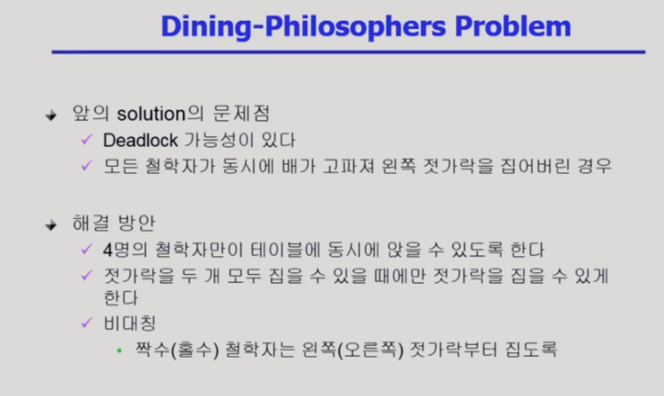
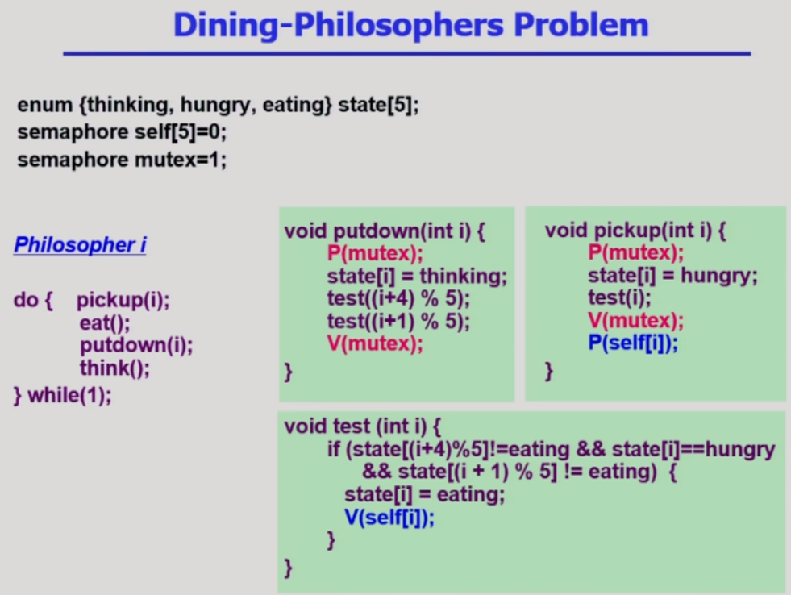

# Process Synchronization 2

> 세마포 연산에서 생길 수 있는 문제인 데드락과 동기화와 관련된 전통적인 세 가지 문제에 대해 알아본다.

## Semaphores

- 자원을 내놓는 과정이 끝나고 나서만 있어서 P0와 P1이 각각 S, Q를 한개씩 가지고 있고 서로 상대방의 것을 요구하면 영원히 대기하는 deadlock

- p1도 Q를 얻기 위해선 S를 먼저 얻게 하면 해결
- Deadlock도 일종의 Starvation 즉, 특정 프로세스들만 자원을 사용하고 다른 프로세스는 영원히 자원을 얻지 못하는 상황

## 동기화 문제 3가지

### Bounded-Buffer Problem (Processor-Consumer Problem)

- Producer생산자 프로세스와 Consumer소비자 프로세스가 존재. 

- Producer 프로세스가 여러 개 있고, Consumer 프로세스가 여러 개 존재.

- Producer 프로세스: 생산자 프로세스는 공유 버퍼에 데이터를 하나 만들어서 집어넣는 역할. 주황색 버퍼들이 데이터가 들어간 버퍼. 회색 버퍼는 내용이 없는 버퍼.

- 발생할 수 있는 문제: 두 개의 생산자 프로세스가 동시에 도착하면 하나의 비어있는 버퍼에 동시에 두 개의 데이터를 집어 넣으면 문제 발생. 때문에 빈 버퍼에 데이터를 넣는 작업을 그냥 하지 않고 공유 데이터에 lock을 걸어서 다른 프로세스들의 접근을 막은 다음 비어있는 버퍼에 데이터를 집어넣고, 데이터를 집어넣는 작업이 끝나면 lock을 풀어서 다른 생산자 프로세스 혹은 소비자 프로세스가 공유 버퍼에 접근할 수 있게 해줌.

- 소비자 프로세스 역시 데이터를 사용할 때 공유 데이터에 lock을 걸어서 다른 프로세스들의 접근을 막고, 데이터를 가져간 다음 lock을 풀어줌.

- 데이터를 다 집어넣은 뒤에는 비어있는 버퍼의 주소를 자신의 뒤에 있는 버퍼의 주소로 변경함

- 공유 버퍼는 제한적. 때문에 모든 공유 버퍼가 꽉 차있는데 데이터를 채우려면 자원이 부족한 상태이기 때문에 소비자가 데이터를 꺼내 사용해서 새로운 데이터를 추가할 수 있음.

- 생산자에게 자원이란 비어있는 공유 버퍼의 개수. 자원의 개수가 0이라면 비어있는 버퍼가 생길 때까지, 즉 소비자가 데이터를 버퍼에서 빼갈 때까지 기다림.

- 소비자에게 자원이란 데이터가 들어있는 버퍼의 개수. 때문에 자원이 0이라면 생산자 프로세스가 자원을 만들어서 넣어줄 때까지 기다려야 함.

- 전체 공유 버퍼 중 비어있는 위치가 어디이고, 내용이 들어있는 위치가 어디있는지 나타내는 포인터 변수가 Shared data. 1) lock을 걸고 푸는 용도와 2) 자원의 개수를 나타내는 용도로 Semaphore 변수를 사용

- mutex: lock을 걸고 푸는 용도. 공유 버퍼에 단 하나의 프로세스가 접근할 수 있게 1

- full: 데이터가 들어있는 버퍼를 나타내기 위한 용도. 처음에는 비어있으니 0개

- empty: 데이터가 비어있는 버퍼를 나타내기 위한 용도

- 생산자 프로세스
  - P 연산을 통해 비어있는 버퍼가 있는지 확인하여 빈 버퍼가 있다면 공유 데이터에 lock을 걸은 다음 자원을 획득하고,
  - V 연산을 통해 lock을 풀어준 뒤 자원을 반납하며 full 변수의 값을 1 증가

- 소비자 프로세스
  - P 연산을 통해 데이터가 차있는 버퍼를 확인하여 가득찬 버퍼가 있다면 역시 mutex 변수의 값을 0으로 변경해서 공유 버퍼에 lock을 건 다음 버퍼에서 데이터를 가져온 뒤,
  - V 연산을 통해 mutex 변수를 1로 변경하여 lock을 풀어준 다음 empty 변수의 값을 1 증가

### Readers and Writers Problem

- 데이터베이스를 읽는 프로세스와 쓰는 프로세스가 존재. Reader process와 Wirter process는 각각 여러 개 존재
- Write는 동시에 여럿이 하면 안 되지만, Read 작업은 동시에 여럿이 해도 문제가 발생하지 않음. 때문에 누군가 read를 하고 있을 때 read 프로세스가 도착하면 함께 read 작업을 허용하는데, wirte 프로세스가 도착하면 항상 기다려야 함. write는 배타적인 문제.

- Reader가 들어갈 때 readcount를 조정해야하므로 그때 동기화문제가 발생하지 않도록 readcount라는 변수를 추가한다

- Reader들이 몰리면 Writer가 Starvation할 수 있다 - 실질적으로 발생하긴 어렵다
- 신호등처럼 일정 시간까지의 reader만 허락하고 나머지는 미루면 Starvetion 해결
- write는 배타적인 작업이기 때문에 작업을 시작할 때 P 연산으로 db 자체에 lock을 걸은 다음 작업을 하고 작업을 마치면 V 연산을 통해 db 전체에 걸었던 lock을 풀어줌
- db는 데이터베이스의 lock을 걸고 푸는 변수
- mutex는 readcount에 lock을 걸고 푸는 변수
- read 역시 자신이 읽는 작업을 하는 동안 write 작업을 하는 걸 막기 위해 lock을 걸어줘야 함. 대신 다른 read 작업은 동시에 진행될 수 있게 readcount라는 변수를 사용. readcount는 모든 read 작업이 접근할 수 있기 때문에 공유 변수. readcount == 1 일때, 즉 최초로 읽을 때에는 P를 통해 db에 lock을 걸어줌. 최초의 read가 아니라면 readcount를 1증가시킨 다음, 자신의 최초의 reader가 아니기 때문에 db에 lock을 걸 필요가 없음. 하지만 readcount는 공유변수이기 때문에 한 번에 여러 개의 read 프로세스들이 접근하여 synchronization 문제가 발생할 수 있기 때문에 P 연산에서 mutex를 통해 lock을 걸고 readcount 작업이 끝나면 V 연산을 통해 lock을 풀어줌. 그 다음 read 작업을 마친 뒤 마지막 read 프로세스가 끝나면, 즉 readcount == 0 이라면 DB 전체에 대한 lock을 풀어줌. 여기서도 역시 readcount에 접근하기 때문에 readcount를 1 줄이고 db의 lock을 푸는 과정 전후에 P와 V 연산으로 mutex를 통해 lock을 걸고 풀어줌.

### Dining-Philocophers Problem

- P(chopstick[i])는 왼쪽 젓가락을 잡는 연산, P(chopstick[(i+1)%5])는 오른쪽 젓가락을 잡는 연산

- 젓가락을 두 개 모두 집을 수 있을 때에만 젓가락을 집는 방법

- 5명의 철학자가 하는 행동은 먹거나 생각하거나 둘 중 하나.

- 먹기 전에는 젓가락을 pick up 함수를, 먹은 뒤에는 putdown 함수를 호출

- semaphore self[5]는 각각의 5명의 철학자가 양쪽에 놓인 젓가락을 모두 잡을 수 있어서 젓가락을 들 권한을 줄 것인지 말 것인지 결정하는 세마포 변수. 예를 들어 self[1]의 값이 0이라면 1번 철학자가 젓가락 두 개를 모두 들 권한이 없다는 것. self[3]이 1이라면 3번 철학자는 젓가락 두 개를 모두 들 권한이 존재함.

- 철학자들의 상태를 나타내는 thinking, hungry, eating. 

- mutex는 5명의 철학자의 상태를 바꿀 때 lock을 걸고 푸는 용도. 여러 철학자들이 동시에 state가 변하는 걸 방지

 

- pickup

1) 철학자의 상태 변수에 접근하기 때문에 P 연산으로 mutex 값을 변경

2) 철학자의 상태를 hungry로 변경

3) test 함수를 통해 젓가락 두 개를 모두 들 수 있을지 확인. 젓가락 두 개를 모두 들 수 있는 권한은 양쪽의 철학자가 밥을 먹지 않고 자신이 hungry 상태일 때만 받을 수 있음
   - semaphore의 특징: 원래 자원의 개수를 초기값으로 가지고 자원의 값이 1이거나 1 이상인 값을 처음에 부여. 하지만 여기서 semaphore 코드에서는 처음에 자원 값에 0을 주고, 주변 철학자들이 밥을 먹지 않을 때 그 때 V 연산을 통해 0이었던 self 값을 1로 변경. 이걸 통해 젓가락 두 개를 집을 수 있는 권한 획득

4) test에서 조건을 확인한 다음 V 연산을 통해 철학자의 상태를 바꾸는 mutex의 lock을 풀어주고, 젓가락을 집어 밥을 먹는 P 연산을 진행

 

- putdown
  - pickup으로 밥을 다 먹은 다음에 putdown 연산 진행. 역시 P 연산으로 mutex에 lock을 걸어서 다른 프로세스가 철학자의 상태를 바꾸는 걸 방지한 다음, test 연산을 자신의 양 옆 철학자에 대해 진행해서 상태를 바꿔줌

- semaphore라는 게 처음에 자원의 개수만큼 그 값을 주고 시작하는데, 여기서는 처음에 semaphore의 값이 0부터 시작하고 그 다음에 자격을 주는 방식이기 때문에 semaphore의 철학과는 조금 다름

