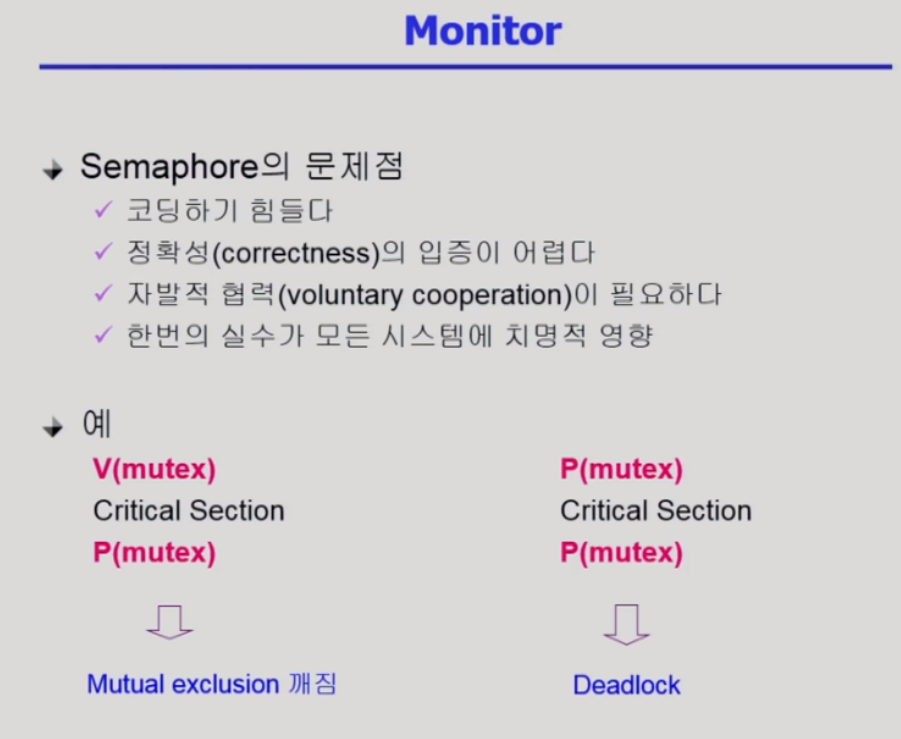
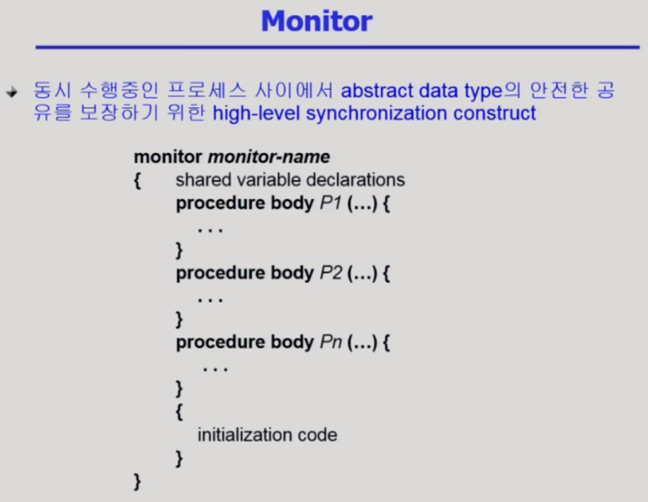
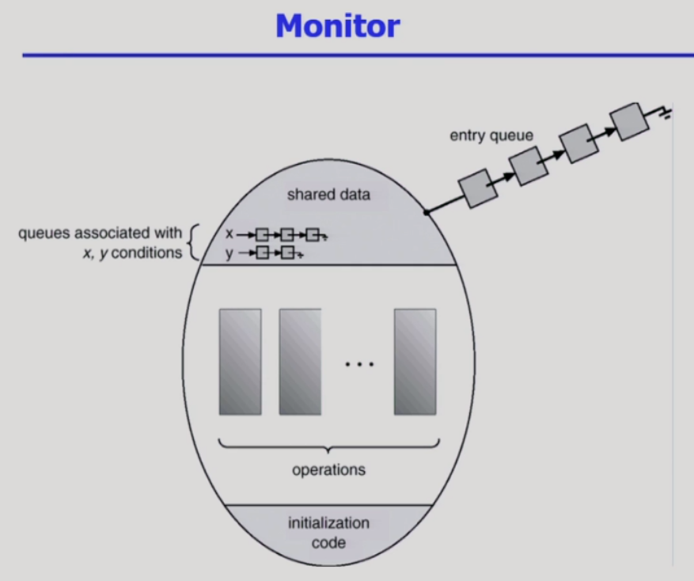
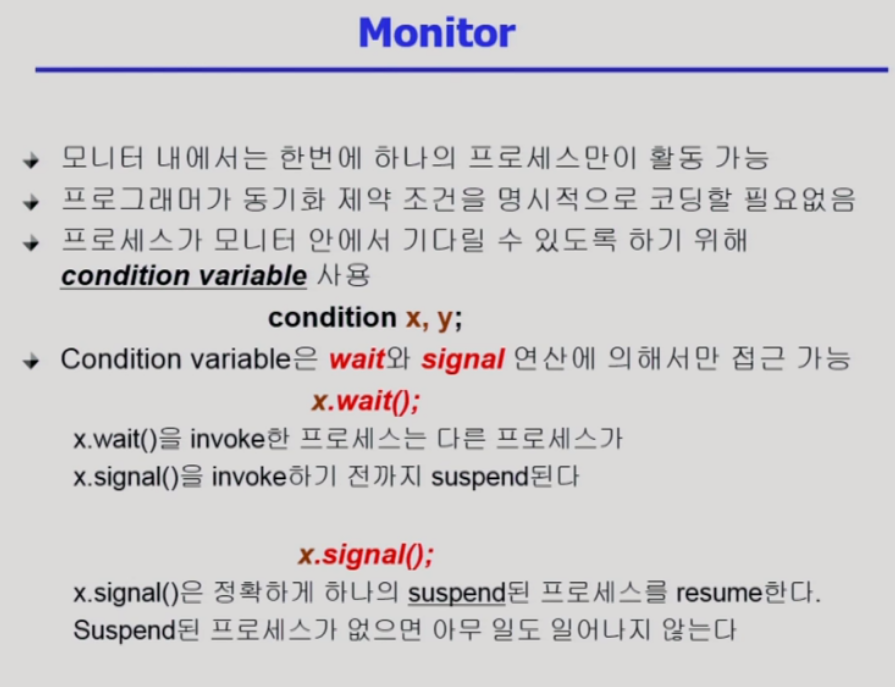
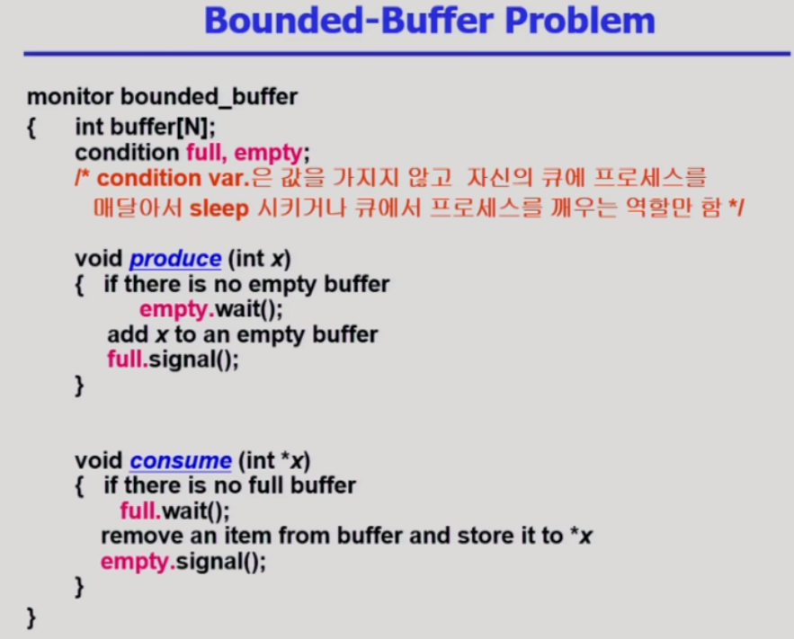
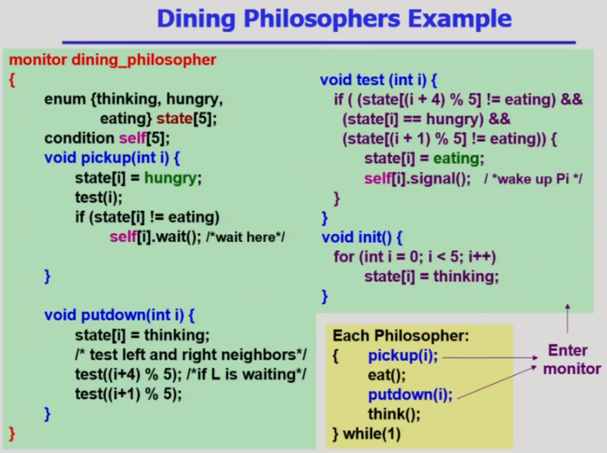

# Process Synchronization 2

> 동기화 문제 해결을 위해 세마포 이외의 모니터 방식에 대해 알아본다.

## Moniter

- 프로그래머가 process synchronization 문제를 쉽게 해결하게 해주기 위해 만든 게 Semaphore였지만 그럼에도 불편한 점이 존재. 이 문제를 해결하기 위해 Monitor를 제공

- 객체지향에 기반. 공유 데이터에 접근하기 위해서는 내부의 procedure를 통해서만 공유 데이터에 접근 가능

- 모니터 내부의 procedure는 원칙적으로 동시에 실행될 수 없게 설정. 이렇게 하면 lock을 걸어줄 필요가 없음. 그냥 monitor 내부의 고유 데이터에 접근하면 됨. 

- 공유데이터를 모니터 안에다가 정의, 접근 코드는 모니터 안의 연산으로만 접근 가능하게

- 하나의 프로세서가 모니터 안의 연산을 진행 중이면 모니터가 알아서 다른 프로세스의 접근을 막고 queue에 대기 시킨다

- monitor 안에 공유 데이터와 접근 코드를 정의해서, 사용자가 공유 데이터에 접근하고자 한다면 오직 monitor 안에 정의된 코드를 입력해야만 공유 데이터에 접근할 수 있게 만들어주는 것이 monitor의 구조입니다. 그리고 monitor 자체적으로 오직 하나의 active한 프로세스만이 monitor에 접근해서 작업을 할 수 있도록 해줍니다. 이는 프로그래머가 일일이 P연산과 V연산을 통해 공유 데이터 혹은 공유 버퍼에 lock을 걸고 작업이 끝나면 lock을 풀어야하는 번거로움으로 부터 비교적 자유롭게 만들어줍니다.

   

  만약 A라는 프로세스가 monitor에서 작업을 하다 CPU 제어권을 빼앗기게 된다면 프로세스 A는 monitor의 코드를 실행하는 도중에 CPU를 빼앗겼기 때문에 monitor 안의 A는 여전히 active한 상태입니다. 때문에 만약 프로세스 B가 공유 데이터에 접근하려고해도 monitor에는 여전히 A가 active한 상태로 남아있고 monitor는 단 하나의 active한 프로세스의 작업만을 허용하기 때문에 프로세스 A가 CPU 제어권을 빼앗긴 상태더라도 B는 공유 데이터에 접근할 수 없고 monitor 밖의 대기 queue에서 기다리게 됩니다.

  오직 monitor에서 실행중인 A라는 프로세스가 필요한 작업을 마치고 monitor 밖으로 빠져 나가거나, 혹은 monitor 내의 어떤 조건을 충족시키지 못해 wait 상태로 변하기 전까지는 다른 프로세스들이 monitor를 통해 공유 데이터에 접근할 수 없게 됩니다.

- condition variable이 큐의 역할을 한다, x라는 자원에 여유가 없으면 wait을 잠들게 해서 통해 대기시킨다, x라는 자원에 여유가 있으면 signal로 깨우는 연산

- monitor 내에는 condition variable이라는 변수가 존재합니다. condition variable은 말 그대로 프로세스의 상태를 나타내고 monitor 내에서 기다릴 수 있게 하기 위해 사용하는 변수입니다. 만약 프로세스 A가 x라는 조건 때문에 공유 데이터에 접근할 수 없다면 A 프로세스를 x.wait();으로 설정해서 x의 대기 줄에서 기다리게 합니다.

  그리고 다른 프로세스가 공유 데이터를 사용하고 x의 조건이 충족되었을 때에는 x.signal();을 통해 wait 상태에서 대기중이던 프로세스에게 monitor에 접근할 권한을 넘겨줍니다.

- 생산소비 문제를 모니터를 통해 해결

- 세마포는 기본적으로 lock을 걸고 공유데이터 접근하고 풀고, 자원의 갯수를 세는 역할

- 모니터는 lock을 거는 과정이 없음, 줄세우는 큐 역할만 해서 코드가 자연스럽다, 기본적으로 동시 접근을 막아준다, 프로그래머가 동시 접근을 고려할 필요 없이 모니터가 알아서

- empty.wait - 빈 자리가 없어서 생산자가 기다리게 즉 큐에 대기하게

- empty.signal - 빈 자리가 생겼다고 신호를 줌, 혹시 대기하고 있으면 깨워라이지 변수값을 바꾸거나 하지는 않는다

- full.wait - 생산된 자원이 하나도 없음

- full.signal - 생산자가 자원을 채웠음

- 모니터가 동기화 문제를 책임져준다

- 앞선 생산자-소비자 문제에서는 하나의 생산자 프로세스 또는 소비자 프로세스가 공유 데이터에 접근할 때에 무조건 공유 데이터 자체에 lock을 걸고 또 작업이 끝나면 lock을 풀어주는 과정을 거쳐야 했는데,

  monitor를 사용한다면 생산자 프로세스와 소비자 프로세스 모두 monitor를 통해서만 공유 데이터에 접근할 수 있고, monitor는 오직 하나의 active한 프로세스만이 접근하여 작업하는 걸 허용하기 때문에 프로그래머가 일일이 lock을 걸고 푸는 과정을 거칠 필요가 없게 됩니다.

   

  monitor에서 만약 생산자 함수에서 빈 버퍼가 없다면, 즉 empty라는 조건을 충족시키지 못하면 empty.wait(); 을 통해 기다리게 만듭니다. 그렇지 않고 빈 버퍼가 존재해서 빈 버퍼에 데이터를 채웠다면, full.signal()을 통해 full에서 잠들어있는 소비자 프로세스를 깨워서 공유 데이터를 읽을 수 있게 해줍니다.

  소비자 함수 역시 데이터가 있는 버퍼가 없다면, 즉 full이라는 조건을 충족시키지 못하면 full.wait();을 통해 기다리게 합니다. 그렇지 않고 데이터가 있는 버퍼가 있어서 데이터를 가져왔다면, empty.signal()을 통해 혹시 empty에서 기다리고 있는 생산자 프로세스를 깨워서 공유 버퍼를 채울 수 있게 해줍니다. 

   

  monitor의 condition variable은 Semaphore에서 사용하던 full, empty 등의 변수들처럼 증가하거나 감소하는 값을 가지는 것이 아니라 자료구조에서 가지고 있는 queue에 프로세스들을 매달아놓는 방식입니다. 이는 monitor와 semaphore의 목적 자체가 다르기 떄문인데,

  monitor는 동시 접근을 막는 걸 monitor 차원에서 지원을 해주는 것이고, semaphore는 자원을 획득하고 반납하는 걸 프로그래머가 의도대로 제어하는 것이기 때문입니다.

- 다른 철학자들도 자신의 양옆에 앉은 철학자들의 상태를 변경해줘야하기 때문에 state는 공유 변수로 설정합니다.

  pickup() 함수를 통해 만약 test() 함수를 만족시킨다면 eat() 함수를 실행하게 되고, test() 함수를 만족시키지 못했다면 그 아래에 있는 if문을 통해 wait상태가 됩니다. 그리고 이후의 putdown() 함수를 통해 밥을 다 먹은 다음 자신의 왼쪽과 오른쪽 철학자들에 대해 test()를 진행하여 혹시 배고픈 상태에 있는 철학자가 젓가락을 집을 수 있는 상태라면 self.signal()으로 wait 중인 철학자를 깨워서 젓가락을 들어 밥을 먹을 수 있게 해줍니다.

  lock을 걸고 푸는 과정이 없다는 게 semaphore와의 가장 큰 차이입니다.

