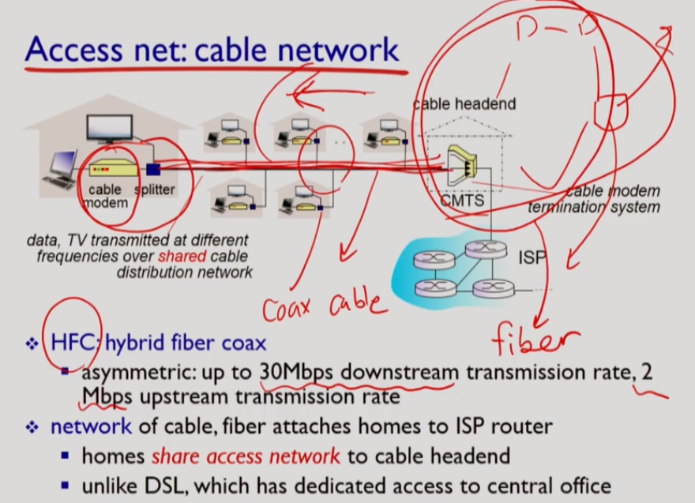

# 네트워크의 구성 요소

>  What is internet?

## 교과목 목표

- 프로토콜 : 통신 규약
- Top-Down으로 네트워크 계층 설명 예정

## 인터넷이란

- host = end system = 사용자 컴퓨터나 서버
- router = 사용자의 메세지가 목적지를 찾아가게 해주는 장치
- link = 물리적 회선 라우터들끼리 연결
- 가장자리에 host, 중앙에 스위치와 라우터 - link로 연결

- 인터넷 = 네트워크들이 모인 네트워크
- 프로토콜 = 인터넷에서 메세지를 보내는 일련의 규칙
- 표준화가 중요
- IETF기관에서 RFC 표준안 발표

## 프로토콜이란

- 포멧, 메세지 순서, 메세지를 받았을 때의 action 등이다

## Network Edge

- access network : host를 네트워크에 연결시켜주는
- bandwidth : 단위 시간당 실어나를 수 있는 비트 수
- bandwidth가 shared(다른 사람과 공유하는지)냐 dedicated이냐

### Digital subscriber line(DSL)

- 전화 회사가 제공해주는 access network
- dedicated link
- DSLAM이 전화와 네트워크를 분리해준다
- 다운로드를 업로드보다 많이 한다

### Cable network

- 케이블 회사가 제공하는 access network
- shared link
- **HFC** : hybrid fiber coax (fiber cable(광케이블)과 coax cable(동축케이블, 각 가정으로)을 섞어서 사용)
- 다운로드가 최대 30Mbps (다른 집과 share할 수 있으므로 최대가 붙는다), 업로드는 최대 2Mbps

### 집의 네트워크

- 라우터가 여러 end system을 묶어서 네트워크에 연결

### 기관의 네트워크

- ISP(Internet Service Provider)로 직접 연결(dedicated)
- 이더넷 스위치로 묶어서 학교 전체를 엮는 라우터에 물리고 직접 ISP에 연결
- 전화나 케이블 회사가 제공하는 네트워크가 없다

### Wireless access network

- 와이파이는 건물 안에서만, 대역폭이 넓다
- cellular network = wide-area wireless network
- 약어가 많다

# 네트워크의 구성 요소

>  Network edge, Network core

### Host

- 패킷 하나를 호스트에서 내보내는데 걸리는 시간 L/R(sec)
- host의 역할 : application message를 packet으로 잘라서 access network로 내보냄

### link

- guided media : 물리적인 wire를 사용
  - copper(= twisted pair) : Ethernet
    - Category 5 : 100 Mbps, 1Gbps Ethernet 지원
    - Category 6 : 10Gbps
  - fiber : HFC (Hybrid Fiber Coax), 지원하는 transmission rate가 높다, light pulse를 signal로 전달, transmission rate가 매우 높고 error rate가 낮다
  - coax : HFC, 지원하는 transmission rate가 더 높고 stable해서 broadband link
- unguided media : electromagnetic spectrum(전자기 스펙트럼)을 사용해 공기 중 전파
  - radio - WiFi, Cellular
  - noise에 굉장히 민감

## Network Core

souce에서 destination으로 정보를 전달하는 두가지 방식

### Circuit switching

- 전화 네트워크에서 사용
- 메세지 전달 전 call setup과정을 거친다
- call up :
  - source로부터 destination까지의 경로를 설정
  - resource reservation
  - 자원을 분할하는 방식이 있어야 한다
  - FDM(Frequency-division multiplexing)- frequency 대역을 나눠서 사용자마다 나눈다, TDM(Time-division multiplexing) - 시간으로 잘라서 사용

- 할당된 connection 사이를 다른 사용자와 share 할 수 없어서 순간적으로 데이터 송수신이 많은 인터넷과 같은 데이터 네트워크에는 비효율적이다

### Packet Swtching

- Call Setup이 없고 자원 예약도 없다
- 각 data transmittion이 full link capacity를 이용
- 하나의 메세지 크기가 너무 크면 회선을 독점하므로 자원 이용이 비효율적이므로 메시지를 packet이라는 chunk로 자른다
- 각 packet에 목적지 주소가 명시되어야 한다
- store-and forward : 라우터는 packet을 전체를 다 받고 보내야한다

#### store-and-forward

- congestion : queueing delay가 심해지고 큐가 쌓여 버퍼가 가득차서 loss가 나는 상황

### Packet switching vs circuit switching

- packet switching이 resuorce sharing이 훨씬 효율적으로 일어난다
- 하지만 resource를 예약하지 않으므로 congestion이 발생할 수 있다
- streaming data에서는 delay가 중요한데 packet switching은 보장하지 못 한다

## Internet structure : network of network

- 소규모 지역 ISP에서 대규모 ISP까지 연결
- 서로에게 consumer와 provider가 된다
- IXP(Internet Exchange Point) : ISP끼리 연결시켜주는 인터넷 연동 서비스
- Multi-tier hierarchy(계층)
- Point-of-presence : consumer isp들에게 인터넷에 접속하게 해주기 위해서 provider isp들의 라우터에 연결할 수 있게 해주는 접속점
- peering : 같은 level에 있는 다른 isp들과 연결 - settlement-free 때문에 연결

- Settlement-free : 통신량이 많은 RISP 간에 직접 peering link를 통해 cost, delay를 줄이는 것
- Multi-home : higher level ISP를 여러개 두는 것

- Content Provider Network 
  - Google, Microsoft 등이 만든 자신들만의 네트워크

## Summary

# 네트워크의 구성 요소

>  Delay, loss, throughput in networks, Protocol layers, service models, Networks under attack: security, Internet history

## Metric

- **Metric : 무엇을 측정할 것인가?**
  - Metric이란? **지표**라고 생각하자. 운영체제든 자료구조든 어떤 과목을 듣던지 이런 방식에는 이런 장단점이 있고 저렇게 하면 이런 장단점이 있다는 얘기는 빠지지 않고 나온다. 좀 더 크게 생각한다면 문제를 해결하는 여러 방법들은 각각 장단점이 있다.
  - 예를 들어 알고리즘 속도를 빠르게 한다면 메모리를 많이 사용하고 메모리를 적게 사용한다면 추가적인 연산이 필요해서 속도가 느려진다.
  - 이때 우리는 두가지에 관심을 갖는다. 속도와 메모리 사용. 이게 알고리즘에서의 Metric, 지표이다.
  - 그러면 네트워크에는 무슨 지표가 있는지 알아보자.

------

## Metric 1. Delay

- **Metric 1-1. Processing Delay**
  - 패킷을 프로세싱할 때 발생하는 딜레이다.
  - 한 홉(네트워크 장치라 생각하자)을 건너오는데 오류가 없었는지 체크하고, 다음에 어디로 보내줄지 결정하는 등 패킷을 Processing 하는데 발생하는 딜레이다. 일반적으로 msec 이하이다.
- **Metric 1-2. Queueing Delay**
  - 바로 이전 게시글에서 라우터는 패킷을 라우터 버퍼안에 **저장**한다고 했다. 자세한 내용은 라우터 인사이드 포스팅에서 살펴보고, 여러 사용자가 라우터를 이용하고 있으면 패킷이 라우터 내에서 잠깐 기다리는 상황이 생긴다. 이 때 기다리는 시간을 Queueing Delay라고 하고. **유일하게 가변적**이다.
- **Metric 1-3. Transmission Delay**
  - 패킷을 링크에 밀어 넣는데 걸리는 시간이다. 패킷의 길이/Bandwidth이다. Bandwidth는 대역폭이라고도 한다. 대역폭을 파이프 굵기에 비유해서 생각해보자.
- **Metric 1-4. Propagation Delay**
  - 게임할 때 북미섭에 접속하면 Delay가 많이 발생한다. 긴 링크를 타고 패킷이 지구 한 바퀴를 돌아올 때까지 시간이 많이 걸리는데 이를 Propagation Delay라고 하며 경로의 길이/속도이다.
  - 정확히는 비트가 다음번 노드에 가기까지 걸리는 시간이다.

 

- 한 노드를 건너가는데 발생하는 딜레이 D_nodal = D_proc + D_queue + D_trans + D_prop

 

- Queueing Delay를 좀 더 자세히 살펴보자
  - 패킷은 라우터 내의 버퍼에서 전송을 기다린다.
  - (패킷의 길이\*패킷의 개수)/Bandwidth이다.(L*a/R)
  - L: packet length(bits), R: link bandwidth(bps), a: **average** packet arrival rate
    - **Queueing Delay는 Stochastic Process(확률 모델)이기** 때문에 La/R이 0.7만 되어도 꽤 느려진다.
    - a가 avarage이기 때문에 평균보다 높을 때 딜레이가 생긴다
    - 좀 더 자세한 내용을 알고 싶으면 Queueing Theory를 공부하자.

------

## Metric 2. Loss

- 라우터 내의 버퍼나 TCP내의 **버퍼가 가득 찬다면 패킷 손실**이 발생한다. Loss가 생기거나 전송 속도가 급격하게 느려지는 상황을 Congestion이라고 한다.
- 저번 글에 굵은 글씨로 강조 표시했던 인터넷의 원칙을 떠올려보자. 인터넷 라우터는 Congestion Control을 하지 않고 오로지 전송만 담당한다. Congestion Control은 TCP에서 담당한다.
- Loss가 일어나서 재전송을 해야 할 경우 속도 저하가 일어난다.

 

------

## Metric 3. Throughput

- 출발지(Source)로부터 목적지(Destination)까지 배달한 데이터의 양이다.
- Capacity가 가장 작은 링크가 있으면 여기서 병목현상이 일어난다. 주로 엣지에서 발생한다.
- 어떤 애플리케이션이냐에 따라서 Loss가 덜 생기는 것이 중요할 때도 있고 Throughput이 중요할 때도 있다. 예를들어 파일 전송이라면 Loss를 허용할 수 없고, 실시간 스트리밍이라면 어느정도의 Loss는 허용하되 Throughput을 일정 수준 이상으로 유지해야 한다.

 

------

## Protocol

- 프로토콜이란?

  - **통신을 위한 약속이다**. 편지를 생각해보자.  편지의 봉투에는 받는 사람의 주소, 이름, 우편번호, 보내는 사람의 이름과 주소가 적혀있다.
  - 모든 사람이 이 약속을 지키지 않고 각자 마음대로 주소를 적는다면 서로 통신하기 곤란하다.
  - 앞으로 다양한 기능의 구현을 위해 다양한 프로토콜을 배우게 된다.

- 계층적인 프로토콜

  - ISP에서도 보았듯이 방대하고 복잡한 구조를 계층적으로 나누면 유지 보수가 편리해진다.
  - 모듈화 된 프로토콜로 기능들을 캡슐화해서 구현할 수 있다.
  - 물론 계층 간 기능 중복, 커뮤니케이션을 위한 오버헤드가 발생할 수 있지만 계층화되지 않은 프로토콜로 네트워크 애플리케이션에서 라우팅 알고리즘과 링크 프로토콜까지 모두 다 구현해야 한다면 주 7일제가 도입될 수도 있다.

- Internet Protocl Stack

  - OSI 7 계층의 애플리케이션, 프레젠테이션, 세션 계층을 하나로 묶어서 애플리케이션 계층이라고 정의한다.

  - 1. Application 계층 : **유저가 만든 데이터를 Message**라는 형식으로 만든다. -> PDU: **Message**

  - 2. Transport 계층 : **Process 간 통신을 담당**한다. header(t)를(어디로 갈지) 추가 -> PDU: **Segment**

  - 3. Network 계층 : Routing을 통해서 홉을 거쳐 **Host 간 통신**을 담당한다 header(n)를 추가-> PDU: **Datagram**

  - 4. Link 계층 : 네트워크 장비 간 통신을 담당한다 header(l)를 추가->PDU: Frame

    - 길 찾기 기능(Routing)은 담당하지 않고 그저 전달만 담당한다.

  - 5. Physical 계층 : 물리적으로 데이터를 실어 나르는 역할을 담당한다.

 

PDU : Protocol Data Unit. 각 프로토콜 계층에서의 데이터를 지칭한다.

## Network security

- malware:
  - virus : 받아서 실행해야 구동
  - worm : 받기만 하면 구동
- spyware malware : 행동 감시
- botnet : 오염된 컴퓨터 집합
- Denial of Service (DoS) : botnet들이 서버로 쓰레기데이터 전송해 과부하
- packet sniffing : 내 packet이 아니여도 다 받아서 본다
- IP spoofing

