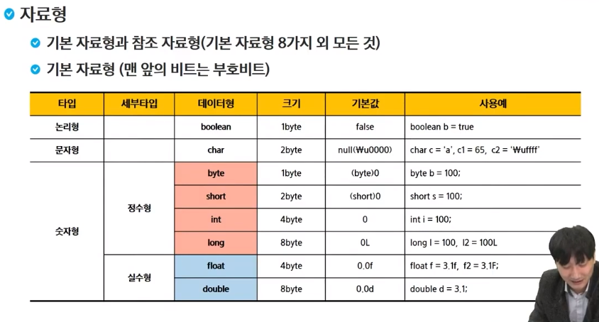

ctrl + shift + c : 주석처리

ctrl + shift + f : auto format 자동 줄 정렬

System.out.print("Hello World");

System.out.println("Hello World");

System.out.printf("%d", 10);

기초자료형

참고자료형

명시적 형변환

int i = 100;

byte b = i; (x)

byte b = (byte) i; (O)

Scanner -> 입력 받기

++op 선행처리

op++ 후행처리

3항 연산자

조건식 ? 값(true일 때) : 값(false일 때)

