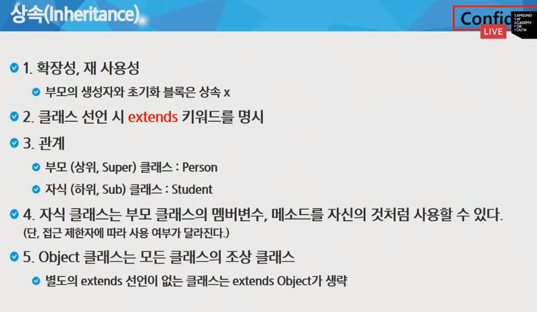
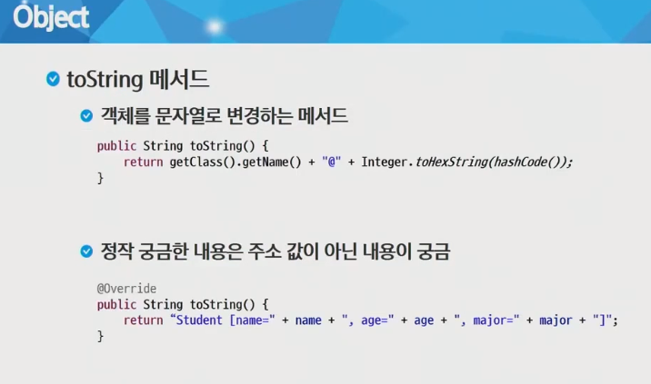
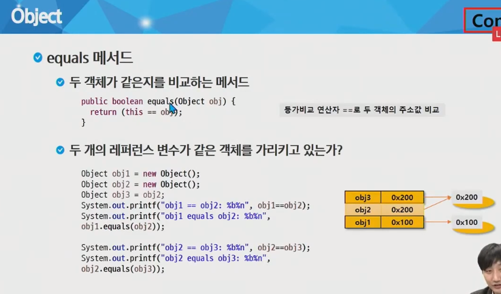
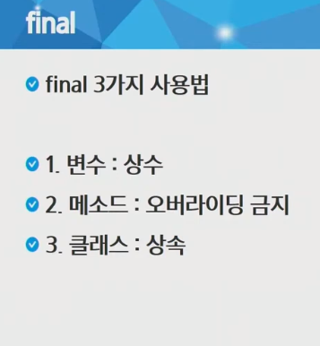
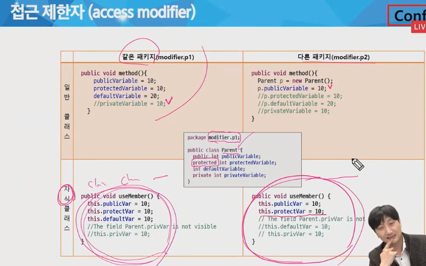
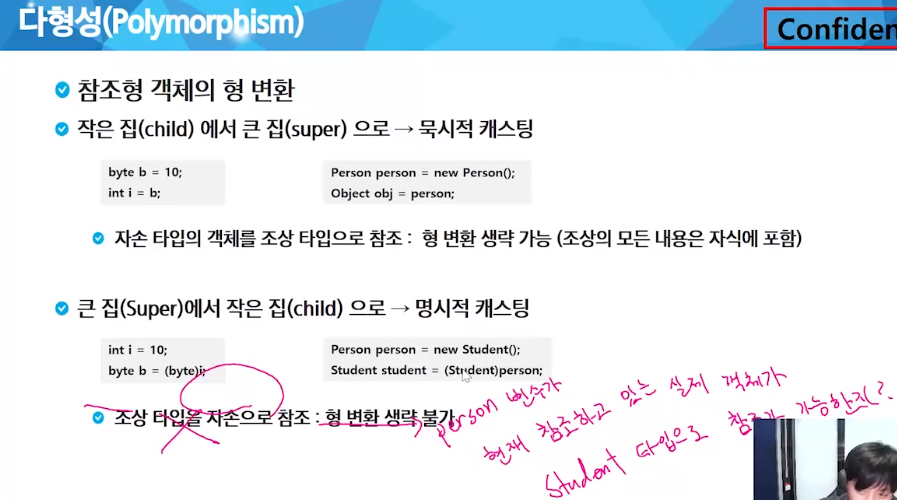
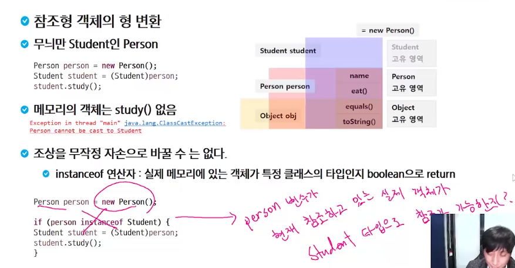
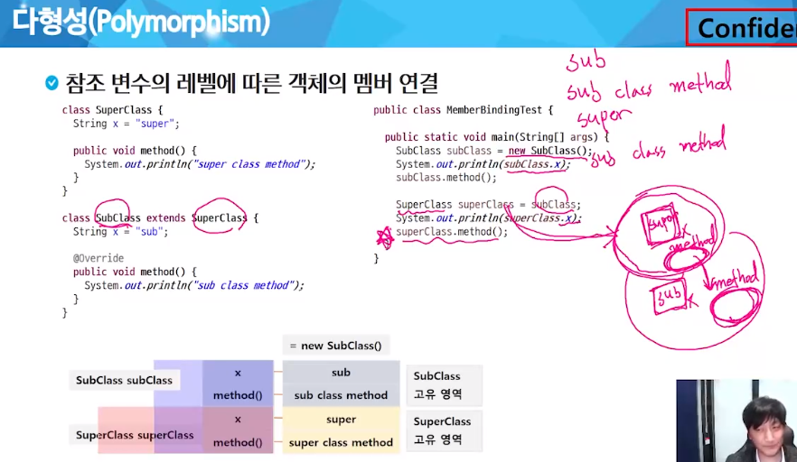

자동 import : ctrl + shift + o

접근제한자 public, protected, (default), private가 있다.
public 모든 위치에서 접근이 가능
protected 같은 패키지에서 접근이 가능, 다른 패키지 접근 불가능, 단 다른 패키지의 클래스와
상속관계가 있을 경우 접근 가능
default 같은 패키지에서만 접근 허용, 접근 제한자가 선언이 안 되었을 경우 기본 적용
private 자신 클래스에서만 접근이 허용

## 상속

super class

sub class

Object -> 모든 class의 부모 extends Object 생략

자식클래스의 객체를 생성하는 것은 부모클래스의 객체를 먼저 선언한 후 거기에 자식 클래스를 이어 붙여서 객체생성을 완성(부모 생성자 실행 후 자식 생성자 실행)

override 부모 변수나 함수를 완전히 똑같이 만들어 재정의

부모의 멤버에 접근하기 위해 super키워드 사용, 부모 생성자 접근 시 super사용

자바는 다중 상속 배제

annotate -> @Override, 컴파일러가 override인지 한번 확인하게 하는

## 접근 제한자

private 자신만

default 같은 패키지

protected 같은 패키지 + 자손

## 다형성

부모 클래스의 참조변수로 자식 클래스의 객체를 참조할 수 있다.

그러면 부모 안의 변수만 불러올 수 있다

함수일 때만 자식의 오버라이드 함수가 실행되고 나머지는 다 부모의 주소를 바라봄

-> **동적 바인딩**(함수만 동적 바인딩 됨, 변수는 x)

형변환 가능 여부를 살피고 형변환

