## 추상클래스

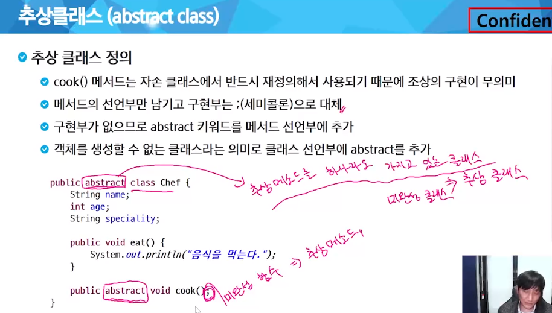

추상 클래스는 미완성이기 때문에 객체로 만들 수가 없다.

선언과 동시에 미흡한 부분을 1회용으로 구현하면 가능 ->  익명클래스 문법으로 1회용 구현과 함께 객체화 가능

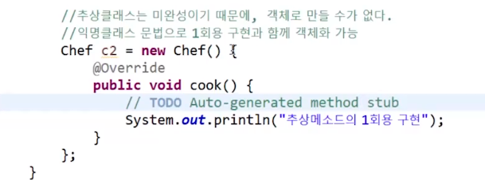

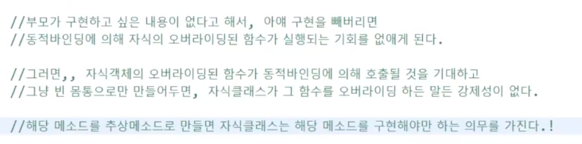

## 인터페이스

- 추상 메소드의 모임

public interface MyInterface { }

1. interface 키워드를 이용하여 선언
2. 선언되는 변수는 모두 상수로 적용()
3. 선언되는 메소드는 모두 추상 메소드로 적용(abstact 적지 않아도 추상 메소드)
4. 객체 생성이 불가능(추상클래스 동일한 특성)
5. 클래스가 인터페이스를 상속 할 경우에는 extends가 아닌 implements키워드를 이용

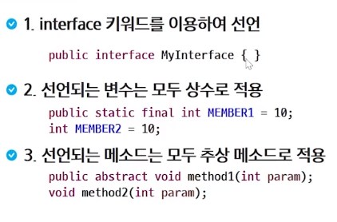

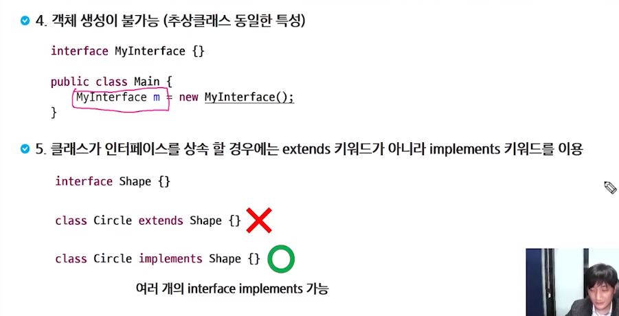

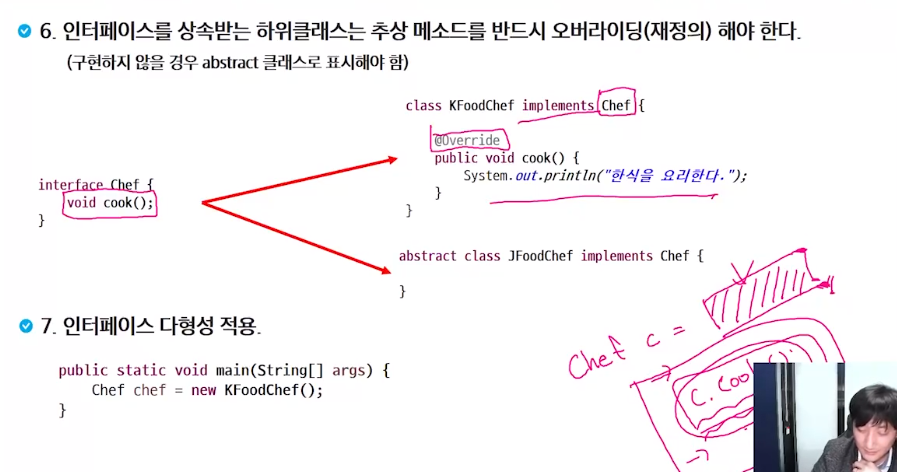

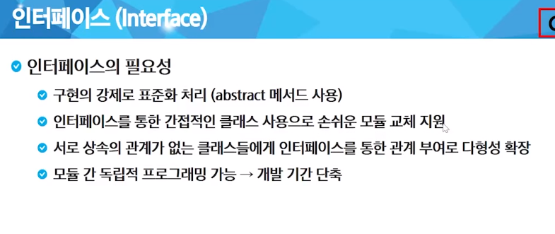

## 예외처리

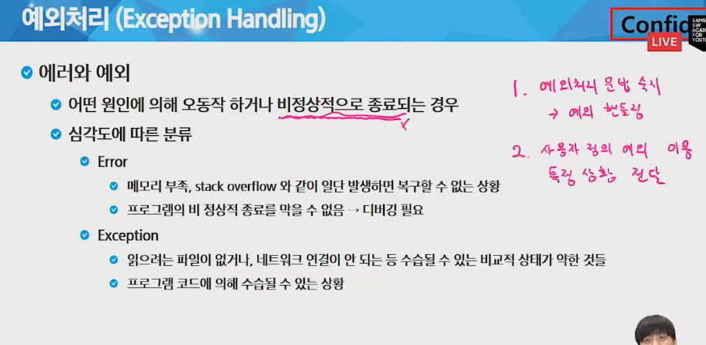

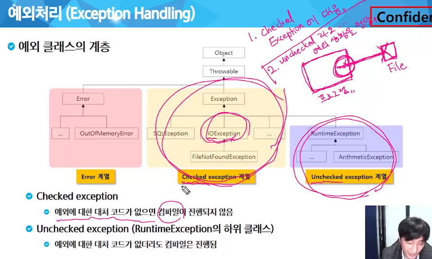

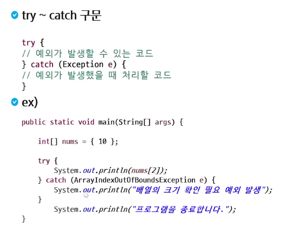

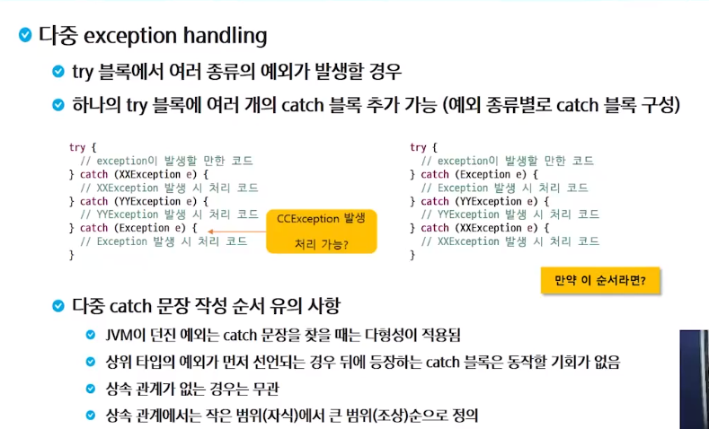

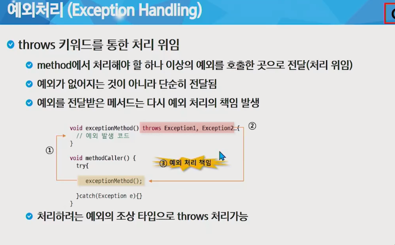

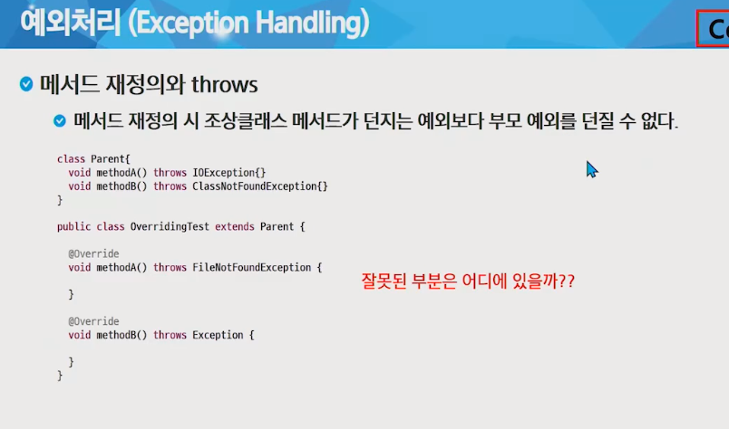

methodB에 ClassNotFoundException을 throw했는데 더 큰 Exception으로 오버라이드할 수 없다

상황을 전달하기 위해 사용한다

## 싱글턴 패턴(Singleton Pattern)

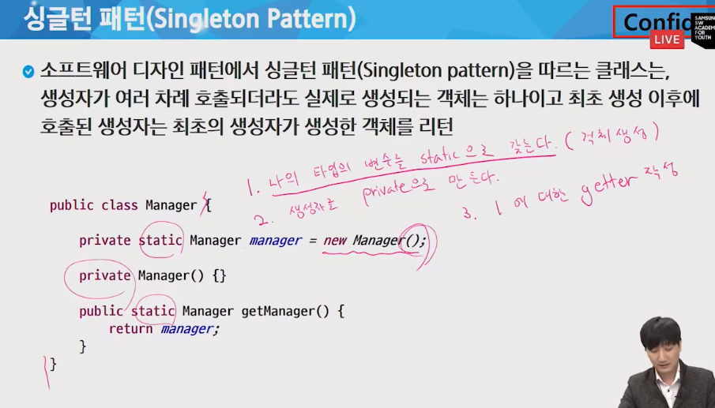

static으로 해야 만들어질 new Manager를 담아놓을 자리를 미리 마련해놔야하므로

static의 getter도 static이어야 한다.

private으로 생성자를 만들어 밖에서는 더 못 만들도록

