## Generic

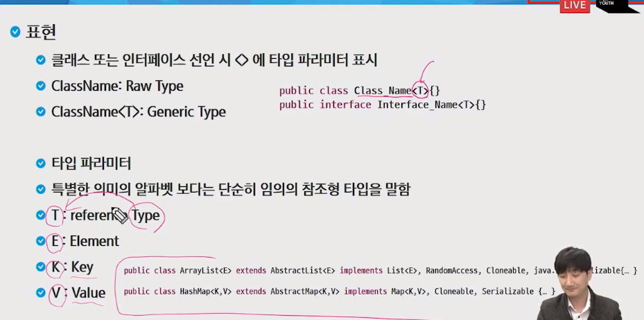

generic 잘 쓸 일 없다.

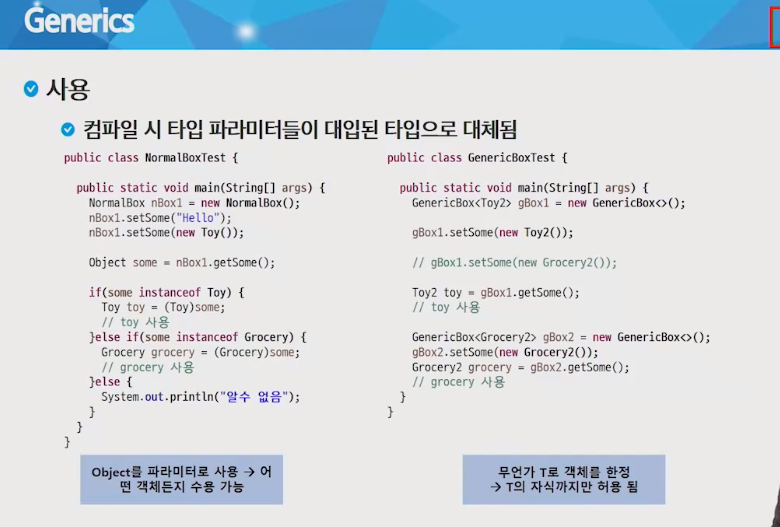

Generic이란 객체를 설계할 때 정해지지 않은 타입 객체를 생성할 때 정하고 싶은 타입을 <>로 메꿔넣고 객체를 생성할 때 타입을 정해주는 기술

int... a -> 가변길이 배열, 파라미터에서 여러개 주면 다 받는다

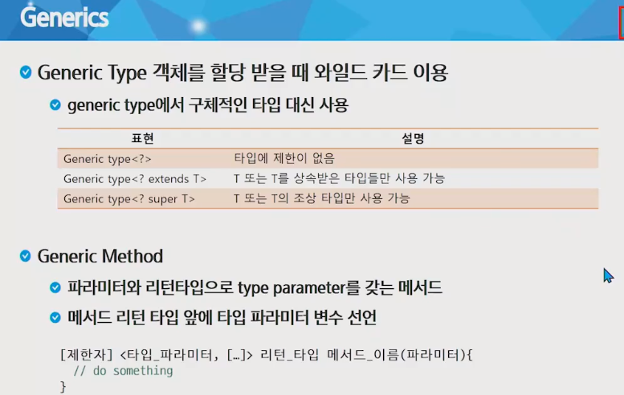

아 이런게 있구나~로 넘어가기

## Collection Framework

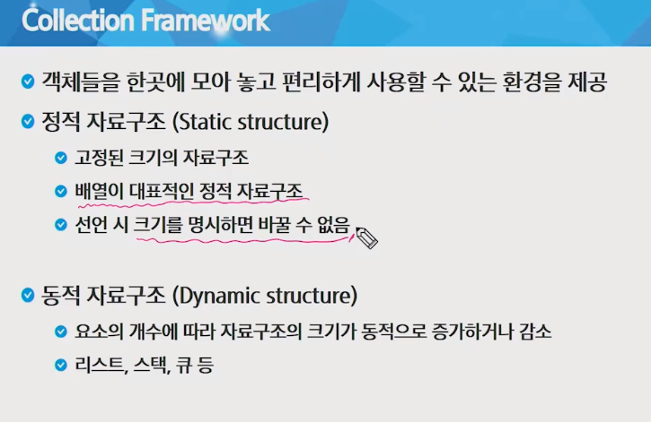

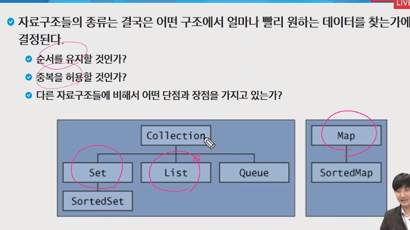

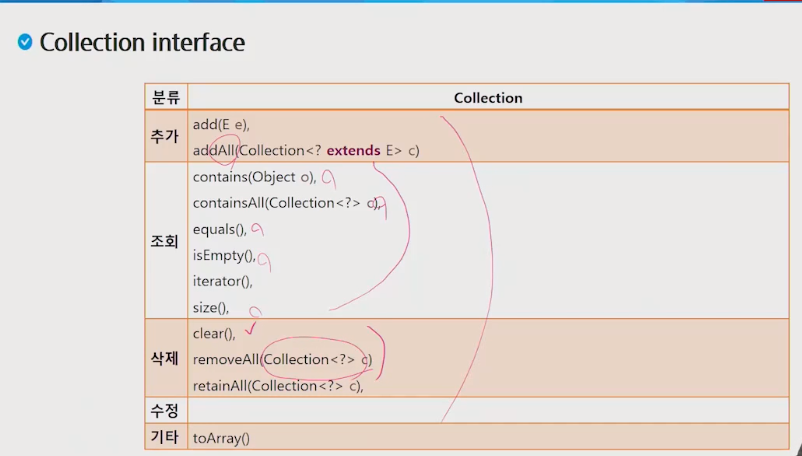

### List 

- 순서가 있고 중복을 허용(배열과 유사), 가변길이

- ArrayList

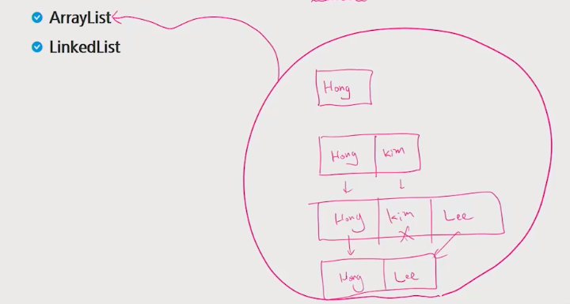

- LinkedList -> 추가 삭제 : 유리, 탐색 : 불리

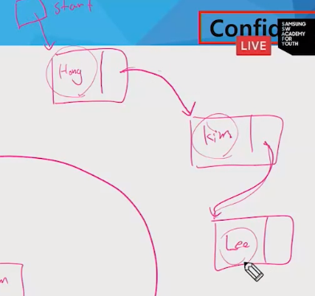

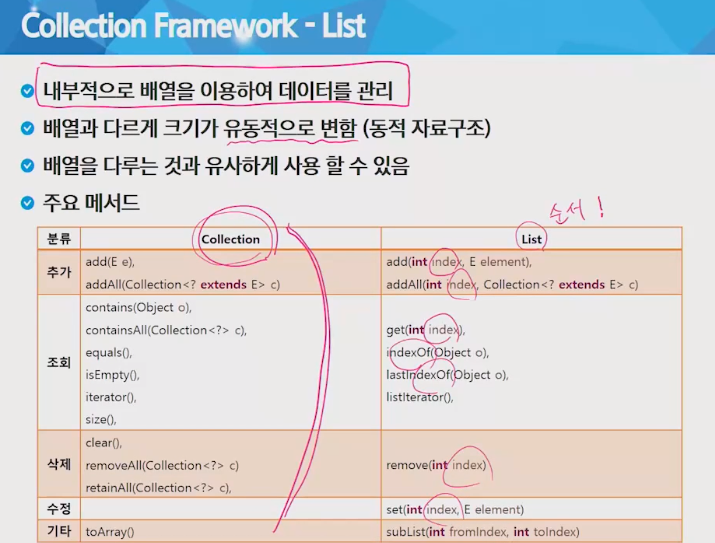

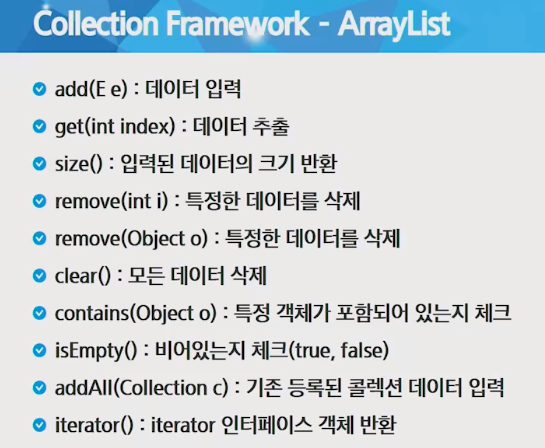

---

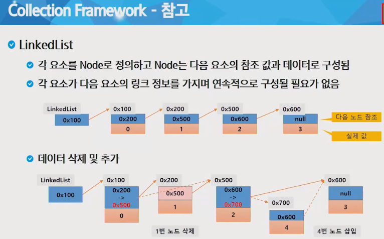

### Set

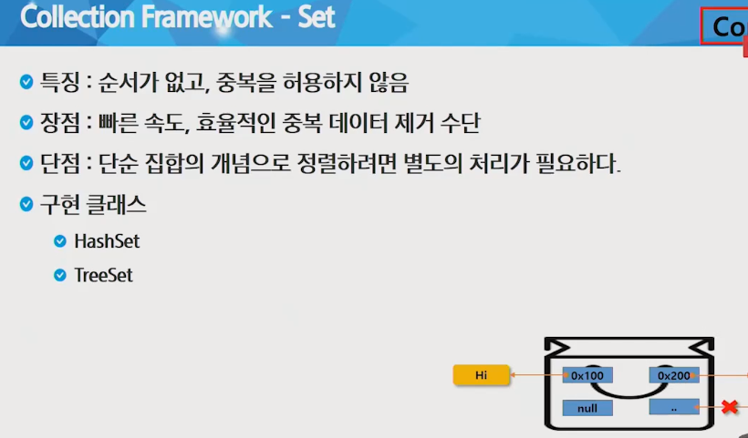

#### hash

입력이 다르면 출력이 최대한 다르도록 해놓은 것

자료 비교 시 해쉬로 비교

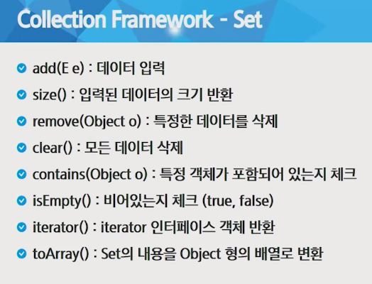

hash로 먼저 비교 후 equals로 비교해서 재정의해서 사용 시 equals뿐만 아니라 hashcode까지 재정의해야한다. generate에서 같이 생성

### Map

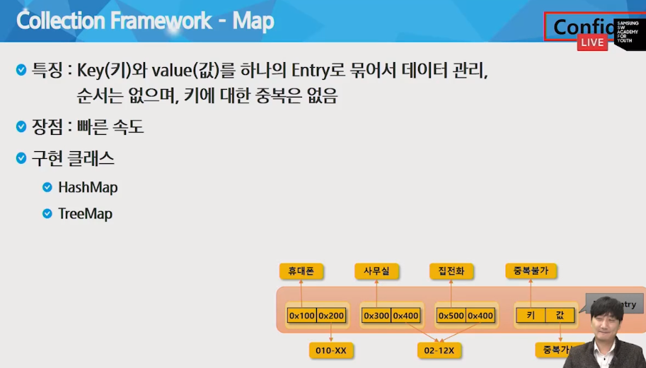

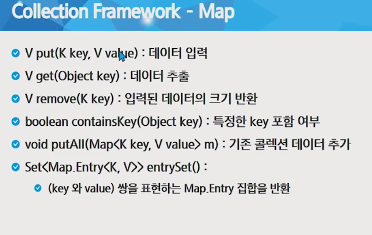

### 정렬

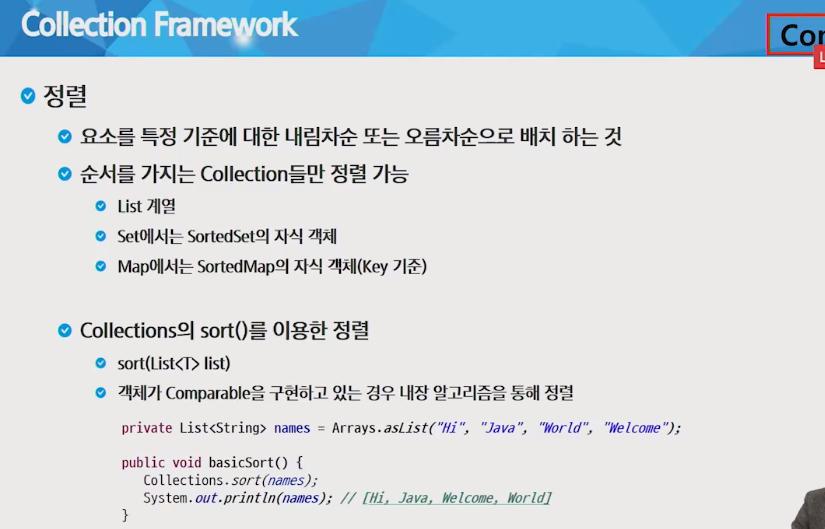

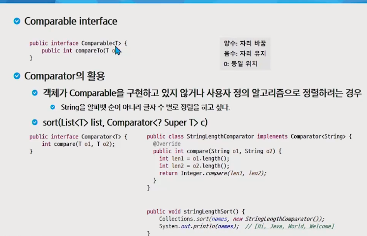

## 입출력 API

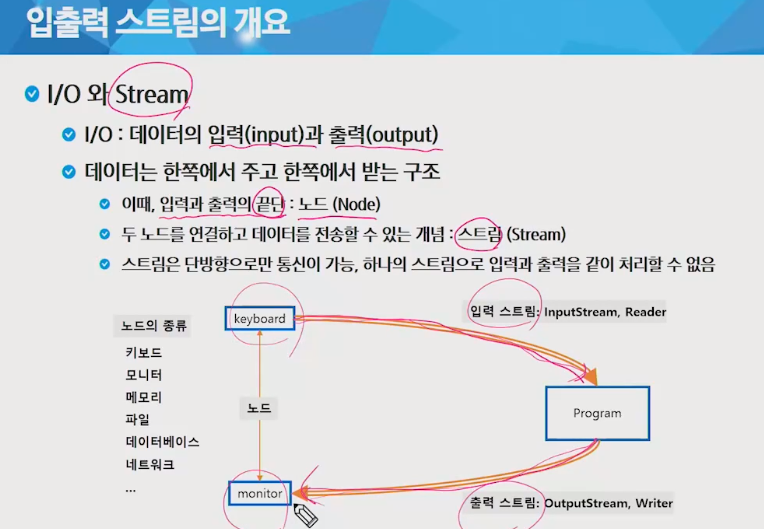

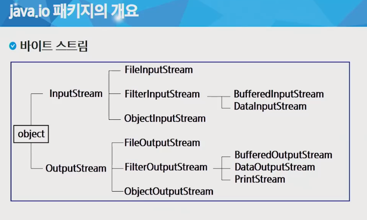

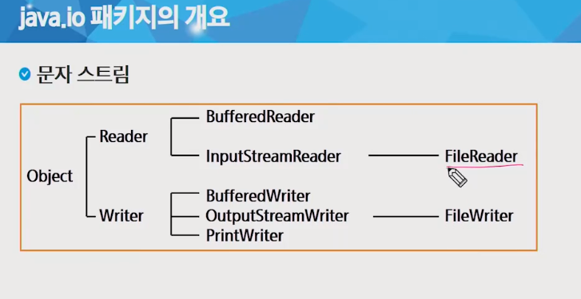

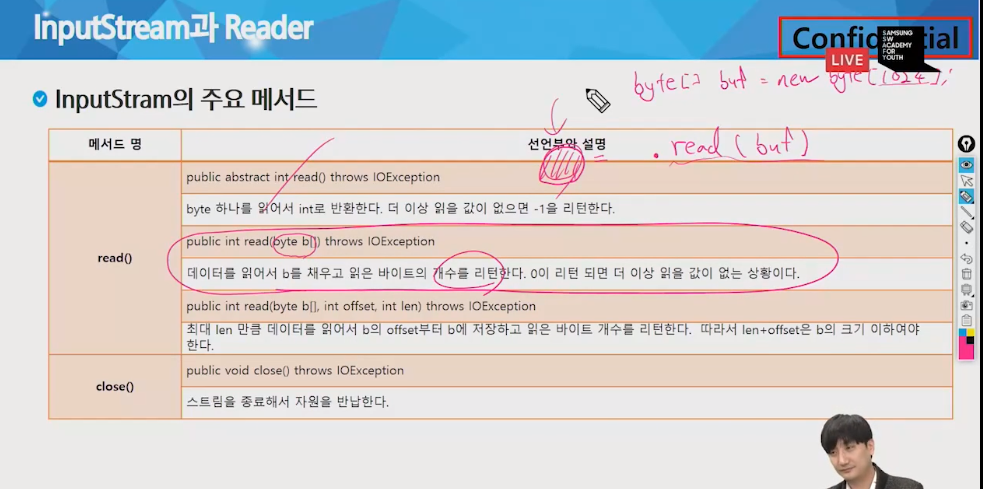

읽을 때 중간걸로 읽어서 읽은 개수를 리턴 받아서 쓸 때 그 크기를 이용해 쓴다

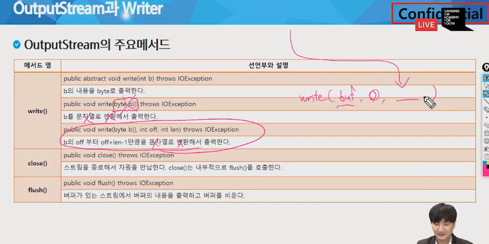

1. 파일 복사하기

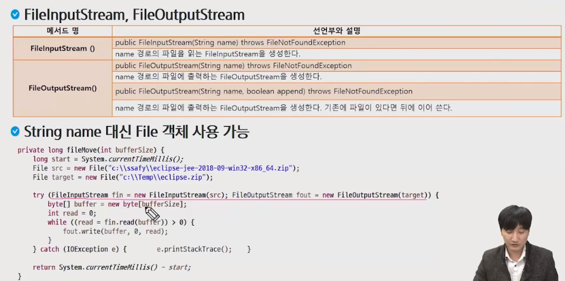

버퍼 사이즈가 1024byte인데 그걸 넘어서면 파일이 복사가 안 되는건가?

while문은 1024byte를 1byte씩 읽고 써서 쓰는 것인가?

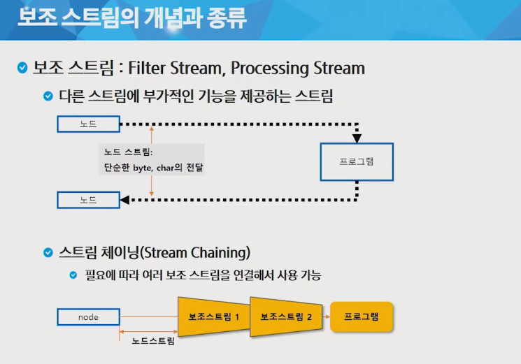

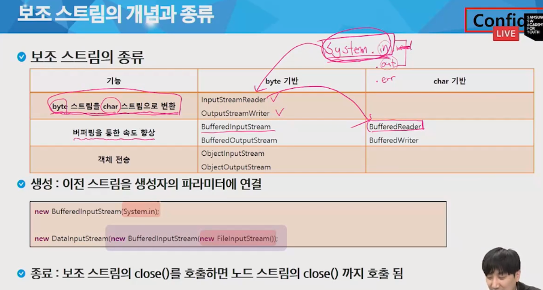

버퍼로 읽기

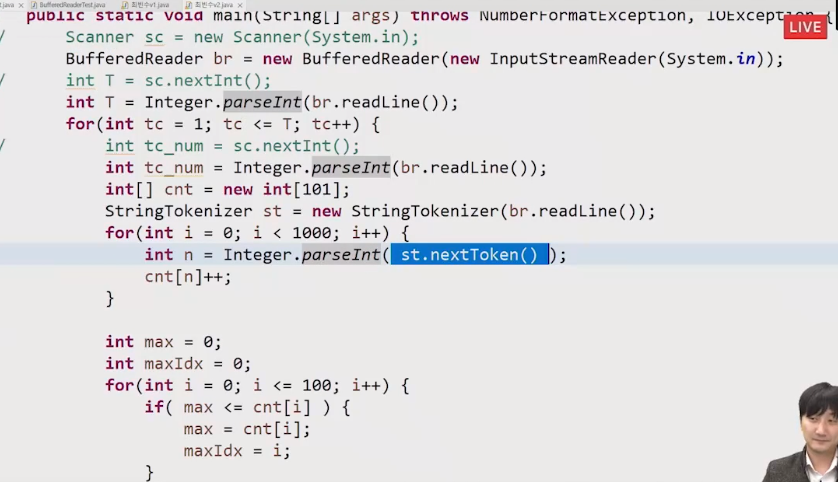

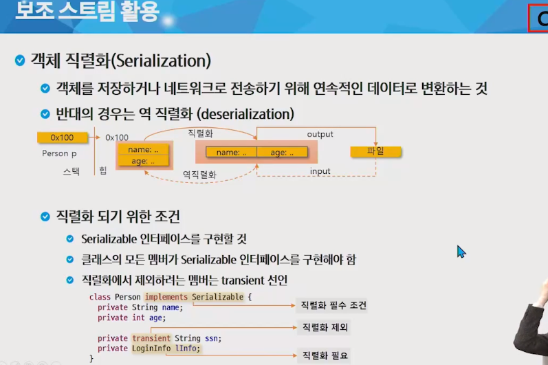

정리

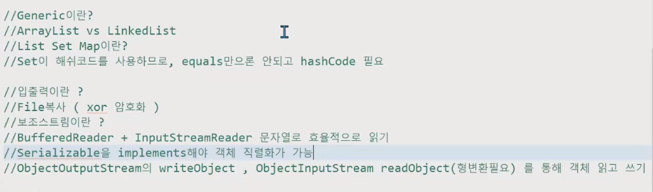

