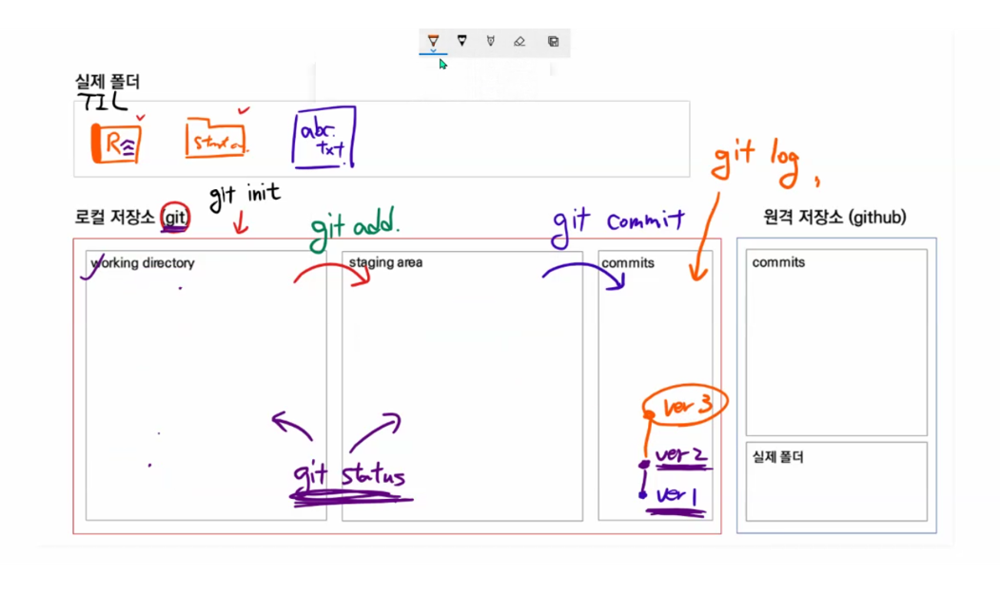

# Git & Github

왜 git 버전 관리하냐 (분산) 버전 관리 프로그램

버전 : 컴퓨터 소프트웨어의 특정 상태

관리 : 어떤 일의 사무, 시설이나 물건의 유지*개량

프로그램 : 컴퓨터에서 실행될 때 특정 작업을 수행하는 일련의 명령어 모음

버전 관리 = 컴퓨터 소프트웨어의 특정 상태를 관리하는 것

git commit

i : insert

esc : 

:wq 

---

* `git init` :
* git add 파일명 :  
* git add . : 현재 폴더 전부 staging area에 올린다
* git commit : 
* git status : working directory 와 staging area 체크
* tracked / untracked : 관리되고 있는지 처음 관리인지
* modified : 수정 됐으면
* git commit -m ''
* git log : commit의 내용 확인

local에서 remote repository 에 올리기 위해

1. 원격저장소 정보 등록(url)

   git remote add remote별명 remote주소 (origin -> 컨벤션, main)

2. 로컬 내용을 push 한다.