# 네트워크의 구성 요소

>  What is internet?

## 교과목 목표

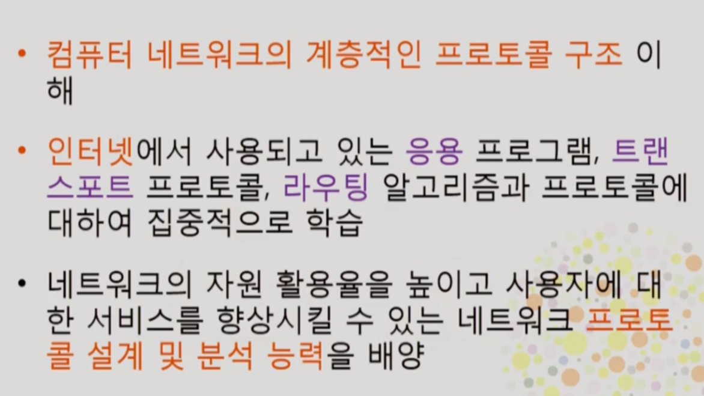

- 프로토콜 : 통신 규약
- Top-Down으로 네트워크 계층 설명 예정
- 수업노트?

## 인터넷이란

- host = end system = 사용자 컴퓨터나 서버
- router = 사용자의 메세지가 목적지를 찾아가게 해주는 장치
- link = 물리적 회선 라우터들끼리 연결
- 가장자리에 host, 중앙에 스위치와 라우터 - link로 연결

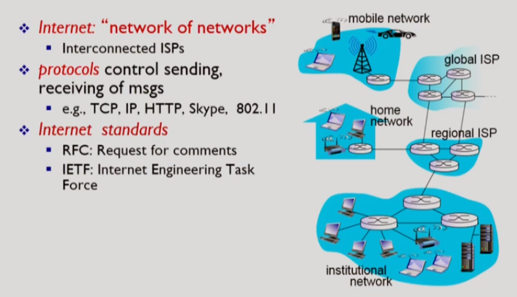

- 인터넷 = 네트워크들이 모인 네트워크
- 프로토콜 = 인터넷에서 메세지를 보내는 일련의 규칙
- 표준화가 중요
- IETF기관에서 RFC 표준안 발표

## 프로토콜이란

- 포멧, 메세지 순서, 메세지를 받았을 때의 action 등이다

## Network Edge

- access network : host를 네트워크에 연결시켜주는
- bandwidth : 단위 시간당 실어나를 수 있는 비트 수
- bandwidth가 shared(다른 사람과 공유하는지)냐 dedicated이냐

### Digital subscriber line(DSL)

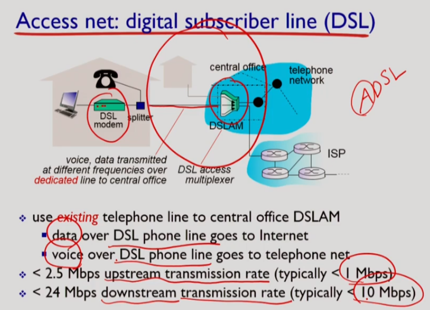

- 전화 회사가 제공해주는 access network
- dedicated link
- DSLAM이 전화와 네트워크를 분리해준다
- 다운로드를 업로드보다 많이 한다

### Cable network

- 케이블 회사가 제공하는 access network
- shared link
- **HFC** : hybrid fiber coax (fiber cable(광케이블)과 coax cable(동축케이블, 각 가정으로)을 섞어서 사용)
- 다운로드가 최대 30Mbps (다른 집과 share할 수 있으므로 최대가 붙는다), 업로드는 최대 2Mbps

### 집의 네트워크

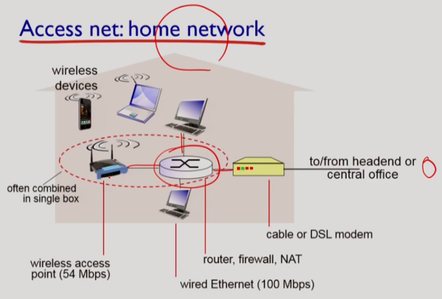

- 라우터가 여러 end system을 묶어서 네트워크에 연결

### 기관의 네트워크

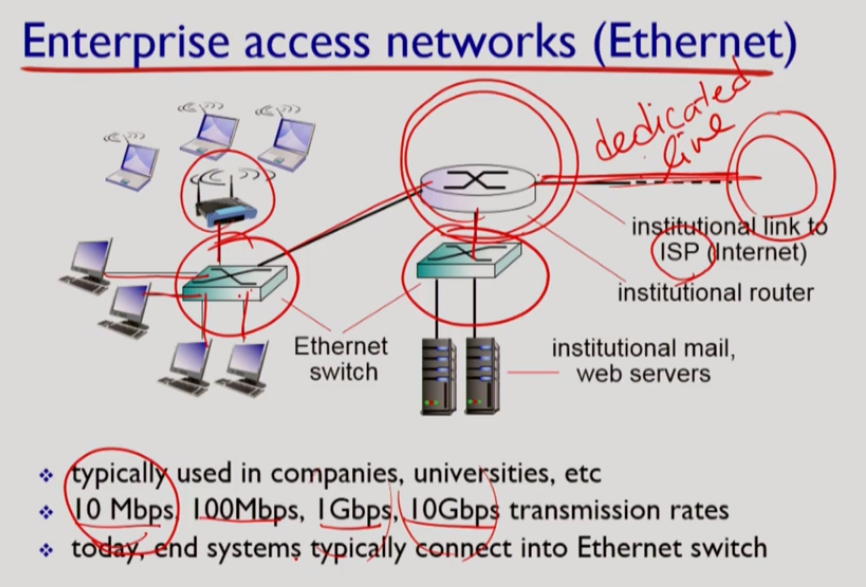

- ISP(Internet Service Provider)로 직접 연결(dedicated)
- 이더넷 스위치로 묶어서 학교 전체를 엮는 라우터에 물리고 직접 ISP에 연결
- 전화나 케이블 회사가 제공하는 네트워크가 없다

### Wireless access network

- 와이파이는 건물 안에서만, 대역폭이 넓다
- cellular network = wide-area wireless network
- 약어가 많다

# 네트워크의 구성 요소

>  Network edge, Network core

### Host

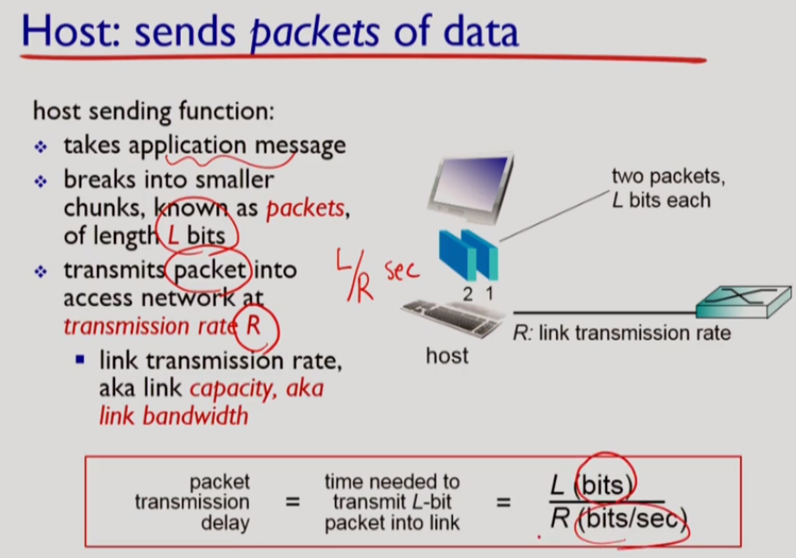

- 패킷 하나를 호스트에서 내보내는데 걸리는 시간 L/R(sec)
- host의 역할 : application message를 packet으로 잘라서 access network로 내보냄

### link

- quided media : 물리적인 wire를 사용
  - copper(= twisted pair) : Ethernet
    - Category 5 : 100 Mbps, 1Gbps Ethernet 지원
    - Category 6 : 10Gbps
  - fiber : HFC (Hybrid Fiber Coax), 지원하는 transmission rate가 높다, light pulse를 signal로 전달, transmission rate가 매우 높고 error rate가 낮다
  - coax : HFC, 지원하는 transmission rate가 더 높고 stable해서 broadband link
- unguided media : electromagnetic spectrum(전자기 스펙트럼)을 사용해 공기 중 전파
  - radio - WiFi, Cellular
  - noise에 굉장히 민감

## Network Core

souce에서 destination으로 정보를 전달하는 두가지 방식

### Circuit switching

- 전화 네트워크에서 사용
- 메세지 전달 전 call setup과정을 거친다
- call up :
  - source로부터 destination까지의 경로를 설정
  - resource reservation
  - 자원을 분할하는 방식이 있어야 한다
  - FDM(Frequency-division multiplexing)- frequency 대역을 나눠서 사용자마다 나눈다, TDM(Time-division multiplexing) - 시간으로 잘라서 사용

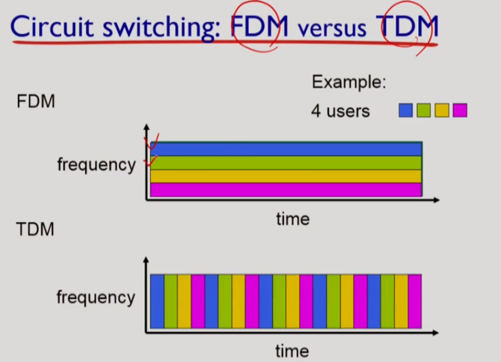

- 할당된 connection 사이를 다른 사용자와 share 할 수 없어서 순간적으로 데이터 송수신이 많은 인터넷과 같은 데이터 네트워크에는 비효율적이다

### Packet Swtching

- Call Setup이 없고 자원 예약도 없다
- 각 data transmittion이 full link capacity를 이용
- 하나의 메세지 크기가 너무 크면 회선을 독점하므로 자원 이용이 비효율적이므로 메시지를 packet이라는 chunk로 자른다
- 각 packet에 목적지 주소가 명시되어야 한다
- store-and forward : 라우터는 packet을 전체를 다 받고 보내야한다

#### store-and-forward

- congestion : queueing delay가 심해지고 큐가 쌓여 버퍼가 가득차서 loss가 나는 상황

### Packet switching vs circuit switching

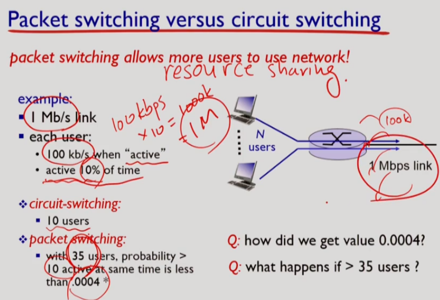

- packet switching이 resuorce sharing이 훨씬 효율적으로 일어난다
- 하지만 resource를 예약하지 않으므로 congestion이 발생할 수 있다
- streaming data에서는 delay가 중요한데 packet switching은 보장하지 못 한다

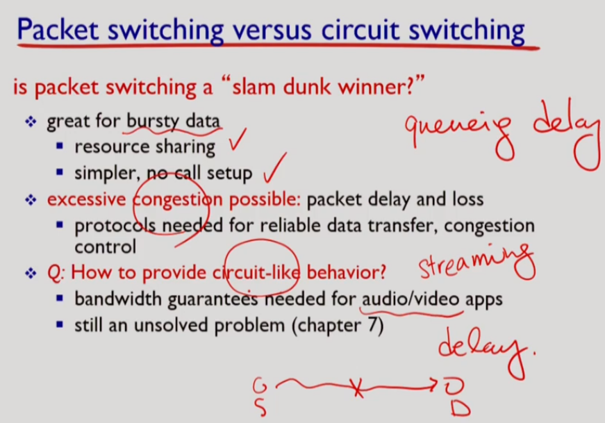

## Internet structure : network of network

- 소규모 지역 ISP에서 대규모 ISP까지 연결
- 서로에게 consumer와 provider가 된다
- IXP(Internet Exchange Point) : ISP끼리 연결시켜주는 인터넷 연동 서비스
- Multi-tire hierarchy(계층)
- Point-of-presence : consumer isp들에게 인터넷에 접속하게 해주기 위해서 provider isp들의 라우터에 연결할 수 있게 해주는 접속점
- peering : 같은 level에 있는 다른 isp들과 연결 - settlement-free 때문에 연결

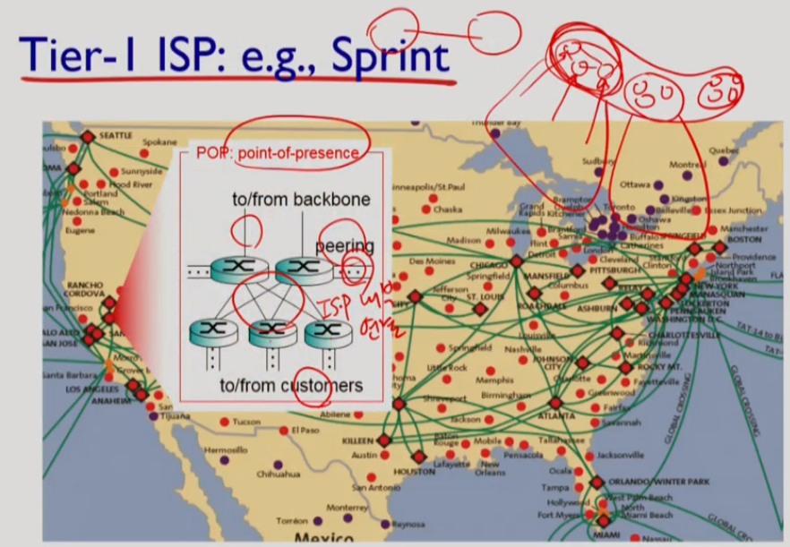

- Settlement-free : 통신량이 많은 RISP 간에 직접 peering link를 통해 cost, delay를 줄이는 것
- Multi-home : higher level ISP를 여러개 두는 것

- Content Provider Network 
  - Google, Microsoft 등이 만든 자신들만의 네트워크

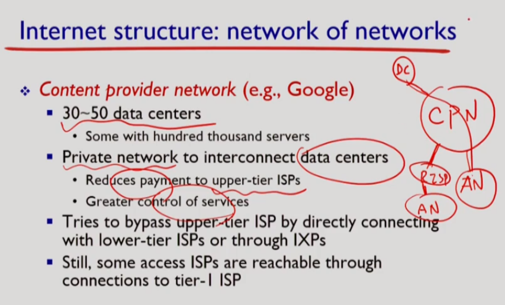

## Summary

