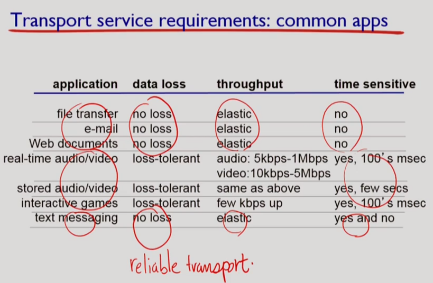
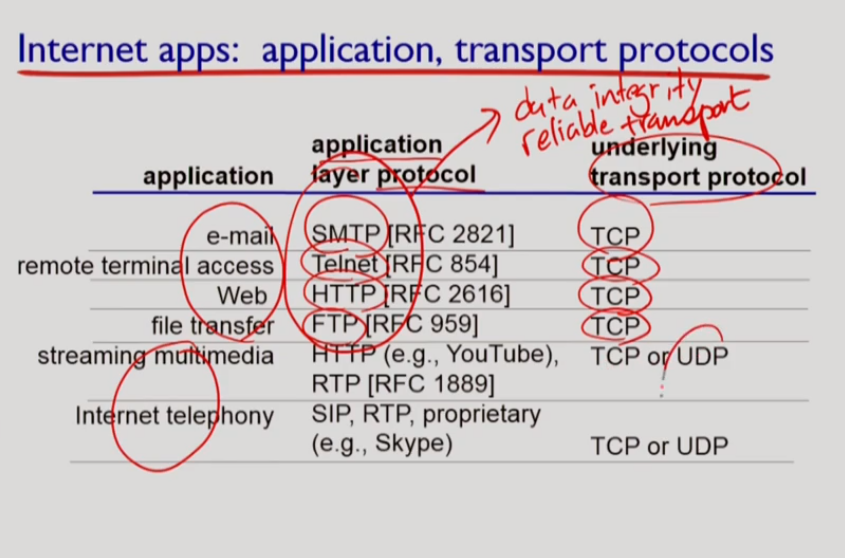
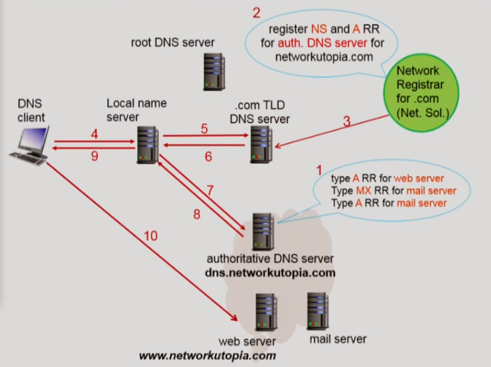

# 어플리케이션 계층1

>  Principles of network, applications, Web and HTTP

우리는 일상적으로 웹서핑을 하거나 보이스톡으로 대화를 하면서 게임을 한다. 이전의 포스팅에서 얘기했듯이 평소 사용하는 프로그램 대부분은 네트워크를 이용하는 애플리케이션이다.  그러므로 먼저 네트워크 애플리케이션 계층을 살펴보도록 하자.

 

------

## 클라이언트 - 서버 아키텍쳐

- 클라이언트란?
  - 클라이언트 프로세스는 서버로부터 **서비스를 받는 프로세스**이다. 예를들어 웹클라이언트( == 웹브라우저)는 웹서버에게 웹 서비스를 요청(Request)하고 웹서버로부터 응답(Response)을 받는다
  - 클라이언트는 서비스를 받는 입장이므로 당연히 클라이언트끼리 직접적으로 통신하지않는다.
  - 항상 켜져있을 필요도 없고 서버는 특정 클라이언트가 고유하게 누군지 식별할 필요 없으므로 고정된 IP가 필요없다.
- 서버란?
  - 서버 프로세스는 클라이언트에게 **서비스를 제공해주는 프로세스**이다. 예를들어 웹서버는 웹클라이언트에게 요청을 받아서 필요한 경우 Database나 다른 서버들과 통신하여 응답을 만들어 클라이언트에게 보낸다.
  - 클라이언트는 특정 서버를 고유하게 알고있어야 하므로 **고정 IP**를 가져야한다.(변동 IP도 가능하긴 하나 논외로 하자. 본질적으로는 고정 IP가 필요하다.)
  - 여러 클라이언트들이 언제든지 요청을 보낼 수 있기 때문에 **항상 켜져있는 상태**여야한다.
- 서버와 클라이언트의 구분
  - 서버인지 클라이언트인지 헷갈릴 때는 이렇게 구분하자.
  - 클라이언트는 **통신을 시작하는 프로세스**이다.
  - 서버는 **통신을 기다리는 프로세스**이다.
- 다른 호스트에 있는 **프로세스들**은 메세지를 교환함으로써 통신한다.

 

------

## P2P 아키텍쳐

- P2P 아키텍쳐란?
  - P2P 아키텍쳐에 참여하는 어떤 **호스트가 서버이기도 하고 클라이언트**이기도 하는 아키텍쳐다.
  - 예를들어 P2P 파일 공유 서비스를 생각해보자. 한 사용자는 다른 사람으로부터 파일을 전송받기도 하고 동시에 다른 사람에게 파일을 전송해주기도 한다.
  - 항상 켜져있는 서버가 없고 사용자는 서버 역할을 동시에 하므로 사용자가 늘어나면 동시에 서비스할 수 있는 능력(Capacity)도 늘어나는 **Self-Scalability한 특징**을 가진다.
  - 임의의 Endsystem을 peer라고 한다.
  - 당연히 관리가 복잡하다.

------

## 소켓, Socket

- 잠깐 복습하자면 인터넷 계층은 애플리케이션-전송-네트워크-링크-물리 계층순이다.
- 소켓이란 계층간의 인터페이스이다.
- application계층과 transport계층 사이의 door

## 포트, Port

- Multi-Programming OS에서는 한 호스트에서 여러 프로세스가 실행중일 수 있다.
- 포트(Port)는 여러 프로세스 중 통신하고자 하는 **프로세스를 구분하는 ID**이다.
- well known port #: HTTP server - 80, mail server - 25

------

###  

### 애플리케이션마다 원하는게 다르다

- Application마다 제각기 목적이 있다. 예를들어 멜론은 오디오 재생이 목적이고, 카카오톡은 메세지 전송이 목적이다.
- 목적이 다르면 요구하는 성능도 다르다. 세가지 측면에서 살펴보자.
- Data Integrity(무결점)
  - File Transfer는 예민하다
  - Audio는 순간적으로 잡음이 발생도 큰 문제는 아니다.
- Timing
  - Game은 예민하다. - 딜레이가 적어야한다
  - File Transfer는 덜 예민하다.
- Throughput
  - Streaming은 최소한의 프레임이 유지되어야 하므로 예민하다.
  - 단위 시간 당 프레임이 중요
  - File Transfer는 당연히 덜 예민할 것이다.
- security

------

## 인터넷 Transport 계층의 두 프로토콜, TCP와 UDP

- Transport 계층은 후에 자세하게 다루므로 여기서는 간단히만 알아보자.
- TCP : Transmission Control Protocol, 말 그대로 전송 제어를 담당하는 프로토콜이다.
  - 믿을만한 (reliable) 전송을 보장해준다.
  - Flow(정보량이 많으면 조절), Congestion(경로상 라우터버퍼가 차면 전송 속도를 줄인다) Control을 제공해준다.
  - Connection Oriented : 서로 커넥션을 맺고 통신한다.
  - Timing, min throughput, security는 보장하지 않는다.
  - 기능이 많은 많큼 Protocol Control Overhead(connection manage)도 크다.
- UDP : User Datagram Protocol, TCP와 달리 Control이 들어가있지 않다.
  - Unreliable한 전송을 한다.
  - Flow, Congestion Control 없이 최선을 다해서 전송한다.
  - Application 계층에서 Integrity를 체크하는 경우 UDP를 사용한다(TCP 경우 중복).
  - 최선을 다해서 전송하므로 Real Time에 적합하다.
  - http 3.0은 UDP를 사용한다.

------

### Application-Layer Protocol

- 무엇을 정의하나?
  - 메세지의 타입
    - 이 메세지가 서버에게 요청을 보내는 Request인지
    - 서버의 응답인 Response인지 구분한다.
  - 메세지의 문법(Syntax)
    - 메세지를 몇비트씩으로 쪼개서 그 부분엔 어떤 필드를 넣을까?
    - 예를들어 메세지의 첫 1비트는 메세지의 타입을 명시하자!라고 정할 수도 있다.
  - 메세지의 의미(Sementics)
    - 그래서 이 처음 1비트의 1과 0이 Request야 Response야?
    - 무슨 의미인지 정의한다.
  - 전송, 응답 규칙
- open protocols: RFCs에 다 정의 됨 공개 : HTTP, SMTP
- proprietary protocols : Skype
- Web과 Http 프로토콜
  - Web은 World Wide Web (www)의 약자로서 인터넷 상에서 동작하는 정보교류 서비스이다. 
  - Http 프로토콜은 Web이 사용하는 프로토콜이다.
  - Web 페이지는 URL(Universal Resource Locater)로 연결된 Html 파일, 자바스크립트, 이미지 등으로 구성되어 있다.
  - 이런 웹페이지를 구성하는 항목들을 Object라고 한다.
  - 웹페이지는 Base Html파일 아래 여러 오브젝트들이 연결된 형태다.
- Http(hypertext transfer protocol)의 개괄적인 내용
  - Http는 Web상에서 정보(문서)를 주고받기 위한 프로토콜이다.
  - client(요청, 받고, display하는 browser)-server(sever가 objects를 요청에 응답) architecture
  - 문서 전송도 File Transfer이므로 앞에서 얘기했듯이 Data Integrity가 Critical하게 중요하다!
  - 그러므로 UDP가 아닌 **TCP를 이용**한다. (http 3.0은 최적화를 위해 UDP를 사용한다.)
  - Http 자체는 Stateless하다
    - 예를들어 로그인 상태가 유지되는 것이 아니라 매번 로그인을 해야한다고 생각하자
    - request history가 없다, 과거 동작을 기억하지 않는다
    - 쿠키를 사용해서 session-id로 stateless한 특성을 보완할 수도 있다.
  - Non-persistent http VS Persistent http
    - 한번 맺어진 tcp 커넥션을 재사용 안하냐 / 하냐의 차이다.
    - Non-persistent는 Base Html파일에 담겨진 Object마다 새로 TCP연결을 맺어 가져와야하므로 성능저하가 크다.
    - 다음 글에서 조금 더 자세히 다루겠다.

# 어플리케이션 계층2

>  HTTP

## RTT : Round Trip Time

- RTT란?
  - 아주 작은 패킷이 클라이언트와 서버 사이를 왕복하는데 걸리는 시간이다.
  - '아주 작은 패킷'은 Transmission Delay를 무시한다는 뜻이다. 단위 패킷당 네트워크 왕복시간 정도로 해석하자.
  - 앞으로 RTT는 기준이 되는 시간처럼 사용한다.

------

## Non-Persistent Http

- 앞에서 Http는 File Tansfer와 비슷하므로 Data Integrity가 중요하다고 했다.
- 따라서 Http는 UDP 가 아닌 신뢰성있는 TCP를 사용한다.
- Non-Persistent Http는 하나의 오브젝트를 받을 때마다 TCP 연결을 다시 맺는다.
- 초장기 버전인 Http 1.0에서 사용하는 방식으로 1.1부터는 Persistent Http를 지원한다.
- 작동방식
  - \1. 클라이언트가 서버에게 Http 프로세스 간 TCP 커넥션을 요청한다. 서버는 요청을 받고 응답을 보낸다.
  - \2. 클라이언트는 요청 메세지를 TCP 소켓에 넣는다.
  - \3. 서버는 받아서 처리 후 응답 메세지를 TCP소켓에 넣고
  - \4. 서버는 TCP 커넥션을 종료한다.
  - \5. 클라이언트는 응답을 받아 화면에 표시하고 추가 오브젝트를 위해 1~4를 반복한다.
- 어느 정도의 시간이 소모될까?
  - 커넥션 생성에 1 RTT, 원하는 오브젝트를 받기 위해 1 RTT가 필요하다.
  - 따라서 오브젝트 하나당 2 RTT가 필요하고, 100개의 오브젝트를 받아야 한다면 200 RTT나 필요하다
  - 그래서 1.1버전부터는 Persistent Http를 사용한다.
- 그럼 병렬로 TCP 연결을 생성한다면?
  - TCP는 신뢰성있는 데이터 전송을 위한 버퍼와 소켓을 가지고 있다.
  - 여러개의 TCP 연결을 생성한다면 소켓과 버퍼가 운영체제에 부담을 많이 주게된다.

## Persistent Http

- 서버가 Response를 보낸 후에도 TCP 커넥션을 유지한다.
- 커넥션 연결에 1 RTT, 여러 오브젝트들을 전송하는데 약 1RTT가 걸리므로
- 여러개의 오브젝트들을 보낸다해도 2RTT + a의 시간이 걸린다.
- Http 1.1 부터 지원한다.

##  

------

## Http Message : Request와 Response

- Http는 무엇일까?
  - Http는 HyperText Tansfer Protocol의 약자이다. 어려운 기술같아 보이지만 어쨌든 Protocol, 규칙이다.
  - 웹(WWW)에서 데이터를 주고받기 위한 프로토콜이다. 주로 html문서를 주고 받는다.
  - 그럼 웹은 뭘까? 인터넷상에서 정보교환을 위한 서비스이다. 웹은 인터넷의 여러 서비스 중 하나이다.
- Http 메세지의 두 종류, Request와 Response
  - Http는 정보를 주고 받기 위한 프로토콜이다.  http는 요청(Request)하면 준다(Response)
  - Request : 정보를 요청하는 메세지
    - ASCII로 되어 있다.
      - American Standard Code for Information Interchange의 약자다.
      - 컴퓨터는 숫자로 연산하므로 숫자와 문자를 연결하는 규칙이다.
      - 즉 사람이 읽을 수 있는 문자로 표현된다.
      - ASCII에서 A는 American이니까 영어다.
    - Request Line : Request의 첫 줄
      - Method : GET or POST 등 어떤 요청인지 적는다.
      - Target : 호스트의 어떤 무엇을 필요로 하는지 적는다.
      - Http Version : 클라이언트가 사용하는 버전을 적는다.
    - Header Line : Http 메세지에 대한 정보가 있다.
      - Host : 메세지를 받는 호스트의 URL
      - User-agent : 요청을 보내는 측의 정보
      - Connection : 요청을 받고 커넥션을 유지할 것인지. ex) keep-alive
      - 등등등
    - Entity body : 메세지의 본문이 들어간다. POST 타입의 경우에 여기에 뭔가가 써진다...!
  - GET과 POST의 차이
    - GET과 POST는 Request message의 대표적인 두가지 메소드다.
    - GET : 파라미터를 URL에 ?로 연결하여 보낸다. 조회용 메서드이고, 멱등하며 캐시 가능하다.
    - POST : Parameter를 Entity Body에 실어서 보낸다. 서버에 처리를 요청할 때 사용하는 메서드이다.
    - 로그인 할 때 아이디와 비밀번호를 어느 메소드로 보내면 좋을 지 생각해보자.
  - 다른 메소드들
    - HEAD : 테스트 목적으로 요청메세지만 주고 받기 위해 본문을 받을 필요가 없을 때 사용한다.
    - PUT : File Upload를 하고 싶을 때 사용한다 -> remote로 서버 파일을 관리
    - DELETE : File Delete를 할 때 사용한다.
    - PUT과 DELETE는 관리자만 사용할 수 있는 메소드다.
  - Response : 요청에 응답하는 메세지이다.
    - Status Line
      - Status Code와 Status text가 실린다.
      - Status Code - Status Text 의 의미
        - 200 OK -request succeed
        - 301 Move Permanently - requested object moved, 새로운 url 표시
        - 400 Bad Request - 요청 못 알아 듣는다
        - 404 Not Found - 서버에 없다
        - 505 Http Version not Supported
    - header line
      - date, derver, last-nodified, connection, content-type... r/n/

 

**HTTP 메서드 내용은 강의 내용을 그대로 정리했기 때문에 실제 사용과는 다르다.**

**간단히 설명하자면**

**Get - 조회용 메서드. 서버 자원 변경 X, 캐시 가능, 본문이 있을 수 있으나 서버에서 처리하지 않을 수 있음. 멱등**

**Post - 서버에게 처리를 요청하는 메서드, 서버 자원 변경 O, 캐시 하지않음, 멱등하지 않음**

**Put - 서버 자원 대체, 멱등하지 않음**

**Patch - 서버 자원 일부 대체, 멱등하거나 않게끔 설계 가능**

**Delete - 서버 자원 삭제, 멱등**

# 어플리케이션 계층3

>  FTP, Electronic mail: SMTP

## 쿠키 : Cookie

 

- Http는 상태정보를 저장할 수 없다
  - 카톡 메세지 하나 보낼 때마다 카톡 로그인을 다시 해야한다고 생각해보자.
  - 즉 자신의 로그인 상태가 저장이 안된다면(Stateless) 많이 곤란하다.
  - Http 프로토콜 자체는 Stateless 한 프로토콜이다!
  - 즉 State 정보 저장은 유저가 해야한다.
  - http를 stateful하게 설계한다면 물리적으로 항상 같은 서버와 통신해야 하기 때문에 서버 측에서 확장하기 어렵다.
- 쿠키 : Cookie
  - 쿠키는 Unique한 ID이다
  - Unique한 ID로 상태정보를 저장할 수 있다.
  - 작동원리
    - 클라이언트가 서버에게 요청을 보낸다.
    - 서버는 클라이언트에게 Unique한 ID를 http헤더에 실어서 보내고
    - 누구에게 어떤 ID를 할당했는지 서버 데이터베이스에 저장한다.
    - 클라이언트는 그 사이트의 쿠키를 다른 쿠키들이 모여있는 쿠키파일에 저장하고
    - 다음 요청부터는 헤더에 쿠키를 같이 적어서 보낸다!
    - 서버는 쿠키가 담긴 http 메세지를 보고 Cookie Specific Action을 취할 수 있다.

------

## 웹 캐시 (Web Cache)

- 다른 말로 Proxy(대리인) Server라고도 한다.
- 웹 캐시는 왜 필요할까?
  - ISP에 오가는 traffic을 줄여 뜯기는 돈을 줄이려고
  - 클라이언트 요청 responce time을 줄이려고
  - 캐시가 많으면 가난한 컨텐츠 제공자가 효과적으로 컨텐츠를 뿌릴 수 있다
- 그럼 중간에 서버를 하나 더 두자!
  - 자주 사용하는 파일은 중간 서버에 두고
  - 덜 사용하는 파일은 중간 서버에 없으면 그때만 서버에 갔다오게
  - 중간에 있는 서버가 Original 서버를 대신한다. == Proxy!!!
- 작동과정
  - 클라이언트가 프록시 서버에게 요청한다.
  - 프록시 서버는 원 서버에게 Conditional Get메소드를 이용해서 물어본다.
    - 프록시 서버는 자신의 파일에 최근 수정일 <Date>를 보고
    - Condtional Get 메소드로 원 서버에게 <Date>이후로 수정되었는지 물어본다.
    - 원 서버는 수정되었지 않다면 304 not Modified를, 수정되었다면 200 OK [New Data]를 응답으로 보낸다.
    - 매번 크기가 큰 데이터를 받을 필요없이 크키가 작은 http 헤더 메세지만 주고 받으면 돼서 ISP 비용이 저렴하다.
    - 수정일 대신 버전을 사용할 수도 있다.
  - 클라이언트에게 응답 메세지를 보낸다.
  - Hit Rate만큼 트래픽이 감소한다.

## Electronic Mail

- User Agent - mail reader, 메일 작성, 편집, 읽는 프로그램(gmail, Outlook 등)
- Mail Servers - 송수신 메세지 모두 저장
- 먼저 Non-Electronic Mail을 생각해보자.
  - 메일 쓰면 UA가 SMTP로 sender의 mail sever의 메세지큐에 보낸다
  - sender mail server는 정기적으로 큐에 모은 메세지들을 SMTP로 reciever의 mail server로 보낸다
  - reciever가 mail server에서 읽어올 때는 POP, IMAP, HTTP 등으로 읽어온다
- 메일 서버의 구조
  - Mail box : 사용자마다 따로 가지고 있는 수신메일을 담는 자료구조다.
  - Message Queue : 송신될 메세지를 담는 자료구조다.
  - Message Queue는 일정시간 주기로 SMTP 프로토콜로 받는 측 서버에게 보낸다.
  - 받는 측 서버는 받은 메세지를 수신자 별로 알맞게 분리해서 Mail box에 넣는다.
- SMTP
  - 이메일 전송을 위한 프로토콜이다.
  - Http와 마찬가지로 Data Integrity가 중요하므로 **TCP 위**에서 작동한다.
  - 25번 포트 사용
  - 1. handshake(greeting) 2. 메세지 교환 3. closure
  - client는 커맨드 라인으로 메세지를 송신하며(ASCII text)
  - 서버의 message에는 response가 들어가 있다(status code, phrase)
  - 송신자를 지정하는 MAIL, 수신자를 지정하는 RCPT, 데이터의 시작을 알려주는 DATA 명령어등으로 구성된다.
- HTTP vs SMTP
  - HTTP는 요청을 보내서 정보를 가져오는(PULL) 프로토콜이다.
  - SMTP는 정보를 보내는(PUSH) 프로토콜이다.
  - SMTP는 hand shaking 후 closure전에 메세지를 여러 개를 보낼 수 있다
  - 그러면 수신 측 서버와 수신 측 클라이언트 간 통신은 PUSH 성격을 가지는 SMTP는 적절하지 않다.
- 수신측 서버 - 클라이언트 간 프로토콜
  - **Mail Access Protocol**이라고 한다.
  - POP, IMAP, HTTP가 사용된다.
- POP3 protocol
  - 인증 단계와 트랜잭션 단계로 구성된다.
  - 인증 단계 - user와 pass 를 client가 보내서 확인 +OK나 -ERR로 응답
  - 트랜젝션 단계 - list, retr(retrieve검색), dele, quit - 클라이언트가 메세지 박스에 있는 리스트를 파악 후 각 메세지 리스트를 읽고 딜리트를 반복
  - 다운로드-삭제 모드와 다운로드 - 유지 모드(delete하지 않고 keep)가 있다.
  - 어쨋든 Stateless하다.
- IMAP
  - 모든 메세지를 서버측에 저장해서 State를 유지한다.
  - 대신 서버 부담이 커진다.
  - 훨씬 복잡, organize하는 커맨드도 필요
  - 서버와 동기화되서 메세지 박스에서 정렬을 바꾸면 서버에서도 바뀐다
  - 지워지면 백업을 안 해놓으면 날아간다

# 어플리케이션 계층4

>  Electronic mail: POP3, IMAP, DNS

## DNS

- Domain Name System의 약자이다.
  - Domain : 기억하기 어려운 IP 주소 대신 www.google.com 과 같이 알기 쉬운 이름을 쓴다. 이 이름이 도메인이다.
  - DNS : 숫자로 된 IP주소와 문자로 된 Domain을 연결짓는 시스템이다.
  - 한 서버가 모든 IP에 대해 DNS 서비스를 제공할 수 없으므로 계층적으로 구현되어 있다.
  - 분산 데이터베이스 구조로 되어있다.
- DNS는 모든 애플리케이션에서 필요할텐데 왜 코어에서 구현 안했을까?
  - 인터넷의 기본 철학은 코어는 전송에만 집중해서 속도를 향상하고
  - 복잡성을 키울 수 있는 시스템은 엣지쪽으로 보내는 것이다.
  - 따라서 모든 네트워크 애플리케이션이 필요로 하지만 DNS 서버의 애플리케이션으로 구현돼있다.
- DNS 서비스 네가지
  - Translation : 호스트 네임(도메인)을 IP 주소로 변환한다.
  - Host Aliasing : www.naver.com 이 사실 mobile.main.naver.com....일 수도 있다.
    - Aliasing 이름과 Canonical 이름을 매핑한다.
    - 복잡한 이름의 Canonical 이름은 여러개의 간단한 별칭을 가질 수 있다.
  - Mail Server Aliasing
    - 이메일을 보낼 때 ~~~ @ naver.com 이라고만 입력하면 자동으로 메일서버로 매핑이 된다.
  - Load Distribution
    - 특정 아이피(특정한 서버)가 www.naver.com의 모든 트래픽을 감당하면 한 서버가 뻗을 수 있다.
    - DNS를 이용해서 www.naver.com 으로 등록된 여러 아이피에 고르게 트래픽을 분산할 수 있다.
- DNS 는 분산 시스템이다!
  - DNS가 중앙 집중된 시스템이라고 생각해보자.
    - 문제점 1. 중앙 DNS 서버가 뻗어버리면 모든 DNS 서비스가 마비된다.
    - 문제점 2. 중앙 DNS 서버 주위로 트래픽 과부하가 일어난다.
    - 문제점 3. 가용성이 100프로에 근접해야 하는 시스템이므로 유지보수가 어렵다.
    - 문제점 4. DNS 서버까지 거리가 먼 곳이 존재한다.
  - 그러므로 DNS서버는 분산시스템이어야 한다.
- Hierarchical(계층) DNS
  - Root DNS
    - .com, .org, ....의 하위 도메인을 관리하는 서버를 알고 있다.
    - Root DNS 서버는 .com을 관리하는 서버, .org를 관리하는 서버, ......의 아이피를 알고 있다.
    - host name에 대한 translation이 없을 때 최상위인 root dns에 contact한다
  - TLD DNS
    - Top Level Domain DNS의 약자이다.
      - URL 맨 뒤에 있는 .com 과 같은 도메인의 하위 도메인들을 관리한다.
      - 예를들어 .com을 관리하는 TLD 서버는 google.com, naver.com, ...... 의 아이피 주소를 알고 있다.
  - Authorititive DNS
    - 각 기관에 속하는 모든 host에 대한
    - host name to ip address를 알고 있다
    - TLD의 하위 도메인들을 관리한다.
    - 예를들어 google.com을 관리하는 Authorititive DNS 서버는 www.google.com, mail.google.com의 IP를 알고 있다.
- Local DNS (=default name server, proxy)
  - 당연히 DNS 서버도 캐시 (프록시)서버를 둘 수 있다.
  - 한번 root를 거쳐서 TLD 서버의 IP주소를 알아오면 캐싱해서
  - 보통 **TLD 서버의 IP주소를 알고 있어 Root를 거치지 않아도 된다**.
  - 이 캐시가 얼마나 유지될 것인지 Time to Leave값을 가지고 있다.
  - out-of-date될 수 있으므로
- Recursion VS Iteration
  - Recursion 방식
    - 어떻게든 찾아옴
    - 호스트 -> Local -> Root -> TLD -> Authorititive -> TLD -> Root -> Local -> 호스트
    - 이와 같은 과정을 각 DNS 서버를 찾을 때마다 반복한다.
  - Iteration 방식
    - 물어보고 모르면 어디를 봐라를 알려줌
    - 호스트 ->Local -> Root -> Local -> TLD -> Local -> Authorititive -> Local -> 호스트
  - Recursion방식의 경우 Root의 트래픽 부담이 크므로 일반적으로 Iteration 방식을 사용한다.
- 메세지 종류 두가지 query, reply는 동일한 메세지 포멧을 사용
  - identification - 16bit으로 query, reply 매칭
  - flag
- DNS 서버의 DB
  - DNS 서버 DB는 Resource Record를 가지고 있다.
  - [Name, Value, Type, TTL] 형식으로 되어있다.
  - TYPE의 값에 따라서 Name 과 Value의 관계가 정해진다.
    - A : Name과 Value는 기본적인 IP 매핑이다.
    - CName: Name과 Value는 Canonical Name(진짜 이름)과 Aliasing Name(별칭)의 매핑이다.
    - MX : Name과 Value는 Host Name과 Mail Server Name의 매핑이다.
    - NS : Name과 Authoritative Name Server의 매핑이다.

------

 

# 어플리케이션 계층5

>  P2P applications

## P2P 아키텍쳐

- P2P 아키텍쳐에서 각 Endsystem은 클라이언트이자 서버이다.
- 유저가 증가하면 Request도 늘고 Response도 는다.
- 스스로 몸집을 키워나가는 Self - Scalabilty(확장성) 특징을 가지고 있다.
- Bit Torrent
  - 파일은 256kb로 나뉜다.
  - 토렌트 : 피어들의 그룹
  - 트렉커 : 그룹에 속한 피어들의 정보를 저장한다.
  - churn : 피어가 올 수도 있고 나갈 수도 있다
  - rarest first : 가장 희귀한 chunk부터 받는다
  - tit for tat 원칙으로 작동한다. -> 나한테 많이 전송해준 유저에게 나도 많이 전송한다.
  - Starvation을 막기 위해 무작위로 최대한 전송해주고 응답을 tit for tat 원칙으로 평가한다

