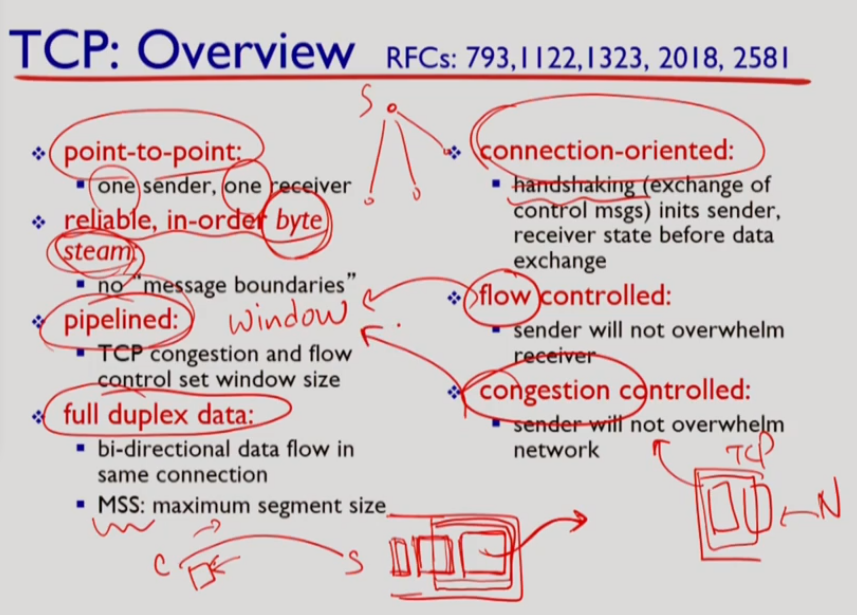

# Transport layer 1

>  Connectionless transport: UDP, Principles of reliable data transfer, Connection-oriented transport: TCP

## Transport Layer, 전송계층

- 지금까지 공부했던 Application Layer는 전송을 담당하는 계층이 아니다**. Http는 사용자가 만들어낸 데이터를 메세지로 만드는** '규칙'이었고 DNS는 도메인-IP간 매핑을 해주는 '서비스'였다.
- 애플리케이션 계층의 웹브라우저든 이메일 클라이언트든 모두 "프로세스"이다. **TCP는 프로세스 간 "Logical Communication"을 담당한다.**
- Logical Communication, 논리적 통신이란 실제 전송이 아니라 메세지를 주고받는 과정에서 오류체크, 흐름제어 등을 한다는 것이다.
- 전송계층의 두 프로토콜
  - TCP : Transmission Control Protocol
  - UDP : User Datagram Protocol
- 멀티플렉싱, 디멀티플렉싱
  - 멀티플렉싱이란? ( Multiplexing, 줄여서 mux라고도 한다.)
    - 하나의 통신 채널로 여러개의 데이터를 동시에 보내는 것이다.
    - 여러 애플리케이션들이 전송계층으로 메세지를 전달하면
    - 전송계층에서는 헤더를 붙여서 캡슐화하고 네트워크 계층으로 일렬로 내려보낸다.
  - 디멀티플렉싱이란? ( Demultiplexing, 줄여서 demux라고도 한다.)
    - 수신 측 전송 계층에서 네트워크 계층에서 일렬로 올라온 데이터들을
    - 헤더정보를 보고 알맞은 각 애플리케이션 소켓으로 전달하는 것이다.
    - Connection Oriented demux
      - TCP의 경우 연결을 맺는데 사용되는 Door Socket이 있고 커넥션 별로 소켓이 따로 있다.
      - 따라서 한 프로세스가 커넥션 마다 소켓 하나씩을 가지므로 여러개의 소켓을 가질 수 있다.
      - 따라서 demux를 위해선 목적지 프로세스와, 출발지 프로세스에 대한 정보가 필요하다.
        - 목적지 프로세스 구분을 위해 : 목적지 IP, 포트번호
        - 출발지 프로세스 구분을 위해 : 출발지 IP, 포트번호
        - 따라서 TCP는 총 네개의 정보가 필요하다.

------

## UDP : User Datagram Protocol

- UDP 프로토콜의 특징
  - 연결을 맺지 않는, Connection Less Protocol이다.
  - 신뢰성이 낮고 (Unreliable), 순서를 맞춰서 전송해주지 않는다 (Unordered)
  - 체크섬 기능으로 오류가 발생했는지 안했는지만 알려준다.
  - 거의 기능이 없는 가장 기본적인 프로토콜이다.
- 왜 사용할까?
  - Best Effort : Congestion Control 없이 일단 보낸다.
  - Pure (No frils)하다.
  - 그러므로 **전송 오버헤드가 없다.**
- 어디에 사용할까?
  - 스트리밍 : Data Integrity보단 처리량이 중요하므로 Best Effort로 전송하는 UDP를 사용한다. 이론적으론 그렇지만 실제로는 TCP를 많이 사용한다.
  - DNS : 일회성 질의이므로 굳이 커넥션을 맺을 필요가 없다.
  - SNMP : SNMP는 망 관리 프로토콜이다. 정기적으로 최신정보를 업데이트하므로 Data Integrity가 중요하지 않다.
  - 신뢰성이 매우 중요한 경우 : 신뢰성이 매우 중요한 경우에는 Integrity를 애플리케이션 계층에서 확인하므로 TCP가 필요없다.
  - Http 3.0은 TCP 오버헤드를 줄이기 위해 UDP를 사용한다.

------

## 신뢰성있는 데이터 전송의 원리

- 신뢰성있는(Reilable) 데이터 전송을 위해선 다음과 같은 기능이 필요하다.
  - Checksum : 체크섬 비트를 둬서 데이터에 오류가 있는지 검사하는 방법
  - Ack : Acknowledge, 잘 받았다는 확인 응답
  - N-Ack : Negative Acknowledge, 잘못 받았다는 확인 응답, 웹에서는 사용하지 않는다.
  - Timer : Ack를 무한정 기다릴 수 없으므로 타이머를 둔다.
  - Window Pipelining : 데이터 전송과 수신을 비동기식으로 처리하기 위한 Window다. 쉽게 얘기하자면 데이터를 주고-받고-주고-받고가 아니라 주고 주고 주고 받고 주고 받고 받고 식으로 통신한다는 것이다.
  - Sequence Number : 순서에 맞는 데이터 전송을 위한 순서 정보다. 포트를 재사용할 수 있으므로 통신 시작 시  랜덤한 Sequence 동기화하는 과정을 거친다. (SYN 플래그를 사용한다.)

 

# Transport layer 2

>  Connection-oriented transport: TCP

## TCP는 Byte Stream

TCP는 메세지를 임시 저장소인 버퍼에 담아서 Flow Control, Congestion Control에 의해 제어되는 속도로 버퍼에 있는 메세지를 전송한다.

- 버퍼 담는다는 것에 주목해보자.
  - TCP는 잠시 버퍼에 담았다가 전송한다.
  - 버퍼로 인해 메모리에 부담이 커질 수 있다.
  - **잠시 담았다가 전송하므로 Throughput 성능이 떨어진다.**
- Flow Control이란?
  - 수신측에도 TCP 버퍼가 있다.
  - 수신 측 **TCP 버퍼가 가득 차도록 송신 측에서 빨리 전송하면** 어떻게 될까?
  - 메시지는 기껏 거의 다 와서 **유실된다.**
  - 커넥션을 맺을 때 / 서로 통신할 때 **자신의 남은 버퍼 크기를 전송**해서
  - 그 크기만큼 보내지 않도록 조정한다.
- Congestion Control이란?
  - 라우터에도 버퍼가 있다.
  - **라우터 버퍼가 가득 차면 메시지가 유실**되어 수신 측에서 ACK가 오지 않을 것이다.
  - **ACK가 오지 않으면 중간 라우터에서 데이터 Loss가 생긴 것** (== Congestion 발생)으로 인식하고
  - 데이터 보내는 속도를 줄인다.

 

------

##  

## TCP의 특징과 원리

- 제공하는 기능들
  - Point to Point (일대일) 연결이다.
  - Reliable, In-Order bytestream이다.
  - Pipelined 되어있다.
  - Full Duplex (동시 양방향 통신)이다.
  - Connection Oriented 통신이다.
  - Flow, Congestion Control을 제공한다.

------

## TCP Segment

출처 : https://www.slideserve.com/redford/the-tcp-segment-header

- TCP 세그먼트의 헤더는 기본 4바이트 5줄 + Options으로 구성되어있다.

- 따라서 TCP 세그먼트의 크기는 20byte + a 이다.

- Src 포트와 Dest포트만 있다. IP 주소는 네트워크 계층 헤더에 있다.

- Sequence Number : TCP는 Inorder 전송을 위해 데이터에 순서 번호를 붙여서 전송한다.

- Acknowledgement Number : **ACK == 100이면 99까지 데이터를 받았고 100번 데이터를 전송해달라는 것**이다. **TCP는 누적 ACK**를 사용한다.

- TCP Header Length : Optional 필드가 있으므로 어디까지가 헤더인지 알아야 한다.

- TCP Control Flags

  - URG : 급한 데이터가 있음을 나타낸다. Urgent Pointer에 값이 있음을 의미.
  - **ACK : 1로 세팅되면 ACK에 값이 유효함**을 의미한다.
  - PSH : PUSH, 버퍼링 된 데이터를 상위 계층으로 즉시 전송할 것을 의미한다.
  - RST : 연결 리셋 시 사용되는 플래그이다.
  - **SYN : 연결 시작 시 송수신 번호 동기화**를 위해 사용된다.
  - FIN : 연결 종료를 나타내는 플래그이다.

- Window Size : ACK를 받지 않아도 전송 가능한 세그먼트의 양이다

  .

   

  Congestion Control을 위한 CWND와 Flow Control를 위한 RWND 중 작은 값을 선택

  한다. 

  - **CWND** : Congestion Window. rwnd를 무시할 때 **송신 측이 Ack 없이 한 번에 데이터를 보낼 수 있는 크기이다.** 작은 값에서 시작해서 점점 늘려나가다 네트워크 상에서 Loss가 일어나면, 즉 중간의 라우터에서 Congestion이 발생해 **패킷이 유실되면 CWND를 줄인다.**
  - **RWND** : Receiving Window, **수신 측 TCP 버퍼 여유공간의 크기**이다. 여유공간의 크기 이상으로 ACK 없이 데이터를 전송하면 수신 측 버퍼가 가득 찰 수 있으므로 Window는 RWND 보다 작아야 한다.

 

------

## TCP Timeout

- 어느 정도 시간이 흐른 뒤에도 ACK가 오지 않으면 Loss가 발생했다고 판단할 수 있을까?
- Timeout 시간이 너무 짧으면 불필요한 재전송이 많을 것이고 너무 길면 Loss가 일어나도 재전송까지 시간이 오래 걸릴 것이다.
- **Timeout시간은 RTT를 이용해서 판단**한다.
- 일정 시간 동안의 RTT 값의 가중평균에 Safety Margin을 더해서 Time-out Interval을 정한다.
  - Time-out Interval = (1-a) * EstamatedRTT + a * SampleRTT + (1-b) * DeviationRTT + b * |SampleRTT-EsstamatedRTT|
  - 일반적으로 a = 0.125, b = 0.25를 사용한다.
  - 최근 추정 값의 오차가 커지면 Interval의 값이 커진다.
  - Interval은 RTT값이 크게 변해도 가중 평균되기 때문에 완만한 그래프를 그린다.
  - Time-out Interval (RTO)를 측정하는 방법은 여러 가지가 있다.

# Transport layer 3

>   Connection-oriented transport: TCP

## TCP Sender Events

TCP 세그먼트를 보내는 측에선 무슨 일을 하는지 알아보자.

 

- 애플리케이션 계층에서 데이터가 도착했다.
  - 시퀀스 넘버와 체크섬을 달아서 세그먼트를 만든다.
  - 타이머가 동작중이라면?
    - 타이머는 가장 오래된 전송 중인(In-Flight) 세그먼트(가장 낮은 시퀀스 번호)에 맞춰져 있다.
    - 세그먼트를 보낸지 너무 오래됐으면 도중에 유실된 것으로 판단한다. 이 때 사용하는 시계가 타이머이다.
  - 타이머가 동작중이지 않다면?
    - 타이머를 켜고 해당 세그먼트에 맞춘다.
- Time Out 발생!
  - Time Out된 세그먼트를 다시 전송한다.
  - Ack를 받지 못한 가장 작은 시퀀스의 세그먼트에 타이머를 맞춘다.
- Ack를 받았다.
  - 받은 Ack에 해당하는 세그먼트를 In-Flight(전송 중)에서 Acked로 변경한다.
  - In-Flight 세그먼트가 있으면 타이머를 세팅한다.
- TCP 재전송 시나리오
  - 수신 측에서 보내는 ACK가 Loss 되어 재전송된 경우
    - 보낸 데이터가 제대로 도착했어도 ACK가 Loss 됐을 수 있다.
    - Ack Timeout으로 송신측은 아까 보낸 데이터를 다시 보낸다.
    - 수신 측은 Loss 된 ACK를 다시 보낸다.
  - ACK를 받기 전에 Time-out 된 경우
    - ACK는 잘 도착했으나 ACK받기 전에 Time-out이 됐다면
    - 받은 ACK에 해당하는 세그먼트는 ACK가 도착하기 전에 재전송된다.
    - 수신 측에서는 받은 데이터를 또 받는다.
    - **TCP는 누적 ACK를 사용**하므로 이전에 받았던 데이터가 다시 도착하더라도 그 데이터에 대한 ACK를 보내는 것이 아니라 **최근에 받았던 데이터(Highest Sequence Number)에 대한 ACK를 보낸다.**
  - Ack가 손실됐지만 Time-out이 발생하기 전에 다음번 데이터의 ACK를 받은 경우
    - ACK == 100을 받지 못했어도 ACK ==120을 받았다면 **TCP는 누적 ACK를 사용**하기 때문에 100번 데이터도 잘 도착한 것으로 인식한다.
    - 따라서 **재전송은 필요없다.**

 

 

------

## TCP Receiver Events

TCP 세그먼트를 받는 측에선 무슨 일을 하는지 알아보자

 

- Ack Generation
  - In-Order의 경우
    - 매번 Ack를 보내는 것은 낭비다. 따라서 받은 Segment들에 대해 모두 ACK를 보냈다면 다음 **In-Order Segment를 500ms동안 기다린다**. 500ms동안 오지 않았다면 바로 ACK를 전송한다.
    - 500ms 동안 기다릴 때 **다음 세그먼트가 오면 바로 ACK를 보낸다.**
  - Out of Order의 경우
    - 받은 Segment들 사이에 누락된 것이 있다면 가장 낮은 값의 ACK를 재전송한다.(Duplicated ACK 전송)
    - **누락된 것을 받았다면 기다리지 않고 ACK를 전송**한다.
- TCP Fast Retransmission
  - Time out 시간은 상대적으로 길다.
  - **3개의 중복된 ACK를 받았을 때 그 세그먼트는 Loss가 발생**한 것이라고 생각하고 **해당 Segment를 즉시 재전송한다**.

 

------

## TCP Flow Control

- Flow Control은 리시버 버퍼가 가득 차는 일을 방지한다.
- RWND는 리시버 TCP 버퍼의 여유공간이다.
  - 리시버가 센더에게 보내는 Segment의 헤더에는 rwnd 값이 포함되어 있다.
  - 센더는 In-Flight Segment개수를 rwnd를 를 넘지 않도록 조정한다. 
  - TCP 연결을 맺을 때 Seq number를 동기화하고 RWND 값을 교환한다.

# Transport layer 4

>   Principles of congestion control TCP congestion control

## TCP 연결 관리

- TCP은 Connection Oriented Protocol이다.
  - 데이터 전송을 보장하는 파라미터들을 각자 설정하기 위해 연결을 맺는다.
- 2 Way Handshaking의 문제점
  - 클라이언트는 서버가 alive 상태인 것을 확인할 수 있다.
  - 하지만 서버는 클라이언트의 SYN 메세지가 언제 전송된 것인지, 혹은 이미 종료된 연결의 SYN 메시지인 지 알 수 없다.
  - **서버 측도 클라이언트가 alive 상태인 것을 확인하기 위해 3 way Handshaking을 한다.**
- 3 Way Handshaking
  - 클라이언트는 SYN M을 보낸다
  - 서버는 ACK M+1과 SYN N을 보낸다.
  - 클라이언트는 ACK N+1과 경우에 따라서 payload를 실어서 보낸다.
  - 쉽게 설명하자면 **클라이언트도 서버가 살아 있는지 확인하고, 서버도 클라이언트가 살아있는지 확인하는 과정**이다. 
- TCP 연결 해제
  - 클라이언트는 FIN flag를 1로 설정하고 보낸다.
  - 서버는 ACK를 보내고 남은 데이터를 전송해준 후 FIN 플래그를 1로 설정해서 보낸다
  - 클라이언트는 서버 측 FIN에 대해 ACK를 보내고 ACK 를 받은 서버는 연결 해제된다.
  - 클라이언트는 ACK가 사라졌을 경우를 대비해 max segment lifetime의 2배만큼 기다렸다가 종료한다.
  - 서버가 보낸 FIN 에 대한 ACK가 사라졌을 경우 서버는 계속 연결을 유지하고 있는 상태가 된다.

 

------

## Congestion Control

- 애플리케이션의 전송량과 수신측에서 실제로 받는 데이터 양의 비교
  - 애플리케이션이 시간당 점점 많은 양을 보내면 수신 측에서 중복을 제외하고 실제로 받는 양은 점점 늘어나지만
  - Link Capacity의 절반도 차기 전에 Congestion으로 인한 Loss와 불필요한 Retransmission으로 실제로 받는 양은 급격히 줄어든다.
  - 따라서 **혼잡을 피해 적당히 보내는 것이 중요하다.**
- Congestion Control의 두가지 방법
  - End to End Approach : End System에서 Congestion Control을 한다.
  - Network Assisted : Network가 Congestion Control을 한다.
  - **코어는 전송만 담당해야 한다는 인터넷의 원칙에 따라 TCP는 End to End Approach를 사용한다.**
- AIMD : Additive Increase Multiplicate Decrease (마치 주식투자 같다.)
  - CWND : Congestion Window
    - 지난 포스팅에서 여러 번 설명했던 CWND에 대해 더 자세히 알아보자
    - CWND : RWND를 무시할 때 송신 측이 ACK 없이 보낼 수 있는 data의 크기이다.
  - CWND를 더해나가다가 Loss가 발생하면 (3 duplicated ack, timeout으로 탐지) 확 줄인다.
  - 초기 CWND는 작은 값이므로 Slow Start라고 한다.
  - Tahoe mode : CWND를 1 MSS로 줄이고 다시 Exponential 하게 증가한다.
  - Reno mode : CWND를 현재 CWND의 반으로 줄이고 선형적으로 증가시킨다.
    - ssthreshold와 CWND의 값이 같게 되어 혼잡 회피(Congestion Avoidance) 단계부터 시작한다.
- TCP Slow Start
  - 초기 CWND는 1 MSS이다. (Slow 한 상태)
    - MSS : Maximum Segment Size
  - 각 ACK를 정상적으로 받을 때마다 CWND를 1 MSS 만큼씩 증가시켜서
  - **1 RTT마다 CWND는 두배씩 증가하게 된다.**
- TCP Congestion Avoidance
  - 혼잡이 일어날 때까지 CWND를 두배씩 증가시킬 순 없다!
  - Slow Start Threshold ( Threshold : 한계점)
    - 줄여서 ssthresh라고 한다.
    - **ssthresh의 값은 임의로 설정된 값이다**.
    - CWND가 ssthresh보다 커지면 Congestion Avoidance로 진입한다.
    - Congestion Avoidance에서는 CWND를 1 RTT마다 1 MSS 씩 늘려나간다.
    - Loss가 발생하면 **ssthresh는 현재 CWND의 절반이 된다.**
    - 그러므로 Reno 모드에서는 Loss 발생 시 혼잡 회피 단계부터 시작하게 된다.
- 시간에 따른 CWND는 톱니 모양이다.
  - TCP의 평균 전송량은 (3/4)*(평균 CWND/RTT)가 된다.
- TCP Throughput의 정확한 계산
  - (1.22*MSS) / (RTT * root(L))이다.
  - 빠른 속도를 유지하려면 새로운 버전의 TCP가 필요하게 된다.
- TCP Fairenss
  - Slow Start를 무시하고 두 연결이 링크로부터 같은 거리에 있다고 할 때
  - 두 연결의 처리율은 Capacity 절반에 수렴한다.
